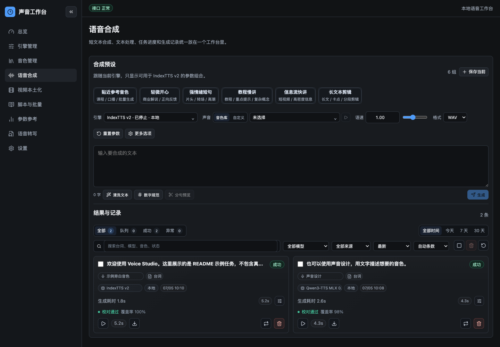

# Voice Studio

Voice Studio 是面向 Apple Silicon 的多引擎语音工作台。它把本地 TTS、声音克隆、声音设计、云端合成、长文本分段、批量生成、ASR 校对和视频本土化流程放在同一个 WebUI 和 REST API 里。

> 重要说明：仓库只包含代码、文档和测试；不包含模型权重、音色库音频、生成结果、本地数据库或 API Key。模型和音色需要使用者自行下载、转换、上传或配置。



早期功能介绍视频：[Bilibili：Voice Studio 早期 WebUI 介绍](https://www.bilibili.com/video/BV1cdLd6TEUA/?vd_source=f22054ec178d3f44a7b40b7e95c2b6f0#reply303763215441)

## 核心能力

- **WebUI 工作台**：引擎管理、音色管理、语音合成、视频本土化、脚本与批量、参数参考、语音转写和设置。
- **REST API**：FastAPI 后端提供生成、长文本、批量、任务、音色、引擎、ASR、历史记录等接口。
- **本地引擎**：IndexTTS v2、OmniVoice、EmotiVoice、F5-TTS、CosyVoice、Qwen3-TTS MLX、Confucius4 MLX 等。
- **云端引擎**：小米 MiMo V2.5、豆包 / 火山引擎 TTS 与声音复刻相关流程。
- **音色来源灵活**：可以使用音色库里的参考音频，也可以临时传入参考音频，还可以使用模型预置音色或声音设计。
- **声音设计**：部分引擎支持用文字描述音色，例如“温暖、清晰、适合知识视频旁白的中文女声”，不一定要先准备真人参考音频。
- **长文本与批量**：支持自动分段、逐段生成、失败重试、ASR 校对、合并输出和 JSON 批处理。
- **视频本土化**：围绕视频源、参考片段、TTS 结果和多段草稿进行本土化配音工作流编排。

## 目录结构

```text
backend/app/        FastAPI 后端、任务队列、引擎路由、音色库、设置与数据库访问
frontend/src/       SvelteKit WebUI
mlx_indextts/       MLX IndexTTS 推理核心与模型结构
scripts/            音色导入、批量处理、质量校验和迁移辅助脚本
docs/               引擎参数、批量生成、架构说明和 RFC
tests/              自动化测试，给开发者和 CI 验证项目是否被改坏
```

运行时数据默认放在 `~/VoiceStudio`。项目根目录的 `models/` 用于本地模型权重，但已被 `.gitignore` 忽略，不会提交到仓库。

本地数据的保留、自动清理、模型与引擎目录规则见 [Voice Studio 本地数据与模型规则](docs/VOICE_STUDIO_DATA_POLICY.md)。

## 快速开始

### 前置要求

- macOS Apple Silicon，推荐 M1/M2/M3/M4
- Python 3.10+
- [uv](https://docs.astral.sh/uv/)
- Node.js / pnpm
- 可选：`ffmpeg`，用于音频转码、视频抽音频和部分本土化流程

### 安装依赖

```bash
git clone https://github.com/foxstudio/voice-studio.git
cd voice-studio

# Python 基础依赖
uv sync

# Web API 服务端
uv sync --extra server

# 模型转换工具
uv sync --extra convert

# 本地 ASR 能力
uv sync --extra asr

# 前端依赖
cd frontend
pnpm install
cd ..
```

### 启动服务

```bash
./start.sh
```

启动成功后打开：

- WebUI: http://localhost:5173
- API: http://localhost:8000
- 健康检查: http://localhost:8000/api/health

如果端口被旧的 Voice Studio 服务占用，可以强制重启：

```bash
./start.sh --force
```

## 模型准备

本仓库不提供模型权重。你需要根据要使用的引擎自行下载模型，并放到对应目录或通过环境变量指定路径。

### IndexTTS v2

默认查找目录：

```text
models/mlx-indexTTS-2.0/
```

示例流程：

```bash
uv sync --extra convert

# 下载原始模型到本地，例如：
git lfs install
git clone https://huggingface.co/IndexTeam/IndexTTS2 models/IndexTTS2-pt

# 转换为 MLX 格式
uv run voice-studio convert \
  --model-dir models/IndexTTS2-pt \
  --output models/mlx-indexTTS-2.0
```

转换后的模型目录通常较大，不应提交到 Git。

### 其他本地引擎

不同引擎的模型来源和目录不同，建议先看对应文档：

- [IndexTTS v2](docs/engines/indextts-v2.md)
- [OmniVoice](docs/engines/omnivoice.md)
- [EmotiVoice](docs/engines/emotivoice.md)
- [F5-TTS](docs/engines/f5-tts.md)
- [CosyVoice](docs/engines/cosyvoice.md)
- [Qwen3-TTS MLX](docs/engines/qwen3-tts-mlx.md)
- [Qwen3-ASR MLX](docs/engines/qwen3-asr-mlx.md)
- [Confucius4 MLX INT8](docs/engines/confucius4-mlx-int8.md)

通用原则：

- 本地权重建议放在 `models/` 或 `~/VoiceStudio/models/`。
- 外部引擎仓库可以用环境变量指定，例如 `VOICE_STUDIO_COSYVOICE_ROOT`、`VOICE_STUDIO_F5_TTS_ROOT`、`VOICE_STUDIO_QWEN3_TTS_ROOT`。
- 缺少模型时，WebUI 会尽量隐藏或禁用相关入口，并在引擎管理页显示状态。

## 音色库与声音设计

仓库不包含音色库。音色库是每个使用者自己的本地数据，默认位于：

```text
~/VoiceStudio/voices/
```

本地数据库默认位于：

```text
~/VoiceStudio/config/voice_studio.db
```

这些文件不会随 Git 仓库上传。

### 使用音色库

适合有参考音频的声音克隆场景：

1. 启动服务并打开 http://localhost:5173
2. 进入「音色管理」
3. 上传 `wav` / `mp3` 等参考音频
4. 填写音色名称、参考台词、授权状态和标签
5. 在「语音合成」页面选择该音色

IndexTTS v2、F5-TTS、CosyVoice Zero-Shot、OmniVoice、MiMo voiceclone、豆包声音复刻等流程会按各自能力使用参考音频。

### 使用临时参考音频

如果不想把声音保存进音色库，可以在 API 或部分工作流里直接传入 `reference_audio_path`。这种方式适合一次性任务、外部 Agent 调用或项目级配音。

### 使用模型预置音色

部分引擎自带官方预置音色，例如 CosyVoice SFT、EmotiVoice、Qwen3-TTS 或云端 TTS 的官方 speaker。此时不一定需要本地音色库。

### 使用声音设计

如果没有参考音频，可以优先尝试支持声音设计的引擎。声音设计通过文字描述目标声音，例如：

```text
温暖、清晰、语速适中，适合知识视频旁白的中文女声。
```

是否可用取决于具体引擎和本地模型是否已安装。WebUI 会根据引擎能力展示对应参数。

## 云端引擎

云端能力不会把 API Key 写进仓库。你可以在 WebUI「设置」页面保存，或使用环境变量。

### 小米 MiMo

MiMo V2.5 支持预置音色、声音设计和声音复刻。配置方式：

```bash
export MIMO_API_KEY="your-api-key"
```

### 豆包 / 火山引擎

豆包相关能力包括 TTS 预置音色、声音复刻训练和复刻音色合成。配置方式：

```bash
export VOLCENGINE_API_KEY="your-api-key"
```

云端声音复刻通常会上传参考音频到服务商。Voice Studio 在相关流程里保留确认开关，请确保你拥有音频授权。

## API 示例

```bash
curl http://localhost:8000/api/health

curl http://localhost:8000/api/engines

curl -X POST http://localhost:8000/api/generate \
  -H "Content-Type: application/json" \
  -d '{
    "text": "你好，这是一个语音合成测试。",
    "engine_id": "indextts-v2",
    "voice_id": "YOUR_VOICE_ID",
    "output_format": "mp3"
  }'
```

更多参数说明：

- [引擎参数手册](docs/VOICE_STUDIO_ENGINE_PARAMETERS.md)
- [批量合成指南](docs/VOICE_STUDIO_BATCH_AGENT.md)
- [豆包集成 RFC](docs/DOUBAO_VOICE_INTEGRATION_RFC.md)

## CLI 示例

```bash
uv run voice-studio generate \
  -m models/mlx-indexTTS-2.0 \
  -r reference.wav \
  -t "你好，世界！" \
  -o output.wav
```

情感控制：

```bash
uv run voice-studio generate \
  -m models/mlx-indexTTS-2.0 \
  -r reference.wav \
  -t "今天真是太开心了！" \
  -o output.wav \
  --emotion happy \
  --emo-alpha 0.6
```

Python 调用：

```python
from mlx_indextts.generate_v2 import IndexTTSv2

tts = IndexTTSv2("models/mlx-indexTTS-2.0")
audio = tts.generate(
    text="你好",
    reference_audio="reference.wav",
    output_path="output.wav",
    emotion="happy",
    emo_alpha=0.6,
)
```

## 开发与验证

`tests/` 是开发验证目录，保留在远端仓库里是有用的。它不会参与普通运行，但可以帮助开发者确认改动没有破坏功能。

```bash
uv run pytest tests/ -q
uv run ruff check
pnpm --dir frontend run check
```

GitHub Actions 也会运行测试：

```text
.github/workflows/test.yml
```

## 本仓库不会提交的内容

这些内容默认属于本机数据或大文件资产，不应进入 Git：

- `models/` 模型权重
- `~/VoiceStudio/voices/` 音色库音频
- `~/VoiceStudio/outputs/` 生成结果
- `~/VoiceStudio/config/voice_studio.db` 本地数据库
- `.env`、API Key、私钥、token
- 临时视频、音频、日志、缓存和前端构建产物

如果你 fork 或二次开发，提交前建议检查：

```bash
git status --short --ignored
git ls-files -o --exclude-standard
git ls-files -ci --exclude-standard
```

## 反馈问题

如果遇到问题，建议优先提交 GitHub Issue：

[https://github.com/foxstudio/voice-studio/issues](https://github.com/foxstudio/voice-studio/issues)

反馈时请尽量带上：

- macOS 版本和芯片型号
- Python、uv、Node、pnpm 版本
- 使用的引擎名称
- 模型目录是否存在，以及是否能在「引擎管理」里看到状态
- WebUI 或 API 的报错文本
- 后端日志：默认 `/tmp/voice-studio-backend.log`
- 前端日志：默认 `/tmp/voice-studio-frontend.log`
- 最小复现步骤

如果问题和云端引擎有关，请不要公开粘贴 API Key、完整鉴权头或私人音频。可以只提供错误码、request id、logid 和脱敏后的请求参数。

## 许可证

MIT License

## 致谢

- [IndexTTS](https://github.com/index-tts/index-tts)
- [MLX](https://github.com/ml-explore/mlx)
- [OmniVoice](https://github.com/k2-fsa/OmniVoice)
- [EmotiVoice](https://github.com/netease-youdao/EmotiVoice)
- [F5-TTS](https://github.com/SWivid/F5-TTS)
- [CosyVoice](https://github.com/FunAudioLLM/CosyVoice)
