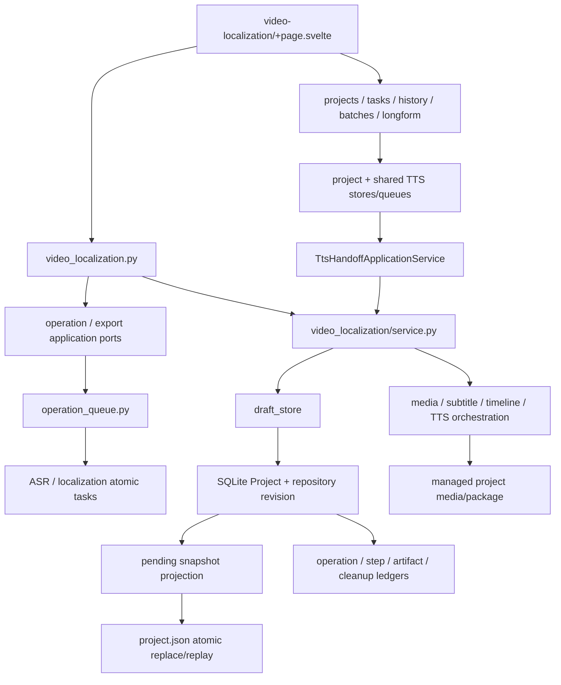
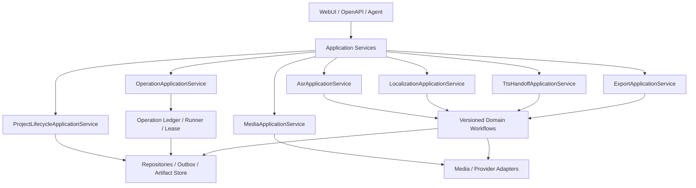
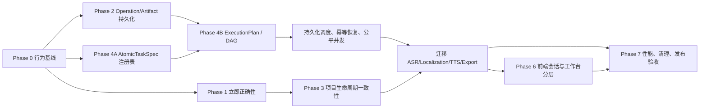

# 视频本土化架构审计与优化路线图

> 状态：`proposal / working roadmap`
>
> 适用范围：视频本土化 WebUI、API、应用编排、领域工作流、任务运行、持久化、媒体、TTS、导出和测试。
>
> 当前复核日期：2026-08-02
>
> 当前复核提交：`a704e83`
>
> 本文是规划、审计索引和验收清单，不是当前实现事实。当前事实仍以根目录
> `AGENTS.md`、`SYSTEM_ARCHITECTURE.md`、视频本土化领域 README、版本化 Schema、
> 领域契约和当前代码为准。

## 1. 文档定位

这份路线图放在 `docs/architecture/`，因为治理范围跨越前端、API、应用层、
任务系统、领域模块和存储，不属于单个子任务或单个代码目录。

文档分工如下：

- `SYSTEM_ARCHITECTURE.md`：只记录已经成立的系统结构和长期规则。
- `backend/app/domains/video_localization/README.md`：记录视频本土化领域当前模块地图。
- `docs/domains/video_localization/domain-contract.md`：记录当前持久数据和领域契约。
- 本文：记录审计发现、目标结构、迁移顺序、测试矩阵和完成条件。
- 具体批次完成后，把稳定事实回写到上述当前文档；不要把阶段流水账写入当前架构文档。

## 2. 目标和非目标

### 2.1 目标

1. 保持本地模块化单体部署，建立清晰的单向依赖。
2. 每项业务能力只有一个应用入口，WebUI、API、后台任务和开发断点复用同一实现。
3. 区分项目内容、任务运行、用户工作区、缓存和媒体状态的所有权。
4. 让长任务具备可恢复、可审计、可取消、可重试和付费调用防重复语义。
5. 将大 JSON 和全量 snapshot 的写放大控制在可预测范围。
6. 保持 ASR、本土化子任务可以继续增删和调整，而不反复修改 queue、API 和前端。
7. 前端页面只组合工作台，复杂状态机进入 controller/store，确定性逻辑进入纯 helper。
8. 建立从单元测试到真实 Web E2E 的分层门禁，并覆盖故障注入、并发和性能。
9. 迁移过程兼容现有 API、项目包和用户真实数据；所有破坏性变更必须单独评审。

### 2.2 非目标

- 不做一次性重写。
- 不以微服务、外部消息队列或事件总线作为第一轮方案。
- 不为了减少文件行数而机械拆文件。
- 不在架构治理期间重写仍在调整的本土化算法。
- 不用重复真实 ASR、LLM、搜索或识图调用代替定点测试。
- 不在没有迁移、回滚和故障注入证据时改变真实项目数据结构。

## 3. 当前审计基线

### 多项目算力准入：待实施边界

普通 TTS 项目公平队列只解决该 worker 的选择顺序，不等于全机资源治理。
全局资源方案须先满足以下条件，不能先套文件锁再补例外：

- 同一所有者在实际设备解析后完成“选择原子任务＋授予资源”，避免任务提前出队等待另一把锁，使后来到达的高优先级任务无法参与选择。
- 租约覆盖推理子进程和模型驻留；取消、父进程崩溃、子进程残留、模型卸载都必须有可测的释放协议。不同数据根仍共享同一机器资源域，测试则显式使用隔离的假资源域。
- 普通、长文本、批量和本土化入口复用原子生成执行门面；批量按段让出资源，CPU/远程任务不占 GPU 配额，排队原因和持久优先级可读。预览转码需纳入独立的媒体资源预算与后台优先级，不能把它当作零成本读取。

先以固定 Provider 验证三项目公平、占用中到达的高优任务、取消竞态、重启恢复和入口覆盖，
再在空闲环境测量真实模型切换、峰值内存和吞吐。证据齐全前保持未实施状态，不将临时锁接入正式服务。

参考：[Ray 资源准入](https://docs.ray.io/en/latest/ray-core/scheduling/resources.html) 区分逻辑资源与物理隔离；
[GPU worker 生命周期](https://docs.ray.io/en/latest/ray-core/scheduling/accelerators.html) 说明调用结束不保证显存释放。

2026-08-02 在干净工作树执行
`.venv/bin/python scripts/audit_video_localization_architecture.py --check-policy`
得到以下可重复基线。本文后半部保留的 2026-07-30 分批记录属于历史证据，不再代表
当前规模或剩余风险。

| 对象 | 规模 |
| --- | ---: |
| 后端视频本土化领域 Python 文件 | 170 个，90,789 行 |
| `operation_queue.py` | 8,104 行，122 个顶层 callable |
| `service.py` | 5,175 行，120 个顶层 callable |
| `asr_flow.py` | 3,068 行，73 个顶层 callable |
| 主视频本土化 API | 1,720 行，86 个路由 |
| 主 API 执行形状 | 38 sync/threadpool、46 async/offloaded、1 async-native、1 async-hybrid |
| 工作台 API 审计范围 | 6 个 router、119 个路由；64 sync/threadpool、47 async/offloaded、5 async-native、3 async-hybrid；95 个有直接 HTTP 测试引用 |
| 前端路由生产文件 | 74 个 |
| 前端路由测试文件 | 63 个 |
| `+page.svelte` | 6,192 行，47 个本地依赖 |
| `VideoCuttingTimeline.svelte` | 4,956 行，22 个本地依赖 |
| `PreviewPanel.svelte` | 2,191 行，13 个本地依赖 |
| `CuttingInspector.svelte` | 1,150 行，9 个本地依赖 |

以上数字只用于定位复杂度，不作为重构成功标准。真正的标准是依赖方向、状态所有权、
故障语义、性能和可验证性。

### 3.1 当前正向资产

- `AsrPipeline` 已形成相对稳定的无持久化领域门面。
- ASR 与本土化原子步骤大量使用版本化 Pydantic 输入输出、指纹和 lineage。
- 本土化正式写入前重复验证源指纹与质量门是正确的提交防线。
- `ProjectSessionController`、`TtsWorkflowSessionController`、
  `TimelineEditController`、`PlaybackSessionController` 已开始承接前端状态生命周期。
- 项目 draft 对客户端和后端字段已有状态所有权过滤和并发冲突检查。
- 预览缓存、波形缓存与正式项目数据基本分离，可重建缓存方向正确。
- 仓库已有 quick/full/browser 三档本土化回归脚本。

### 3.2 当前总体判断

当前实现仍是模块化单体，但已经从“基础持久化不可靠”进入“核心生命周期可恢复、
剩余边界和契约待收口”的阶段。Project CAS、snapshot projection、reset/delete cleanup
和 operation ledger 已形成可靠底座；下一阶段不应推倒领域算法，而应优先治理媒体
resource 边界、相邻 API 的 I/O 线程边界、TTS handoff、typed operation registry、
Draft/operation 权威收尾和前端工作台分层。

### 3.3 近期已经改善的边界

以下内容不再作为待修问题重复实施，但仍需在后续迁移中保持回归：

- 普通打开、轻量索引修复不再推进历史项目 `updated_at`。
- 历史项目按业务 `updated_at` 倒序，而不是项目包文件 mtime。
- 历史菜单已经有轻量 `ProjectSummary`，目录 reconcile 可独立运行。
- 媒体资产、timeline 挂载、用户混音状态和波形展示已明确分层。
- Project repository revision CAS 已覆盖草稿、重命名和 worker 写入；rename 只保存一次。
- Project/snapshot 使用同事务 projection，失败可重放；reset/delete 使用 durable cleanup
  job/tombstone 和 `.trash` staging，重启可恢复。
- 前端 409 冲突使用 base/latest/local 三方合并，覆盖 cue、字幕、术语、场景和 timeline。
- 本土化 v2 产品开发断点已经退役，当前公共契约只保留 localization-v3。
- 公共媒体和导出下载已统一限制在当前项目包内，并拒绝项目根外、跨项目和软链接
  逃逸路径；完整 Draft PUT 不再拥有参考音、TTS、候选、时间线和导出 locator。

仍未解决的是完整 operation/step/artifact 的权威收尾、TTS 跨 store handoff、
宽泛 Draft/operation 参数、公共响应中的媒体绝对路径与 resource ID 迁移、
以及页面、Timeline、Preview 的状态所有权继续下沉。

### 3.4 本轮深度复核方法与覆盖状态

“看过每个文件”不等于“证明每个行为正确”。本轮把 170 个后端领域文件、86 个主路由、
5 个相邻共享 router、74 个前端生产文件、63 个前端测试文件全部纳入静态 inventory，
再按真实用户链路复核公共入口、状态所有者、依赖方向和验证证据。当前 67 个 finding
中 33 个 `done`、21 个 `in-progress`、13 个 `open`。

| 维度 | 已复核 | 当前证据等级 | 下一步 |
| --- | --- | --- | --- |
| 功能入口 | 历史项目、workspace、media、operation、ASR、本土化、字幕/说话人、TTS、Timeline、导出、设置 | 119 条工作台 route 的 owner/I/O/auth/error/test manifest；95 条有直接 HTTP 测试引用 | 在 VL-AUD-061 逐项处置剩余 24 条直接行为测试缺口 |
| 依赖结构 | 领域 import DAG、package import、跨层 importer、前端 reachability | 0 runtime/package cycle、0 dead Svelte；12 个跨层例外 | allowlist 逐项绑定 owner 和退出工作包 |
| 状态所有权 | Project/Draft、ledger、snapshot、media、TTS、workspace、selection/playback | lifecycle/CAS 较强；media locator、TTS、完整 Draft 仍混合 | 先关 VL-AUD-055，再做 TTS handoff/typed Draft |
| 并发与恢复 | CAS、lease/fence、snapshot replay、reset/delete cleanup、前端迟到响应 | 自动故障注入较强；跨进程、Provider unknown、双浏览器不足 | 真实进程终止 + fake provider + 双 context |
| 性能与容量 | operation feed、响应体、bundle、部分 CPU/RSS | 有历史基线；workspace/交互和持续预算不足 | 固定 fixture/机器的 p50/p95 和浏览器交互预算 |
| 安全与隐私 | artifact/export confinement、部分 public payload 脱敏 | 媒体 path ownership 与全局断网夹具缺失 | resource ID/root confinement + fail-closed 网络 |
| 测试层级 | unit、repository/API、full、SSR、browser | 纯函数/存储强；DOM mount 和隔离 E2E 弱 | gate manifest + 4 条隔离浏览器旅程 |
| 兼容迁移 | 多个 query-only/apply/幂等迁移 | 单项强；无最旧支持版本到 HEAD 的完整 golden chain | 定义支持矩阵、备份恢复和重复升级 |

证据等级必须分开写：

- `automated-current`：当前提交可由持续门禁重现。
- `manual-current`：当前提交由隔离真实服务/Web 验收，但还没有持续脚本。
- `historical`：旧提交或旧隔离环境的证据，只能说明曾经通过。
- `missing`：尚无能证明该退出条件的证据。

后续不能因为某个 finding 的实现已落地，就把历史手工截图或相邻测试当作
`automated-current`。每个 `done` finding 最终都要映射到至少一个持续门禁。

## 4. 当前功能与依赖地图



主要问题不是节点数量，而是：

- 主 API 已不再直接调用 queue，但仍直接认识过多领域 contract/reader。
- 架构门禁已统一扫描主 router 及项目、任务、历史、批次、长文本五个相邻 API；
  当前 119 个 route 均输出方法、完整路径、I/O 执行形状、业务 owner、同模块 helper
  闭包、route-level auth、显式错误码和直接 HTTP 测试引用；24 个没有直接行为测试
  引用的 route 已进入 VL-AUD-061 的持续门禁缺口，不用 OpenAPI 或领域单测伪装覆盖。
- shared TTS queue 对视频本土化 service 的直接反向 import 已拆除；绑定校验、有限重试
  和失败日志统一进入 handoff application service。注册、history 放轨和 longform
  终态已有版本化 durable outbox、同事务源记录、跨进程 lease/fencing 和启动重放；
  剩余缺口是完整服务进程强杀、长投影 heartbeat 和长期 retention。
- operation ledger 已是状态权威，但完整详情、TTS 投影和部分 UI state 仍聚合在 Draft。
- 页面直接参与 TTS fallback、乐观候选和 timeline placement。

### 4.1 逐功能当前链路

| 功能域 | 当前主要链路 | 当前权威状态 | 重点风险 |
| --- | --- | --- | --- |
| 历史项目 | summaries/sync → project store/manifest | SQLite 项目索引 | 100 条上限、媒体可用性、更新时间语义 |
| 草稿 | GET query / repair command / PUT/PATCH → service → draft store | `Project.parameters.video_localization` | 读取和修复已分离；大聚合、DB/snapshot 双写仍待拆分 |
| 项目生命周期 | projects API → video service/repository/cleanup | DB + stable package locator + snapshot | CAS/补偿已完成；继续锁定跨进程与兼容回归 |
| 源媒体 | import → source pipeline → media assets/health | 项目媒体目录 + draft metadata | 客户端可写绝对路径，尚无 resource ID/root confinement |
| 预览/波形 | API → cache/media helpers | 可重建 cache | 部分 API 绕门面，错误语义分散 |
| operation | API → application port → operation queue → domain | command/step/attempt/artifact ledger + compatibility mirror + process runtime | 状态 reader 已切换；provider uncertain 裁决、retention 和 Draft mirror 清理待完成 |
| ASR | operation → AsrPipeline → 原子步骤 | ledger/managed artifact + draft 投影 | queue 仍维护部分资格、reader 和 replay 编排 |
| 本土化 | operation → v3 workflow → 原子步骤 | 版本化步骤结果 + draft 投影 | registry/参数/fingerprint 仍多份维护 |
| 字幕/说话人 | API → mutation/domain helpers | draft typed/partly typed fields | 大 service 聚合调用 |
| TTS | localization handoff → shared task/batch/history | shared stores + draft projection | 双写、反向依赖、孤儿任务 |
| 时间线 | page/controller/helper → draft | timeline clips + UI state | 页面状态机过大、契约宽泛 |
| 导出 | API → ExportApplicationService → exporting | 文件 + draft.exports | GET/POST 已分离；CAS 前写正式目录会留下冲突/失败孤儿，需 staging + lease |
| 页面工作台 | page → components/controllers/API | 页面 state + session + draft | 页面承担应用服务职责 |

### 4.2 当前工作树的可复现静态证据

以下数字来自 2026-08-02、提交 `cbe30d0` 的生成器输出，只用于定位依赖和验证规划，
不作为长期架构事实。
正式实施某一批次前必须重新生成，不允许把数字本身当作优化目标。

| 对象 | 当前证据 | 架构含义 |
| --- | ---: | --- |
| 视频本土化领域 Python 文件 | 170 个，90,490 行 | 原子 contract、reader、projection 和 store 拆分后文件数增加；评价标准应是稳定公共入口和单向依赖，不是文件数 |
| `operation_queue.py` | 8,104 行；122 个顶层 callable | queue 仍承担 registry、runner、资格/血缘、recovery 和部分 reader 编排；step/artifact primitive 已下沉但权威收尾未完成 |
| `service.py` | 4,969 行；118 个顶层 callable、89 个 public callable | 一个 facade 仍覆盖项目、媒体、ASR、本土化、字幕、TTS、缓存和 serving |
| `asr_flow.py` | 3,068 行；73 个顶层 callable | 既有工作流编排，也保留被下游复用的 helper |
| 主视频本土化 API | 1,719 行，86 个路由 | 单 router 仍同时承担命令、查询、媒体 serving 和开发 artifact reader |
| 主 API 执行形状 | 38 sync/threadpool；46 async/offloaded；1 async-native；1 async-hybrid | 主 router 为 0 async/no-await、0 未保护本地应用调用；不代表相邻共享 router |
| 跨层 importer | 12 个版本化例外 | policy 已阻止新增债务，但分层尚未完成；`video_localization.py`、两个 application port、shared queues/settings 仍在清单 |
| 前端路由生产/测试文件 | 74 / 63 | 不可达 Svelte 组件为 0；源码字符串测试仍有 2 个 |
| `+page.svelte` | 6,142 行，直接导入 47 个本地模块 | 页面仍是客户端应用服务、状态容器和布局入口的混合体 |
| `VideoCuttingTimeline.svelte` | 4,956 行，直接导入 22 个本地模块 | 轨道显示、手势、selection、编辑、混音和媒体恢复仍在一个组件 |
| `PreviewPanel.svelte` | 2,191 行，直接导入 13 个本地模块 | 播放调度、媒体探测、代理准备和恢复仍集中在组件 |
| `CuttingInspector.svelte` | 1,150 行，直接导入 9 个本地模块 | 已明显收缩；任务、字幕、音色和多种 command 仍需按 owner 继续拆 |

### 4.3 后端模块、依赖和状态复核

#### 4.3.1 真实依赖图结论

静态 import 图需要区分运行时依赖与 `TYPE_CHECKING` 类型依赖。当前忽略只在
`TYPE_CHECKING` 中成立的边后，领域运行时强连通分量为 0；策略允许清单也已清空，
以后重新引入任意循环都会使 quick/full 失败。

```text
API → app.services.video_localization_operations
    → operation_queue → service/domain
```

- 原 `service.submit_operation()` 反向导入 queue 的职责已迁到
  `app.services.video_localization_operations`。该应用端口统一承接 operation
  submit/list/detail/cancel/retry 和受限开发结果读取，并在提交时持有 Draft
  状态所有者的共享写锁；API 不再直接导入 queue。
- 原 `asr_flow → section_review → entity_normalization → asr_flow` 运行时循环已通过
  data-only policy、composition adapter 和惰性包导出拆除。
- 领域包 `__init__.py` 不再 eagerly re-export 有依赖的 quality/readiness 实现，
  因此普通子模块 import 不会被放大为 package SCC。
- ASR 运行时与 package import 图当前均无环。全文理解的 11 个公共数据模型已由
  `document_understanding_contracts.py` 所有，模型调用记录由 `llm_contracts.py`
  所有；研究、画面、分段复查和全文复查不再为类型注解反向引用
  `asr_pipeline` facade。旧 facade 名称仅兼容 re-export 同一类对象。
- shared `task_queue`、`longform_queue` 会反向导入视频本土化 `service` 来注册、
  拒绝或投影 TTS 任务；视频本土化 `service` 同时调用这两个 queue。该双向集成缺少
  明确的 handoff port/outbox。

当前领域内被引用最多的是：

| 模块 | 领域内 import 数 | 判断 |
| --- | ---: | --- |
| `schemas` | 51 | 合理的共享契约入口，但 legacy `extra=allow` 扩大兼容边界 |
| `llm_observability` | 22 | 可保留为共享纯观测契约 |
| `timeline_timecode` | 21 | 稳定纯 helper，方向基本正确 |
| `media_assets` | 16 | 路径、缓存、manifest、音频索引职责仍偏宽 |
| `localization_source` | 11 | v2/v3 共用输入契约，适合作为稳定原子边界 |
| `media_health` | 10 | 新单一 resolver 方向正确，应保持只读、无 store 反依赖 |

#### 4.3.2 API 调用边界

主 router 的 86 个路由中，58 个直接调用 `service`，其余仍直接认识 schemas、
preview/media contract 和多个原子结果 reader；它已经不直接导入 `operation_queue`，
但传输层仍同时知道 facade、artifact reader、领域结果和文件 serving。

目标边界不是把所有代码机械搬进一个新类，而是按用例建立少量公开应用门面：

```text
API
 ├─ ProjectLifecycleApplicationService
 ├─ VideoLocalizationWorkspaceApplicationService
 ├─ MediaApplicationService
 ├─ OperationApplicationService
 ├─ AsrApplicationService
 ├─ LocalizationApplicationService
 ├─ TtsHandoffApplicationService
 └─ ExportApplicationService
```

每条 API 只能调用一个主用例门面；response projection 可以使用独立的 data-only
public contract，但不能为读取 artifact 绕过应用门面进入 queue 私有实现。

架构生成器现在统一扫描主 router 与工作台真实依赖的 `projects.py`、`history.py`、
`tasks.py`、`batches.py` 和 `longform.py`。初次纳入时发现 25 个没有 `await` 的
`async def` 路由，其中项目 API 8 个、历史 3 个、任务 6 个、批次 2 个、长文本 6 个；
这些同步 store/file 链路已经改为普通 `def`，其余混合路由使用显式线程卸载。门禁当前
为 0 async/no-await、0 未保护本地应用调用，并持续按以下规则分类：

- 纯 CPU/内存且有严格上限：可以保留 async，但要证明不会触发同步存储或文件 I/O。
- 同步 repository、文件、hash、音频 probe 或 facade：改为普通 `def` 让 Starlette
  进入线程池，或在应用服务边界显式 `asyncio.to_thread`。
- 已返回 `FileResponse` 的轻量 path resolution：resolver 自身仍不得扫描大型目录或
  重建缓存。
- operation submit/cancel/retry：提交事务必须短且有上限，真正业务处理只能进入 runner。

#### 4.3.3 功能域与状态所有者

| 功能域 | 当前入口和实现 | 当前写入 | 复核结论 |
| --- | --- | --- | --- |
| 项目目录/历史 | projects API、`service`、`project_store` | SQLite Project + repository revision | lifecycle CAS/cleanup/snapshot 已完成；相邻 API 线程边界与媒体 resource 边界待收口 |
| Draft 读取/保存 | workspace API、`draft_store` | Project parameters + pending snapshot projection + `project.json` | GET 纯读，DB commit 与 snapshot 最终一致；大聚合和宽泛字段仍待拆 |
| 媒体导入/抽轨/分轨 | media API、operation、`source_pipeline` | media dir + Draft metadata | 统一 health/resolver 已建立；存储提交和任务 ledger 未拆 |
| Preview/波形 | Preview API、`preview_cache`、`media_assets` | rebuildable cache | 组件只发媒体/缓存 intent；typed media client 与 preview cache session controller 分别拥有代理准备和缓存生命周期 |
| operation | operation API、application port、`operation_queue/state` | command/step/attempt/artifact ledger + Project compatibility mirror + 内存 runtime | 状态/步骤基础设施已持久化；provider uncertain 裁决、retention、mirror cleanup 和 runner 编排仍混合 |
| ASR | `AsrPipeline`、`asr_flow`、原子模块 | typed result/managed artifact + Draft projection | 原子契约较强；运行时循环已清零，继续收口 registry/reader |
| 本土化 full | `service.run_localization_v3_draft` | typed v3 result + formal dual tracks | v3 为正式 15 步；registry/validation/reader 仍在多处维护 |
| 本土化开发重放 | v3 typed batch/step snapshot | 产品目录外开发快照 | 产品 v2 stop-after 已删除；只允许复用正式原子实现，不恢复第二套产品流程 |
| 字幕/cue/speaker | typed API + `subtitle_mutations/cues/speakers` | Draft content | 部分命令已 typed；timeline/字幕/TTS 失效仍跨模块更新 |
| 参考音 | typed selection command + `reference_clips` | media + Draft reference list | 入口已可达；应继续复用 media health 和统一 command transaction |
| TTS handoff | 页面、video service、shared queues | shared task/history + Draft projection | 双写、反向 import、补偿和孤儿状态是主要一致性风险 |
| Timeline | 页面 controller/helper + Draft clips | Draft timeline + UI state | typed clip/state 尚未完全收紧，撤销历史和 selection owner 重复 |
| Export | export application service + domain renderer | managed export dir + Draft export state | command/query 已分离；缺 staging、冲突清理和多进程 render lease |
| 设置/provider | settings page/store、LLM/search/TTS adapters | settings store | profile 选择已统一；settings 仍反向调用领域 cache/path 模块 |

#### 4.3.4 写放大和容量风险

`operation_queue.py` 当前有 32 个 `_mark_operation()` 调用点。operation 状态已经进入
独立 ledger，且无变化写不会推进 revision；但兼容 payload mirror 和完整结果仍可能
触发 Draft 聚合投影。一次内容型 Draft 保存仍会：

1. 重新构建并序列化整个 `VideoLocalizationDraft`；
2. 保存完整 Project parameters；
3. 登记 pending snapshot projection，并在 commit 后原子替换 `project.json`；
4. 重新计算 quality gate；
5. 重新检查媒体 health；
6. 更新 timeline audio path cache。

因此任务越长、完整结果越大，兼容 Draft mirror 的成本仍会上升。后续不再重复建设
ledger，而是完成 step/artifact reader authority、retention 和 mirror cleanup，再以
固定 fixture 测量 Project JSON/snapshot 的剩余写放大。

### 4.4 前端组件和客户端依赖复核

#### 4.4.1 当前入口树

```text
+page.svelte
 ├─ PreviewPanel
 │   ├─ playback readiness / registry / cache helpers
 │   └─ typed intent：媒体准备与 preview cache session
 ├─ VideoCuttingTimeline
 │   ├─ gesture / selection / navigation / context-menu
 │   ├─ media health / playback readiness / waveform
 │   └─ timeline clip、subtitle、mix、lane command intents
 ├─ CuttingInspector
 │   ├─ TaskProgressPanel → TaskStepResultDialog / workflow stages
 │   ├─ subtitle settings / TTS history
 │   ├─ reference library / selection form
 │   └─ legacy dubbing panel
 └─ 页面内 controllers/helpers 47 个直接 import
```

页面仍直接发起 workspace、字幕/cue、speaker、reference、TTS、history 和 timeline
等请求。项目目录、operation feed、export、Preview 媒体代理、preview cache 和
`TaskProgressPanel` 详情已分别进入 typed client/controller/session 边界；其余请求
仍需按状态所有者迁移，避免 project epoch、取消、错误映射和恢复策略散落在页面。

#### 4.4.2 组件所有权问题

| 区域 | 当前重复/混合所有权 | 目标 |
| --- | --- | --- |
| 项目 session | page generation、request controller、draft controller、polling timer | 单一 `ProjectWorkspaceController`，所有响应带 project epoch |
| operation feed | page polling + TaskProgressPanel detail fetch/cache | `OperationFeedController` 按 `projectId:operationId` 管理 |
| 播放 | page time + Preview registry/readiness + Timeline readiness | 单一 playback session；组件只显示和发送 intent |
| selection | page selected IDs/range + Timeline selection session + TTS selection | 一个 selection store，显式区分 cue/subtitle/clip/range |
| undo/redo | `TimelineEditController` typed transaction history | 一个 command history 和 draft revision checkpoint；页面只投影计数 |
| notice | page `message/error` 多个裸 timer + activity notice | 带 ID、作用域和生命周期的 notice store |
| autosave | page pending flags + project session controller + save barrier | 一个可重试 save queue；项目切换/导出共用 barrier |
| media recovery | page、Preview、Timeline 各有条件与 command | 消费同一 `ProjectMediaHealth.recovery_action`，由 media controller 执行 |

#### 4.4.3 已清理的不可达生产组件

初始审计从 `+page.svelte` 入口沿生产 import 图遍历，发现以下 9 个 Svelte 文件不可达，
仓库其他生产文件、测试、脚本和动态 import 也没有引用：

```text
BatchSentenceReviewPanel.svelte
CueEditor.svelte
CueTable.svelte
CueTimelineEditor.svelte
LocalizationTextImport.svelte
ReferencePool.svelte
SentenceRail.svelte
SpeakerRoster.svelte
TrackWaveform.svelte
```

逐组件核对后确认它们分别是旧 cue editor/timeline、旧 speaker/reference pool、
旧批量审校/文本导入和旧 waveform 组合，现役功能已进入
`VideoCuttingTimeline`、`CuttingInspector` 和页面 command。9 个文件已删除，
policy allowlist 清空；当前生产 import 图不可达 Svelte 组件为 0。

### 4.5 状态所有权与一致性矩阵

| 状态 | 当前权威源 | 当前副本/投影 | 主要风险 | 目标处理 |
| --- | --- | --- | --- | --- |
| 项目名称/业务更新时间 | Project repository | history summary、project folder name | rename/目录/DB 非原子 | lifecycle service + CAS + repair plan |
| 当前业务 Draft | Project parameters JSON + repository revision | pending projection、`project.json`、前端 Draft | 大聚合、宽泛字段、兼容投影 | 继续拆 typed 子模型；保留单一 CAS repository |
| operation/step | operation/step/attempt/artifact ledger | Draft compatibility mirror、内存 runtime、UI summary/detail | provider uncertain、retention、mirror 写放大 | 完成 ledger reader authority 和 mirror cleanup |
| ASR/本土化完整结果 | operation result_summary/开发文件 | Draft current projection | 历史 reader 与当前投影混淆 | immutable artifact + versioned projection |
| TTS 真任务 | shared task/longform/history | Draft tts task、timeline clip | 双写失败、反向 import、孤儿任务 | handoff application service + outbox/reconcile |
| 媒体文件 | managed project package | Draft 绝对 path metadata、health read model | 客户端可写/读取宿主任意可读路径；缺 root/symlink confinement | server-owned resource ID + managed locator + 递归脱敏 |
| preview/waveform | rebuildable cache | browser media registry | stale generation、重复准备 | opaque revision + bounded cache controller |
| timeline arrangement | Draft timeline clips | page/controller snapshots | `dict` 宽泛、双历史、并发覆盖 | typed commands + entity revision |
| mix/track state | Draft UI state + page state | Preview/Timeline props | workspace 与内容写混合 | workspace store，内容 Draft 不持有高频状态 |
| selection/hover/playhead | browser runtime | page、Timeline、TTS session | 多 owner、切项目残留 | 单一 ephemeral session store |
| 用户布局偏好 | Draft ui_state | local component state | 推进 Draft revision、冲突噪声 | user workspace persistence |
| settings/profile | settings store | 新任务 parameter snapshot | cache invalidation 与领域反向依赖 | settings application service + events |

### 4.6 测试覆盖复核

最近一次完整门禁证明 1,314 个后端用例、758 个前端用例、Svelte check 0/0 和生产构建/
bundle budget 可重复通过；最近合入后的 quick 门禁为后端 604+6、前端 234。
测试数量不能替代覆盖形状审计。

| 层级 | 已有优势 | 当前缺口 |
| --- | --- | --- |
| 领域纯函数 | ASR、字幕、时间码、本土化 typed contracts 覆盖较多 | 个别共享 contract/helper 只有间接覆盖 |
| 应用/存储 | 项目读纯度、媒体 health、导出 CAS、部分并发已有测试 | 崩溃点、DB/文件补偿、durable lease 尚不存在 |
| API/OpenAPI | 主 router 与五个相邻 router 共 119 路由已统一生成方法、路径、执行形状、业务 owner、同模块 helper、route auth、显式错误和直接 HTTP 测试引用，并锁定 0 async/no-await、0 未保护调用；95 条路由有直接行为引用 | 24 条路由没有直接 HTTP 行为引用；route auth 只做静态 Depends 清点，global middleware 另行审计；媒体路径仍泄露 |
| 前端 helper/controller | 63 个 route test 文件，selection/timeline/autosave 纯逻辑较强 | 已有 5 个 SSR behavior 测试；点击、焦点和真实浏览器 lifecycle 的组件级自动化仍不足 |
| 前端源码策略 | 2 个测试文件仍锁定 wiring/禁用条件 | 任务流程、配音历史和步骤结果已迁为 SSR render；Timeline 和 page policy 仍需迁移 |
| 浏览器 | 标准只读门禁覆盖任务详情、刷新、窄屏、console；可选模式覆盖参考音保存 | 缺离线 autosave、双客户端冲突、项目切换竞态、媒体恢复、取消/重试 |
| 性能/容量 | operation feed 有固定 p50/p95/CPU/RSS/响应体基线，bundle 有预算 | workspace/Timeline 交互和持续服务进程预算未门禁 |
| 故障恢复 | Project CAS/snapshot/reset/delete 和部分 provider/批次已有故障注入 | 缺 provider 返回后崩溃裁决、完整 TTS handoff、跨进程 lease 和浏览器级服务重启 |

当前后端没有直接测试 import 的领域模块包括
`localization_quality_cycle`、`localization_timeline_rules`、
`preview_cache_contracts`、`project_manifest`、`quality_issues`、
`review_contracts`、`speakers`、`state_ownership`、
`subtitle_tts_invalidation` 和 `tts_parameter_pack`。其中一部分通过上层间接覆盖，
另一部分可能是 legacy 或只剩测试引用；实施前要用 public behavior coverage 区分，
不能机械为每个私有函数补测试。

## 5. 审计发现登记

状态值：

- `open`：确认存在，尚未解决。
- `in-progress`：已完成可独立验证的一部分，但尚未达到整项完成证据。
- `verify-current`：近期并发修改可能涉及，实施前必须重新验证。
- `accepted-risk`：明确暂缓且有边界。
- `done`：有实现、测试和文档证据后才能标记。

### 5.0 P0：必须先处理的本机数据边界

| ID | 问题 | 当前状态 | 完成证据 |
| --- | --- | --- | --- |
| VL-AUD-055 | 客户端 Draft 可写入并取回本地媒体绝对路径，media resolver 只检查可读文件，未限制 project root 或 symlink 逃逸 | in-progress | P0A 已完成：公共 source/stem/cue/reference/candidate/timeline/export 文件读取统一限制在稳定项目包内，拒绝项目根外、跨项目及软链接逃逸；完整 Draft PUT 保留后台已有 locator，并剥离新注入的 reference/cue/subtitle/candidate/timeline/export path，只允许 source/stem 首次兼容写入真实且位于约定子目录的受管文件。P0B 第一纵切已把所有 Public Draft/Project/Export 中的 source/stem locator 置空，workspace 以 `ProjectMediaHealth.resource_id` 提供资源身份，原音/人声/背景系统片段只返回 `media_source_clip_id`，内部 Draft 路径保持不变。尚需 TTS/参考音/候选/导出 locator 的递归脱敏、专用请求 DTO，以及 legacy 外部路径的显式登记/修复迁移，完成前不标 done |

### 5.1 P1：正确性、任务安全和用户数据

| ID | 问题 | 当前状态 | 完成证据 |
| --- | --- | --- | --- |
| VL-AUD-001 | operation 重启将 active 直接改 queued，付费步骤可能重复执行 | in-progress | durable claim/lease/attempt/fencing 和 provider `prepared → submitted → success/result_unknown` 生命周期已落地，9 个 LLM/Search gateway 复用；未知结果不自动重放，legacy active 恢复为失败；仍需真实进程强杀、跨进程 claim 和人工裁决矩阵把当前代码证据提升为持续验收 |
| VL-AUD-002 | `list_projects()` 默认只取 100 条，旧项目任务无法恢复/查找 | done | 目录读取不再截断；operation 按 project-scoped ledger + JSON slice 查询，恢复扫描读 ledger；locator 已退役；1,000 项目 lookup、恢复和 legacy backfill 回归通过 |
| VL-AUD-003 | 所有项目曾共用单 worker，跨项目长任务不公平 | in-progress | 进程内默认 2-worker 的 project-fair scheduler 已实现：跨项目有限并发、项目内 FIFO/单槽、pending+active 去重与 1–4 启动容量测试通过；仍需多进程项目互斥、Provider/CPU/GPU 资源分类和真实长任务容量验收 |
| VL-AUD-004 | async 路由直接执行 ffmpeg/Demucs/导出，可能阻塞事件循环 | done | 导出、选区裁音/抽帧、上传后 ffprobe 均在线程执行；提取/分离/ASR/自动参考音统一 operation；并发健康检查锁定事件循环响应 |
| VL-AUD-005 | 同一能力保留直接执行和 operation 两套公共生命周期 | done | 旧重任务公共执行入口已移除或退役；OpenAPI 只公开 typed operation/独立选区 command，前端不再调用第二套直接执行生命周期 |
| VL-AUD-006 | operation/完整步骤结果兼容镜像仍可重写完整 Draft/snapshot/quality/media cache | in-progress | payload-free command/state ledger 已拆出且无变化的 Project 保存不推进 state revision；queue 当前 32 个 `_mark_operation()` 调用点，完整结果、retention、mirror cleanup 与写放大仍待完成和基准 |
| VL-AUD-007 | DB、project snapshot、媒体目录生命周期没有原子/补偿语义 | done | Project/snapshot 使用同事务 coalesced projection、post-commit 原子文件写、失败留档与启动重放；reset/delete 使用同事务 cleanup job/tombstone、稳定包 `.trash` staging、启动重放和 active-work 事务复核。已覆盖 DB 失败不先删媒体、文件移动失败、删除防复活、重置阻断新写和 command 历史退役；完整门禁通过，并在隔离真实服务完成 Web 端项目加载、重命名、更新时间倒序、刷新持久化、重置、删除、空目录与响应式验收，验收期间无新增控制台错误 |
| VL-AUD-008 | rename 读取旧 Project、内部和 API 双保存，可能覆盖并发草稿 | done | Project 私有 repository revision 在同一 `BEGIN IMMEDIATE` 中 CAS；rename 只修改已加载模型并经 `save_project_metadata()` 保存一次，冲突返回 typed 409；Draft patch/worker 在最新状态上有界重试。并发 repository、rename、Draft 冲突定点 6 条回归通过 |
| VL-AUD-009 | TTS submit、shared task 和 draft projection 跨状态源无统一事务 | in-progress | `TtsHandoffApplicationService` 已成为 generate/task/longform 的唯一绑定边界，组合根注入项目投影；三个 v1 outbox 事件覆盖 task/longform 注册、history 结果放轨和 longform 失败/取消终态，分别与源记录同 SQLite 事务提交并由启动过程有界重放。pending 事件用 `BEGIN IMMEDIATE` 领取 60 秒租约并递增 fencing token，Project 事务和 applied/failed 收尾都复核 live claim；过期旧 runner 不能写项目。消费者按 task/workflow 身份幂等，重复注册不推进 Project revision；注册同步失败补偿删除未入队源任务；reset 原子退役 pending、delete 原子删除事件。定点覆盖 outbox 写失败整体回滚、提交后崩溃间隙、投影失败重放、并发单赢家、过期接管、旧 token 拒写、子进程领取后直接退出、源记录缺失、重置和删除。仍需完整服务进程强杀、长投影 heartbeat 与 retention 门禁 |
| VL-AUD-010 | 完整 operation/detail 可能返回本地绝对 artifact path | in-progress | operation/开发 artifact locator 已脱敏且兼容内部 reader；Public Draft 的 source/stem 及其系统 timeline 片段已改为 path-free resource identity，前端播放只使用受控 URL。workspace 仍可能通过 TTS/reference/candidate/export 等兼容字段返回 locator，必须与 VL-AUD-055 后续纵切一并收口 |
| VL-AUD-027 | 编辑后立即导出没有统一等待 autosave/subtitle barrier，可能导出旧字幕或旧时间线 | in-progress | 视频/SRT 已统一 flush 且有失败行为单测；仍需导出浏览器行为测试 |
| VL-AUD-028 | autosave 请求前清空 pending，失败后可能允许关闭/切项目并丢失内存修改 | in-progress | 失败请求保留/合并/显式重试单测已通过；仍需断网关闭/恢复浏览器测试 |
| VL-AUD-029 | 冲突合并只有 timeline 细粒度 dirty intent，可能用旧 glossary/scene/subtitles 覆盖另一客户端新值 | in-progress | 客户端已保存 base snapshot；409 后对 cue、localized subtitle、glossary 按 ID/字段三方合并，对 scene context 仅在本地相对 base 改变时覆盖，对 timeline 保留显式 timing/lane/delete intent，定点前端 86 条通过；仍是全 Draft PUT，base 未覆盖全部可编辑域，且缺真实双浏览器交错证据 |
| VL-AUD-030 | 已退役“项目音色库/保存当前选区”功能曾被永久 flag 形成不可达 UI | done | 当前生产入口和红框面板已移除；回归应断言入口不存在，不再把旧裁音/封面/音色库流程作为当前产品能力 |
| VL-AUD-039 | 主视频本土化 API 的 async 路由曾直接执行同步 repository/文件 facade | done | 当前主 router 86 路由已逐项分类：38 sync/threadpool、46 async/offloaded、1 native、1 hybrid；0 async/no-await、0 unprotected app call；相邻共享 router 的范围缺口单列 VL-AUD-056 |
| VL-AUD-044 | 页面首次加载遇到后端离线时只恢复健康灯，不重试项目，服务恢复后仍停在空工作台 | done | 失败初始加载保留 URL 项目并登记 recovery intent；全局 API 恢复事件只在未加载 Draft 时重试；纯策略测试与“首次项目请求连接失败 → 恢复 → 历史/详情/刷新/窄屏”真实浏览器回归通过 |
| VL-AUD-046 | 云端 TTS 已开始、超时或服务重启后可能自动重放，MiMo 本地 fingerprint 被误当成 Provider 幂等依据 | in-progress | 单句、长文本和 batch 在 Provider 边界前持久化 uncertain；豆包单句 request ID 先写库再提交；cloud active/uncertain 不自动恢复，重试要求确认且 batch 排除成功 segment；仍需 cloud batch 的逐 segment provider attempt ledger、request ID 和裁决状态 |
| VL-AUD-047 | 初始 catalog reconcile、菜单 sync 与 create/rename/delete 直接覆盖同一项目列表，迟到旧响应可复活已删除项目或覆盖新名称/新项目 | done | `ProjectCatalogController` 单一持有目录状态、read/mutation/entity generation；mutation 开始和成功提交均使旧读取失效，删除不确定结果只确认目标存在性；9 个并发行为测试、页面边界策略、完整门禁和真实 Web 创建→改名置顶→刷新→删除均通过 |
| VL-AUD-048 | 配音历史 load/focus/终态刷新与单条、当前片段、全部删除直接覆盖同一数组，迟到读取可复活已删除记录，批量部分失败会造成页面与服务端分叉 | done | `TtsHistoryController` 按 active project 持有 generation/read/mutation epoch；所有删除成功后读取权威列表，不确定响应用无展示上限列表对账；11 个竞态/范围测试、页面边界策略和真实 Web 删除→刷新→API 对账通过 |
| VL-AUD-049 | “删除全部配音记录”只覆盖前 500 条，且逐条 HTTP 删除会让后端为每条记录重复扫描完整 history，数量增长后语义错误并呈平方级退化 | done | typed project/result/segment bulk command、单次锁内库存扫描、SQLite 批量事务和清理失败显式结果；501 条、跨项目/来源隔离、共享音频、文件失败、完整门禁及真实 Web 全删/刷新通过 |
| VL-AUD-050 | `database.conn()` 在一次连接中重复读取可变 `DB_PATH`，并发路径切换可能把旧连接的 schema 状态登记到新空库，造成随机 `no such table` | done | 连接入口固定 path snapshot；确定性切换测试证明两个文件各自初始化；原失败用例隔离复跑和 879 项完整后端门禁通过 |
| VL-AUD-053 | 缺少 workflow schema 的 operation 被持久化为字面量 `"None"`，ledger audit 又用相同标准化错误把它判为 matched | done | writer/audit 共用 null-safe 标准化；普通 projection 保留 sentinel 等显式迁移；query-only 规划与 ledger/step 原子 apply；真实库 250/250 迁移、0 sentinel、440/440 audit matched |
| VL-AUD-057 | 打开项目菜单同步目录时，若当前项目因外部移动/临时缺盘从结果消失，页面直接取消 pending autosave 并清空 runtime，可能丢失内存编辑 | done | 目录 reconcile 先修复可发现包，再保留所有已索引项目并以 `missing` 表示暂不可用；前端 controller 对当前项目增加遗漏保护，菜单同步不再取消 autosave、清 runtime 或隐式切换。API 回归覆盖项目包移出、更新时间不变和恢复；controller 覆盖当前项目保留与非当前项目正常移除。隔离真实服务/Web 验收覆盖目录缺失、内存编辑、服务离线保存失败、服务与目录恢复、再次保存和目录重新 available，未读写用户项目或调用付费能力 |
| VL-AUD-059 | 测试依赖逐用例 monkeypatch 阻止真实 Provider，整套 quick/full/CI 没有 fail-closed 的非 loopback 网络与付费调用边界 | open | 测试启动时清空真实 Provider 配置；默认拒绝非 loopback socket/DNS/HTTP；显式 fake provider allowlist；退出断言真实 Provider 尝试为 0 |
| VL-AUD-062 | 本土化 TTS 使用 cue/subtitle/group ID 调 shared script-segment 投影；找不到 Project segment 时仍无条件保存 Project，推进 `updated_at` 和 repository revision | done | VL-bound TTS 已跳过 legacy script projection；`update_segment_result` 只在找到脚本段且结果字段真实改变时保存，并返回是否发生写入。真实数据库回归证明 VL task、unknown segment 和同值重放均保持 `updated_at`/repository revision 不变，真实变化只推进一次；success/failure 共用同一入口 |

### 5.2 P2：边界、性能和扩展性

| ID | 问题 | 当前状态 | 完成证据 |
| --- | --- | --- | --- |
| VL-AUD-011 | `service ↔ operation_queue` 运行时循环；API 曾直接持有 queue | done | `video_localization_operations` 应用端口统一 operation 传输入口；service 不再反向 import queue；API 不再直接 import queue；运行时/package cycle 均为 0，允许清单为空，提交锁与路由委派测试通过 |
| VL-AUD-012 | queue 曾约 9.3k 行/145 callable，同时负责 runner、恢复、验证、编排、快照和 reader | in-progress | v2 删除、应用端口与通用 development artifact store 已把 queue 从约 19.9k 降至 8.7k；11 类路径/schema/身份/payload 读取统一，仍需迁出任务资格/血缘 reader、snapshot writer、runner、recovery 和 registry |
| VL-AUD-013 | API、queue、workflow contract、前端重复维护步骤与参数 | open | 单一 `OperationSpec/AtomicTaskSpec` registry；派生契约测试 |
| VL-AUD-014 | 开发快照/managed artifact 的 registry、配置和 retention 尚未完全统一 | in-progress | 硬编码 Desktop 路径已删除，默认落产品目录外临时位置，大部分 ASR 节点使用 managed artifact store；仍需收口 legacy localization checkpoint、统一 registry/config/retention 和 replay 测试 |
| VL-AUD-015 | draft 多处 `dict/list[dict]`、`extra=allow`，前端手写重复类型 | open | current schema `extra=forbid`；legacy adapter；TS 生成/parity |
| VL-AUD-016 | `updated_at` 同时承载用户编辑、后台进度和 UI 写入 | in-progress | Draft 写入显式声明 intent；UI、progress、重启恢复、GET 导出不推进 Project 时间；仍需独立 revision/runtime/workspace 字段迁移 |
| VL-AUD-017 | `has_source_media` 只看 metadata，不验证媒体真实可用 | in-progress | `ProjectMediaHealth`、统一 resolver、workspace/summary/Preview/Timeline/readiness/quality/prerequisite/serving/export 已落地；真实缺失媒体浏览器验收和完整包移动 API 集成通过，待真实浏览器外部移动验收 |
| VL-AUD-018 | draft get/目录解析会迁移、写 DB、写 snapshot 或静默回空草稿 | done | GET 与目录定位纯读取；显式 repair-storage 迁移/恢复；缺失状态和无快照失败语义、幂等 autosave、更新时间、真实 API/浏览器均有证据 |
| VL-AUD-019 | 导出使用有副作用的 GET，并可能同步生成文件 | done | GET 只下载已提交产物，POST 显式创建；输入指纹复用、受管路径、并发编辑拒绝覆盖、OpenAPI、事件循环和真实浏览器导出均有证据 |
| VL-AUD-020 | 前端页面直接编排 generic/longform TTS 与乐观时间线状态 | open | LocalizationStudioController/TtsApplicationClient；组件行为测试 |
| VL-AUD-021 | 页面与 Timeline、Preview、Inspector 仍是超大控制器组件 | in-progress | Inspector 已删除永久关闭的旧配音生成分支、611 行重复 UI/状态/回调，并把现役配音结果面板按标签延迟加载；仍需继续按状态所有者拆分页面、Timeline、Preview 和 Inspector |
| VL-AUD-022 | 7 个前端测试曾以源码字符串为主，Svelte render/mount 组件测试为 0 | in-progress | 当前 2 source-string / 5 SSR component behavior；Preview 恢复策略已有纯 contract、真实 SSR 媒体树和浏览器媒体验证，继续迁移 Timeline 与 page policy 后清零 allowlist |
| VL-AUD-031 | 页面快照栈和 `TimelineEditController` 同时维护 undo/redo 历史 | done | snapshot/redo/order 已删除；cue/subtitle/clip/lane/UI 共用 typed transaction；接口失败无幽灵历史、批量删除只记一次；ID 级重放保留后台新实体与运行时字段，完整门禁和真实 Web 撤销/重做已通过 |
| VL-AUD-032 | Preview 与 Timeline 对无媒体 solo 轨的可听判定不同 | done | 两处共用 `resolveAudibleMix`；只由真实挂载媒体的 solo 轨压制其他轨；空轨、跨普通轨/配音 lane、静音/零增益测试通过 |
| VL-AUD-033 | 父页面和 Timeline 组件双重拥有 selection session | done | 页面是 selection 唯一 owner；Timeline 只读投影并发下一状态 intent；cue/subtitle/clip/TTS/range/loop 走统一项目清理边界，单选/多选、检查器、跨项目和返回无残留验收通过 |
| VL-AUD-034 | Preview、TaskProgressPanel 和页面直接 fetch/API，绕过项目 epoch/client 边界 | in-progress | TaskProgressPanel 只发详情 intent；Preview 无直接 API/fetch；代理准备、preview cache、operation feed、project catalog 和 TTS history 分别经 typed client/controller/session，以 project/entity + generation 拒绝迟到响应；页面直接 `Api.*` 当前 57 处，剩余业务 API 仍待逐项迁移 |
| VL-AUD-035 | 页面多处通知 timer 可由旧消息定时器清除新消息 | in-progress | 主要 activity notice 已统一到 controller 并以 generation/消息身份防竞态；Preview `onPlaybackIssue` 仍直接 `setTimeout` 清共享错误，需要迁入同一 owner 后再关闭 |
| VL-AUD-036 | 任务详情缓存未按项目隔离，旧异步结果可能写入新项目实例 | done | 详情缓存按 project + operation 复合键隔离；项目切换清空详情、loading 与选中结果；迟到响应提交前校验 project epoch；策略测试与真实双项目任务详情切换通过 |
| VL-AUD-037 | `localization_draft` 同时承载正式 v3 与旧 v2 开发断点，版本定义曾互相污染 | done | v2 `stop_after` 请求、开发路由、queue/snapshot reader、领域实现和专属测试已删除；typed API 拒绝旧字段，generic operation 对旧模式明确返回 410；公共契约只剩 localization-v3 |
| VL-AUD-038 | 任务轮询刷新可能覆盖用户刚切换的检查器面板，直接点“配音”偶发回到任务页 | done | 静态写入点审计确认轮询不写 inspector section；全新 WebUI 直接点击“配音”并跨过两轮空闲轮询后仍保持激活，控制台 0/0 |
| VL-AUD-040 | `asr_flow ↔ entity_normalization ↔ section_review` 存在运行时循环，ASR 结果类型还反向挂在 facade | done | 直接与 package-root 循环均已移除；document-understanding 与 LLM call record 下沉到无 service/runtime 依赖的 data-only contracts，原子任务直接依赖契约，旧 facade/observability 导出保持类身份兼容 |
| VL-AUD-041 | 没有可重复的 p50/p95、内存、写放大和交互性能基线 | in-progress | operation summary/feed 已有 repository、同 revision cache-hit 和受控 revision 推进三种固定无付费模式，覆盖机器/样本/cold-warm/cache-hit/cache-miss/unchanged/health/CPU/RSS/DB；仍需 workspace、交互与持续预算 |
| VL-AUD-042 | video-localization SSR 已由约 771.95 kB 降至约 647 kB、客户端最大 chunk 已由约 545.48 kB 降至 451.21 kB | in-progress | 任务结果和配音结果脚本已按用户动作延迟加载；Vite manifest analyzer 与 full-gate 体积预算已建立；仍需更多检查器/非首屏 lazy boundary、浏览器加载和交互性能预算 |
| VL-AUD-043 | 完整项目 operation summaries warm 单请求约 60 ms，但 12 路并发轮询 p95 约 1.20 s | done | WebUI 已迁移到 `operation-feed-v2`：active head 最多 32 条，历史按 50 条默认、100 条上限的 keyset cursor 分页，读取不查询 `projects.data`。10,000 条历史 head 最大 25,678 bytes，200 页精确覆盖 10,000 条且无重复；12 路服务进程 changed p95 39.384 ms、同轮 health p95 31.991 ms、CPU 1.943 ms/测量请求、RSS 增量 1,146,880 bytes，纯读数据库无变化。旧 v1 只保留兼容入口；runtime legacy authority close 单列 WP-03F，不再属于本性能问题 |
| VL-AUD-051 | 10 条终态 operation 的“摘要”仍携带步骤正文、最终结果和错误详情，空闲轮询响应达 423,061 bytes | done | 独立 typed summary 契约；终态只传列表元数据，首次展开按 project + operation 读取详情；同项目响应降至 8,561 bytes，固定 50+1 fixture 为 25,345 bytes，详情完整性、只读 DB、前端 lazy-load 和浏览器请求链均验证 |
| VL-AUD-052 | workspace 重复内嵌 operation 与 TTS 任务历史，真实项目首次读取达 3.49 MB，随后又调用专用 reader | done | workspace 中两类 server-owned histories 固定为空，专用 operation/TTS reader 保持完整；真实响应降至 1.87 MB，契约、完整门禁和生产预览验收通过 |
| VL-AUD-054 | operation submit 的公共契约仍是任意参数字典；`stems`、`reference_clips` 仍会把执行器忽略的键写入 fingerprint，其他 kind 也在 queue 内手工维护不同白名单 | in-progress | source-audio-v1 已采用零输入契约、拒绝额外字段并清理 legacy retry 参数；E4.1 仍需以 `(kind, workflow_version)` 为键的 typed registry、discriminated request schema 及全 kind retry/fingerprint/OpenAPI parity |
| VL-AUD-056 | 架构生成器只审计主 `video_localization.py`，遗漏工作台使用的 projects/history/tasks/batches/longform router；其中 25 个 route 是 async/no-await 且会执行同步 store/文件工作 | done | 生成器与 no-new-debt policy 已扩展到 6 个 router/119 个 route；25 个相邻同步链路改为 `def`，项目生成、波形、WebSocket 和 project task 最终保存显式 offload，当前 0 async/no-await、0 未保护应用调用。每条 route 均输出完整路径、执行形状、业务 owner、同模块 helper、route-level auth、显式错误和直接 HTTP 测试引用；URL 变量/拼接有 analyzer 单测，95 条已关联直接 HTTP 行为测试，24 条真实空白转入 VL-AUD-061。慢 Project store 与 health 并发、90 条相邻 API/OpenAPI 回归、完整门禁及真实 Web 项目加载/46 项历史菜单/console 0 错误通过 |
| VL-AUD-058 | Inspector 的字幕生成启用条件仍看持久化 `vocals_clean_path`，真实提交入口看 `ProjectMediaHealth`；文件缺失时按钮可能可点，随后静默停在“准备中” | open | 所有消费者只读取同一 media health/capability；命令返回 typed disabled reason；缺失/恢复媒体的组件和浏览器测试 |
| VL-AUD-060 | 通用 browser verifier 依赖已有 ASR 大项目且动态注入缺失的摘要 DOM，不能可重复证明 lifecycle/布局等完成证据 | open | 隔离 DB/项目/媒体 fixture；禁止注入被测 DOM；拆 lifecycle/media/operation/edit-export 场景；监听 console warning/error、pageerror、failed request 和 5xx |
| VL-AUD-061 | 本土化专用 full 门禁不包含 `test_project_summaries.py` 等跨模块关键契约；若只跑项目规定门禁会漏历史排序、媒体 health 和包 rebase；route manifest 还识别出 24 条没有直接 HTTP 行为测试引用的工作台路由 | open | 生成 VL finding→test/gate manifest；逐条判定 24 个 route 缺口是补行为测试、纳入已有跨模块测试还是明确只保留契约层；full 纳入关键跨模块文件；每个 done finding 至少有一个持续门禁，CI 与本地 full 的覆盖差异显式报告 |
| VL-AUD-063 | 后端暴露 `repair-storage`，前端 recovery 文案却没有对应 client/command，用户只能看到提示或误走“导入视频”创建新项目 | open | typed repair command client；恢复动作只作用当前项目；available/missing/moved/error 状态机和浏览器恢复链路 |
| VL-AUD-064 | Timeline/Inspector/Preview 的部分 slider、resize、trim、reorder 只有 pointer 交互；历史/导出菜单声明 menu 语义却没有 roving focus/方向键模型 | open | slider 键盘步进/Home/End；reorder 上移/下移命令；合法的 menu keyboard pattern 或普通 popover 语义；焦点、200% zoom 和屏幕阅读器组件测试 |
| VL-AUD-065 | 历史项目长名称为每行建立 ResizeObserver、MutationObserver 和持续 RAF，列表又一次性渲染全部项目；大目录打开菜单可能产生观察器/动画放大 | open | 统一 overflow/marquee primitive；reduced-motion/可见性暂停；大目录分页或虚拟化阈值；1,000 项目 observer、long-task、内存和滚动预算 |
| VL-AUD-067 | 导出在 CAS 前直接写正式 package/segments/zip；渲染失败或指纹冲突会留下孤儿/半成品，多进程还可能重复渲染 | open | `.export-staging/<render-id>` 隔离生成；异常/冲突 finally 清理；成功后原子发布；durable render lease；冲突和进程终止后目录无残留测试 |
| VL-AUD-045 | 长视频低缩放时字幕 cue 命中区域可缩到约 2 px，相邻 cue/选区/标题宽度手柄会拦截点击 | done | 语义时间命中在 DOM target 与真实时间区间不一致时恢复正确 cue；低缩放隐藏拖边命中、选区手柄移入时间尺、标题宽度手柄不越界；鼠标、Ctrl 多选、键盘、双击、触控及 1x/放大状态均由真实浏览器通过 |

### 5.3 P3：清理与维护性

| ID | 问题 | 当前状态 | 完成证据 |
| --- | --- | --- | --- |
| VL-AUD-023 | 9 个 Svelte 组件从页面生产 import 图不可达 | done | 全仓库引用/动态 import 与现役替代核对后删除 2,378 行旧 UI；allowlist 清空，unreachable=0，check/build/full/browser 通过 |
| VL-AUD-024 | `localization_quality_cycle.py` 仅测试引用 | done | 模块已在 `7be565b` 删除；HEAD、生产 import 图、测试与活文档无残余引用；现役质量循环由 ASR pipeline 及原子 review/recheck/gate 实现 |
| VL-AUD-025 | per-project lock registry 长期不清理 | done | 通用引用计数式 `KeyedLockRegistry` 替换媒体索引裸字典，并统一代理/缩略图/波形的重复实现；同键串行、异键并行、异常释放、1,000 项目 churn、完整门禁和真实媒体播放/刷新均通过 |
| VL-AUD-026 | 大测试文件和私有函数耦合妨碍内部重构 | open | 公共契约/fixture 分层；减少私有实现直接测试 |
| VL-AUD-066 | 前端至少保留多组无生产调用的 API wrapper、三套 marquee/overflow 逻辑和重复 CSS selector，增加误用和维护面 | open | 生产 import/call graph + 动态调用确认；删除无调用 wrapper；合并共享 overflow/format helper；architecture allowlist 防复活 |

## 6. 可变子任务流程的隔离策略

当前 ASR 和本土化子任务仍在调整。路线图不得把“当前步骤数量”变成基础设施常量。

### 6.1 稳定层

以下内容应先稳定：

- operation/step 的版本化 envelope。
- step ID、输入版本、输出版本、上游 lineage 和 fingerprint。
- 状态转换、取消、恢复、attempt、lease 和幂等语义。
- artifact 存储与读取协议。
- 副作用分类：`pure/read/paid/write/final_commit`。
- 并行、汇合、失败、warning、跳过和重试语义。
- formal 与 development replay 复用同一原子实现。

### 6.2 可变层

以下内容允许持续变化：

- 步骤数量、显示名称和执行顺序。
- 某一步使用规则、本地模型或云模型。
- 并行组和补查循环。
- UI 阶段分组和 reader 文案。
- 开发模式从哪个步骤 stop/replay。

### 6.3 目标规格

```text
WorkflowDefinition
  ├─ workflow_id / version
  ├─ ordered StepSpec[]
  ├─ dependency graph
  ├─ input/output contract references
  ├─ required / optional / conditional
  ├─ side-effect / cost / idempotency policy
  ├─ retry / cancel / recovery policy
  ├─ reader projection
  └─ formal/development availability
```

API、queue、开发断点和前端阶段展示从该规格派生；不再分别手写同一组步骤。

运行前由 plan compiler 将定义编译为不可变 `ExecutionPlan`：

- 保存 workflow definition version、source revision/fingerprint。
- 每个实例有独立 `task_instance_id`，引用稳定 `definition_id`。
- 校验无环、依赖闭包、最大 fan-out、契约版本和成本上限。
- 条件步骤只在条件成立时 materialize；join 只等待本次 plan 中真实存在的实例。
- 明确区分 `not_materialized`、`skipped`、`blocked`、`failed` 和 `cancelled`。

例如证据补查不再固定创建 research/visual 两个空任务再事后改成 skipped，而是由
typed follow-up plan 决定创建 0/1/N 个实例；零任务时生成确定性的 empty bundle。

## 7. 目标架构



### 7.1 应用服务职责

| 服务 | 唯一职责 |
| --- | --- |
| `ProjectLifecycleApplicationService` | create/open/rename/reset/delete/reconcile，定义跨 DB/文件补偿 |
| `VideoLocalizationDraftApplicationService` | revision/CAS、内容更新、草稿投影 |
| `MediaApplicationService` | 导入、资产健康、代理、抽轨/分轨 operation |
| `OperationApplicationService` | submit/cancel/retry/query；不实现业务算法 |
| `AsrApplicationService` | ASR 正式/开发工作流编排 |
| `LocalizationApplicationService` | 本土化正式/开发工作流编排 |
| `TtsHandoffApplicationService` | prepare/submit/project/reconcile/compensate |
| `ExportApplicationService` | 创建导出任务、状态和下载 |

### 7.2 状态所有权目标

| 状态 | 目标所有者 |
| --- | --- |
| 项目名称、描述、`content_updated_at` | project repository |
| 本土化当前业务草稿与 revision | video localization draft repository |
| operation/step/attempt/lease/heartbeat | operation ledger |
| 步骤完整结果、开发快照、frame 等 | artifact store |
| TTS 真任务 | shared task ledger |
| TTS 在项目中的可见投影 | video localization read model |
| 播放位置、hover、临时选择、拖动 | 浏览器 session/runtime state |
| 需要跨会话的用户布局偏好 | user workspace state |
| 媒体文件 | project media store |
| 预览/波形 | rebuildable cache |
| project snapshot | DB commit 后的恢复镜像/outbox consumer |

### 7.3 行业依据与适用边界

本路线图采用成熟模式，但不把“用了某个术语”当作完成：

- [FastAPI 并发说明](https://fastapi.tiangolo.com/async/)明确区分真正异步 I/O 与同步
  阻塞库：同步 path operation 由外部线程池执行。因此本项目的规则是先按真实调用链
  分类，再选择普通 `def` 或显式 offload，不以函数声明形式猜测非阻塞。
- [OpenAPI 3.0.4 discriminator](https://spec.openapis.org/oas/v3.0.4.html#discriminator-object)
  支持显式 `oneOf` + discriminator。它适合从 `(kind, workflow_version)` registry
  派生 operation 请求 union，但所有分支仍必须显式列出和独立校验，不能用 discriminator
  绕过 schema validation。
- [Playwright test isolation](https://playwright.dev/docs/browser-contexts)使用独立
  BrowserContext 建立 clean-slate 测试；本项目用两个独立 context 验证并发编辑，
  每条 lifecycle/media/operation/export 旅程使用隔离 DB 和项目目录，不复用人工项目。
- [WAI-ARIA Slider Pattern](https://www.w3.org/WAI/ARIA/apg/patterns/slider/)和
  [Menu Pattern](https://www.w3.org/WAI/ARIA/apg/patterns/menubar/)要求与声明 role
  匹配的焦点、方向键、Home/End/Escape 等交互。实现不了完整 menu 模型时，应退回普通
  popover + button 语义，不能只贴 ARIA role。

SQLite、outbox、lease 和 staging 只解决本地模块化单体内的持久化与恢复问题；它们不
自动提供跨进程资源调度、Provider 幂等或分布式事务。每一项仍以故障注入和恢复不变量
为验收依据。

## 8. 分阶段实施计划

每一阶段都按“小批次、先测试、后迁移调用方、最后删除旧路径”执行。阶段编号是依赖顺序，
不是要求一次完成全部内容。

### 8.1 迁移依赖图



依赖含义：

- 正确性热修不需要等待大迁移。
- operation/artifact 持久化和原子任务注册表可在行为基线后并行设计。
- 动态 ExecutionPlan 必须同时依赖任务注册表和可持久化运行实例。
- 不要先机械拆 God module；先迁移状态所有权和调用方，再删除旧大分支。
- 前端可以先修 P1 行为，但大规模 controller 拆分应等待后端应用入口稳定。

### 8.2 可执行优化工作包

下表是后续架构优化或局部重构的默认拆分。每个工作包都必须单独形成可回退 diff；
“完成”要求实现、自动测试、最新服务浏览器证据和文档同时成立。

| 工作包 | 当前状态 | 关联发现 | 依赖 | 实施边界 | 必须验证 |
| --- | --- | --- | --- | --- | --- |
| WP-00 当前基线生成器 | in-progress | 013/022/041/056 | 无 | 已生成 6 个工作台 router/119 个 route、import DAG、模块规模及 route owner/helper/auth/error/test 矩阵；下一批补 finding→gate 和 browser scenario manifest | 输出可重复；主/相邻范围显式；误差来源和环境信息齐全 |
| WP-01 架构依赖门禁 | in-progress | 011/040/056 | WP-00 | 第一层已锁定循环、跨层 importer、6-router async/no-await/unprotected call、dead UI 和源码测试；继续消减 12 个跨层例外、2 个源码测试 | 版本化 allowlist 有 owner/退出条件；允许债务减少，新增债务失败 |
| WP-02 API I/O 边界 | done | 004/039/056 | WP-00 | 主路由与 projects/history/tasks/batches/longform 的 119 个 route 已按 sync/offloaded/native/hybrid 分类，25 个隐藏的同步 I/O 路由已迁到线程边界，业务 API 语义不变 | 慢 Project store 时 health 保持响应；相邻 API 和 OpenAPI 回归通过 |
| WP-03 Operation summary repository | 002/006/012/043 | WP-00 | 按 Operation Ledger RFC 5A 增加 typed summary core、复合 ID repository、shadow write/backfill/只读对账；先保持 v1 等价，再迁 v2 active + keyset history，不改变完整 Draft/detail schema | 1,000/10,000 历史 head/page 有界，旧任务可读；revision 与 row/core fingerprint 一致；12 路 changed、纯读 DB、cursor、locator、并发快照和 Web 加载更早均通过 |
| WP-04 Durable ledger + artifact store | 001/006/014 | WP-03 | 新表/RFC、双写观察、迁移 reader，最后移除 Draft 权威 | claim/lease/attempt/crash 点、retention、legacy reader、零重复付费提交 |
| WP-05 有限并发调度 | 003 | WP-04 | 资源池、同项目 scope mutex、公平队列 | 多项目并发、公平、取消、资源上限、无饥饿 |
| WP-06 Workflow registry/plan compiler | 012/013/037 | WP-04 | 单一 StepSpec、DAG、typed command；先迁移一个无付费流程 | DAG 校验、0/1/N 条件任务、reader/OpenAPI/frontend 派生一致 |
| WP-07 ASR 依赖解环 | 040 | WP-01 | 把 entity/text pure helper 和结果 contracts 从 facade 下沉 | import DAG、ASR quick/full、开发断点和正式结果完全一致 |
| WP-08 本土化 v3 定点重放 | 013 | WP-06 | 仅为 v3 内部调试建立 typed step/batch replay，不恢复产品 `stop_after` API | 正式/重放复用同一原子实现；付费批次只重放目标；产品契约保持单一 v3 |
| WP-09 Project CAS/outbox | done | 007/008/016/018 | WP-03 | repository revision CAS、snapshot projection/replay、稳定 locator、reset/delete cleanup plan 已落地；`updated_at` 独立化仍由 VL-AUD-016 后续工作包承接 | DB/文件故障点、并发 autosave/rename、重启 replay、真实 Web reset/delete/排序均已有证据 |
| WP-10 TTS handoff port | in-progress | 009/020 | WP-04、WP-09 | injected application port、三个版本化 outbox 事件、同事务源记录、同步快路径、启动重放、reset/delete 退役及跨进程 lease/fencing 已落地；下一步补完整服务进程强杀、长投影 heartbeat、retention 和前端 application client | prepare/submit/terminal 全状态、投影失败补偿、重启 reconcile、无孤儿任务、并发单消费者 |
| WP-11 Draft typed 子模型 | in-progress | 010/015/055 | WP-09 | P0A 已把文件读取和完整 PUT 的 backend-owned locator 权限收紧；P0B 第一纵切已让 Public Draft 的 source/stem 与系统媒体 timeline path-free，并让前端改用 health resource identity。下一步按 TTS → reference/candidate → export 收紧 public payload，再用专用请求 DTO 取代全 Draft 兼容过滤 | legacy fixture、绝对路径/软链接负向、public payload 脱敏、前后端 parity、迁移幂等 |
| WP-12 前端项目/任务 controller | 034/036/038 | WP-04、WP-09 | project epoch、operation feed、detail cache、导航优先级 | 切项目旧响应、轮询与点面板竞态、刷新持久性、取消/重试 |
| WP-13 前端 selection/history/save | in-progress | 027/028/031/033/035 | WP-11、WP-12 | selection/history/notice/三方冲突已完成；继续收口 save queue 与 export barrier 的浏览器证据 | 撤销重做、离线保存、导出 barrier、双客户端冲突、切项目保护 |
| WP-14 Preview/Timeline 媒体控制 | 017/032/034 | WP-12 | 共享 audible mix、media controller、playback session | 正常/缺失/fallback/partial stems、solo、恢复、刷新、控制台 |
| WP-15 组件行为测试与 dead UI | 022/023 | WP-12 | dead UI 已清理，SSR render/type contract/browser harness 已落地；继续替换剩余 3 个源码字符串测试 | DOM/键盘/焦点/ARIA；生产构建和浏览器 |
| WP-16 性能与 bundle | 006/021/041/042 | WP-00，按批次跟进 | 写放大、目录、任务轮询、Timeline、bundle 分别测量优化 | 固定机器/fixture 的 p50/p95/max、内存、bundle 和交互预算 |
| WP-17 发布/回滚验收 | 全部 | 前述目标工作包 | legacy migration、feature flag、回滚 runbook、数据备份验证 | quick/full/browser、故障注入、性能、真实服务和实际 diff |

推荐近期顺序：

```text
A. P0/WP-11：封闭媒体路径/resource ID 安全边界（VL-AUD-010/055）
B. 正确性小批：菜单同步不得丢 pending（057）
C. WP-00/01/02：扩展相邻 API 审计、I/O 门禁和 fail-closed 测试网络（056/059/061）
D. WP-04：完成 provider uncertain 裁决、retention、Draft mirror cleanup
E. WP-06：typed OperationSpec registry + discriminated API（013/054）
F. WP-10：补完整服务强杀、长投影 heartbeat、retention 和前端 application client
G. WP-12/13/14/15：补隔离 browser matrix、repair/capability、键盘和组件行为（058/060/063/064）
H. 导出生命周期：staging、冲突/失败清理和 durable render lease（067）
I. WP-16：持续采集 workspace、Timeline、1,000 项目菜单和 bundle；清理确认无调用代码（065/066）
J. WP-17：完整迁移/回滚/浏览器/性能验收
```

当前不再从已完成的 WP-03/07/09 重走一遍。先处理 A/B，因为它们分别是“客户端可控
宿主路径”和“静默丢编辑/污染更新时间”两类直接数据风险；之后再补门禁并收尾 operation/TTS
权威和前端分层。不要先按行数大规模拆 `service.py` 或 `+page.svelte`，每次拆分必须
对应一个状态所有者、应用用例或可测公共契约。

### Phase 0：事实基线与回归保护

目标：在继续调整子任务流程的同时，先锁定不能破坏的公共行为。

任务：

1. 为审计登记项建立 issue/test ID 映射。
2. 固化 OpenAPI、错误码、project package 和 legacy draft 读取契约。
3. 建立依赖图检查：API、application、domain、store、provider 单向约束。
4. 建立 representative project fixture：
   - 空项目。
   - 有源媒体项目。
   - 媒体丢失项目。
   - 有 ASR/本土化结果项目。
   - 有 TTS、timeline、history 项目。
   - legacy schema 项目。
5. 记录现有性能基线，不先设置脱离硬件的绝对结论。

退出门：

- quick/full 固定数据门禁可重复通过。
- fixture 不包含真实用户路径、密钥、私密媒体或付费调用。
- 每个 P1 项至少有失败测试、故障注入草案或明确无法测试的原因。

### Phase 1：立即正确性修复

目标：先降低无需大迁移即可修复的高风险。

建议批次：

1. `VL-AUD-002`：修复 100 项目限制；operation 使用 repository 按 ID 查询。
2. `VL-AUD-010`：detail/reader 响应移除绝对路径。
3. `VL-AUD-016`：明确 `content_updated_at` 语义；后台 progress/UI state 不推进历史排序。
4. `VL-AUD-017`：增加 media health，而不是复用 `has_source_media`。
5. `VL-AUD-004/005`：同步重入口先进入 thread/operation，再逐步退役直接入口。
6. `VL-AUD-019`：有副作用导出改为 POST command，GET 只下载已有产物。
7. `VL-AUD-027`：所有依赖草稿的导出先等待统一保存屏障。
8. `VL-AUD-028`：autosave 失败保留 pending、阻止关闭/切项目并提供重试。
9. `VL-AUD-029`：为字幕、glossary、scene context 建立字段/实体级 dirty intent。
10. `VL-AUD-030`：完成“保存选区为音色”真实链路，或移除按钮与快捷键。

退出门：

- 101+ 项目恢复测试通过。
- 后台进度和纯 UI 状态不改变历史排序。
- 媒体丢失项目显示可恢复状态，不出现伪“可播放”。
- API 响应不包含本机绝对路径。
- 长导出运行时健康检查和只读 API 保持响应。
- 编辑后立即导出一定包含最新已确认草稿；保存失败时不启动导出。
- autosave 失败不会丢失待保存意图，也不能无提示关闭或切项目。
- 双客户端修改不同内容域时，冲突合并不覆盖对方新值。
- 页面不存在可见但永久不可达的音色保存入口。

第一批实施记录（2026-07-30）：

- `VL-AUD-002`：`project_store.list_projects()` 显式读取完整目录；新增 150 项目摘要和
  最旧项目 queued operation 恢复测试。该改动只修复正确性，仍保留全量反序列化的
  性能债务，不能替代 operation repository。
- `VL-AUD-027`：视频和三类 SRT 导出统一经过 `flushPendingAutosave()`；保存失败时
  command 不执行，并固定等待前的目标项目 ID。
- `VL-AUD-028`：autosave 失败恢复原 scope/UI patch，合并保存期间的新编辑，不自动
  无限重试；显式 flush 可重试同一请求。
- 新增测试曾因未隔离 `AppSettings` 把 `project_000` 写入正式项目目录；测试夹和
  数据库记录已通过正式删除入口清理，测试改为同时隔离数据库与所有数据目录。
- 浏览器门禁原先只检查前 10 条任务，长历史项目会误报“找不到 ASR 任务”；门禁现会
  有界展开“查看更早”后再定位固定任务。

第二批实施记录（2026-07-30）：

- `VL-AUD-010`：新增公共响应投影，Project、Draft、operation 列表/详情/命令响应、
  JSON 导出以及 raw ASR、初始分析、说话人开发结果不再暴露内部
  `artifact_path`、snapshot path 或输入音频绝对路径；内部 operation reader 仍能
  读取 legacy locator。现阶段没有删除持久化 locator，也没有把正式媒体路径全面迁移
  为 resource ID/URL，因此状态保持 `in-progress`。
- `VL-AUD-016`：Draft Store 写入改为显式 `content/runtime/workspace/repair`
  intent。Project 历史时间只由 content/用户命令推进；UI patch、operation progress、
  服务重启恢复和只读 JSON 导出均保留 Project 时间。Draft `updated_at` 继续推进以维持
  现有并发冲突语义，后续再用独立整数 revision 替代。
- `VL-AUD-017` 深审确认至少六套媒体可用性判定并存：菜单和时间线主要看 metadata，
  serving 才检查文件，ASR/stems 与播放的原音候选回退策略还不一致。下一批必须先建立
  单一 `ProjectMediaHealth` 读取模型，再让 summary、Timeline、Preview、readiness、
  quality gate 和 operation prerequisite 共同消费；不再用前端条件分支局部修补。
- 最新后端进程加载后完成真实 Web 验收：刷新并打开既有大项目、切换检查器工作区状态，
  `ProjectSummary.updated_at` 保持不变；历史项目项为“名称一行 + 描述/紧凑时间一行”，
  单项高度约 42.5 px；页面可交互且控制台无新增 warning/error。验收中曾先连到未热重载
  的旧后端，旧逻辑误推进了一次目标项目时间；确认无运行任务后重启服务，并将该次验收
  造成的 Project 时间恢复到验收前值，再用最新进程复验通过。

第三批实施记录（2026-07-30）：

- `VL-AUD-017` 已新增 path-free `ProjectMediaHealth v1` 和唯一
  `inspect_project_media` resolver。可用资产必须是可读普通文件；源音频会跳过失效的
  `source_media.audio_path` 并选择真实可用的 `stems.original_audio_path`，目录不再被
  当成媒体文件。
- 新的 workspace 读取接口一次返回 Draft 与媒体健康状态。历史摘要、前端媒体投影、
  Preview、Timeline、readiness、quality gate、operation prerequisite、媒体 serving
  和导出已迁移到相同判定；旧 `has_source_media` 仅作为兼容字段。
- 显式本地项目同步可识别受管理根目录内的完整项目包重命名，并将数据库中的旧根
  locator 原子地重映射到新根。单元/API 回归已覆盖失效主候选回退、部分 stems、
  metadata-only、目录伪文件和完整包移动。最新真实服务上的缺失媒体项目显示明确恢复
  状态，不挂载视频、音频或旧持久化媒体片段，页面可交互且无新增控制台错误；正常项目
  仍挂载一组视频、三组固定音轨和对应时间线片段。为避免移动用户真实项目，完整包外部
  移动目前只在隔离 API 集成测试中执行，因此状态保持 `in-progress`。

第四批实施记录（2026-07-30）：

- `VL-AUD-004/005` 已收口源音提取、音轨分离、英语 ASR 和自动参考音候选的公共
  生命周期：页面只提交 operation；四个旧同步 POST 路由保留为 deprecated 迁移提示，
  固定返回 HTTP 410、任务 kind、替代 URL 和请求形状，不再执行领域工作。
- 用户明确保存字幕/时间选区改走独立
  `POST /reference-clips/from-selection` command，避免把短交互命令伪装成自动候选任务；
  裁音与封面抽帧在线程池执行。上传仍异步流式写入，写完后的 ffprobe 也移出事件循环。
- API/OpenAPI 契约测试证明旧入口不会触发领域函数；两个并发测试分别在选区处理和
  媒体探测被阻塞时确认 `/api/health` 仍能响应。前端旧 wrapper 已删除，类型检查和
  相关后端回归通过；完整门禁和真实浏览器证据记录在本文末尾的当前验证基线。

第五批实施记录（2026-07-30）：

- `VL-AUD-030` 根因是参考音库和选区表单仍整体受常量
  `legacyDubbingEnabled = false` 控制；时间线虽正确设置 `save-selection`，对应 DOM
  永远不会渲染。参考音管理现已从旧配音实验区解耦，旧生成实验区仍保持关闭。
- 可保存条件不再读取 `vocals_clean_path` 字符串，而是由纯
  `referenceSelectionAvailability` 同时校验有效时间范围、分轨状态和 workspace
  `ProjectMediaHealth.vocals=available`；页面提交前复用同一媒体健康判定。
- 显式浏览器模式在真实完整项目中完成“选择 ASR 字幕 → 字幕设为选区 → 打开参考音
  表单 → 保存 → 返回音色库 → 刷新 → 再次从时间线打开 → 音色仍可见”，并继续覆盖
  任务详情、窄屏和控制台错误。标准浏览器门禁默认仍为只读，只有显式环境变量才保存。

第六批实施记录（2026-07-30）：

- `VL-AUD-037` 发现正式入口切换到 document-first `localization-v3` 后，旧 v2
  `stop_after` 开发断点仍通过无版本参数的摘要 helper 读取“当前正式定义”，导致任务
  历史把 v2 原子步骤投影成 v3 阶段。现已拆出显式 v2/v3 摘要 helper：正式 full
  固定记录 v3，旧开发断点固定记录 v2，公共正式工作流接口继续返回 v3。
- 这只是把真实边界记录清楚，并未把两套算法伪装成已统一。旧 v2 断点仍与 full 共用
  `localization_draft` kind 和同一请求模型，状态保持 `in-progress`；后续需迁移到 v3
  原子门面，或在兼容期后显式退役。

第七批实施记录（2026-07-30）：

- `WP-00` 的只读基线生成器已进入自动测试，统一计算后端 import SCC、API
  async/no-await、跨层 importer、前端入口可达性和测试形状；不以手抄行数作为门禁。
- `WP-01` 第一层防倒退策略已启用。当前债务登记在版本化 JSON 中，并为每类例外声明
  owner 和对应工作包退出条件；比较采用“当前集合减允许集合”，因此拆除旧债务不会要求
  先改 allowlist，新增债务则立即失败。
- 策略同时接入 quick/full。单测分别锁定当前基线通过、六类新债务注入失败和旧债务
  删除仍通过。当前门禁还不是最终精确的 API → application → domain → adapter/store
  全边矩阵；它会在 WP-02/WP-06 抽出稳定应用端口后继续收紧，避免把当前巨型 facade
  错误固化成目标架构。

第八批实施记录（2026-07-30）：

- `VL-AUD-039 / WP-02` 已对全部 112 个路由按真实执行形状分类：45 个无原生异步需求
  的同步调用链使用 FastAPI sync handler，由框架线程池调度；65 个 async handler
  只在显式 `asyncio.to_thread` 中调用本地同步能力；源媒体上传保留原生异步读取；
  TTS batch 保留异步 queue submit，并把提交前构建和提交后持久化分别卸载。
- 架构基线新增 `sync_threadpool / async_offloaded / async_native / async_hybrid`
  分类，以及 async handler 中未受 `await`/`to_thread` 保护的本地应用调用检查。
  `async/no-await` 和未保护调用的允许清单现均为空，后续新增会在 quick/full 失败。
- 并发回归分别注入阻塞 operation reader 和阻塞 TTS batch request builder，并在
  250 ms 超时内请求 `/api/health`；两种情况下 health 均返回 200。OpenAPI URL、
  请求模型、状态码和领域调用语义未改变。
- 最新真实服务 warm 读测量进一步暴露 `VL-AUD-043`：单线程连续读取 operation
  summaries 的中位数约 59.6 ms，而 12 路 summaries 与 12 路 health 同时请求时，
  summaries p95 约 1,195.8 ms，health p95 仍为 44.7 ms。说明事件循环隔离已经生效，
  但完整 Draft reader 的并发扩展性仍不足，归入 WP-03/WP-16，不把本批线程边界修复
  误报成读取性能已经解决。
- 全量测试第一次暴露两条测试直接用 `asyncio.run()` 调 API 函数的实现耦合；已改为
  按新的同步处理器形状直接调用，并重新执行定点和完整门禁。最新后端重启后，真实浏览器
  在既有完整项目上通过任务详情、步骤结果、刷新持久性、窄屏和控制台检查。

第九批实施记录（2026-07-30）：

- `VL-AUD-002 / WP-03` 已新增唯一 operation repository。完整 operation payload
  继续只以 Project JSON 为权威；派生 SQLite 索引只保留
  `project_id / operation_id / created_at / status / cancel_requested`，不复制步骤结果
  或 artifact。按 ID 查找先走 locator，再只从对应项目 JSON 提取目标 operation；
  recovery 只加载含 active/cancel-requested operation 的项目，不再遍历全部 Project。
- summaries reader 使用 SQLite JSON slice 只读取 operations 和摘要所需的
  source-media/stems 投影；损坏的无关 Draft 字段不会阻断任务历史。普通 GET 不迁移、
  不修复、不写 Project；legacy backfill 只在 worker startup 显式执行，带
  `locator-v1` schema marker，旧的 payload-bearing 索引会被可重复重建。
- Project 主记录、索引和索引状态在同一 SQLite transaction 更新；删除同样原子清理。
  故障注入证明投影写失败时 Project 与索引一起回滚。真实数据库重启迁移后为 33 个
  Project、33 个 `locator-v1` 状态和 402 条 operation，权威 JSON 与索引数量相等，
  非空索引 payload、孤儿 locator、缺失/过期状态均为 0。
- 1,000 项目 lookup、legacy backfill、旧 state-table 兼容迁移、损坏数据、
  missing-vs-empty、恢复仅加载目标项目、原子保存/删除和事务回滚已进入自动回归。
  已开始运行的任务在重启后标记为
  `failed / VIDEO_LOCALIZATION_OPERATION_INTERRUPTED`，不再隐式重复运行；从未开始的
  clean queued task 保持 queued 且不产生无意义 Draft 重写。durable
  lease/attempt/provider idempotency 仍属于 WP-04，因此 `VL-AUD-001` 只标记
  `in-progress`。
- 新增只读 live HTTP benchmark，不创建任务或调用付费 provider。同一真实项目 warm
  探索值由连续 median 59.6 ms 降至 38.8 ms，12 路 summaries p95 由
  1,195.8 ms 降至 448.3 ms。它证明本批读取范围收窄有效，但 health p95 在该单轮
  24 请求窗口从 44.7 ms 波动到 155.9 ms；缺少固定 fixture、重复轮次和 CPU/磁盘采样，
  所以 `VL-AUD-043` 仍为 `in-progress`，不把探索值升级成稳定性能门。

第十批实施记录（2026-07-30）：

- `VL-AUD-040 / WP-07` 的直接
  `asr_flow → section_review → entity_normalization → asr_flow` 循环已拆除。
  reader/debug warning 过滤下沉到无 workflow import 的
  `review_warning_policy.py`；`section_review` 保留同名兼容导出，编排层只依赖纯策略。
- `entity_normalization.py` 不再静态反向导入 ASR 编排 facade。原子服务通过显式
  callable port 获取术语表和名称解析算法；唯一
  `entity_normalization_runtime.py` composition adapter 连接仍在迁移期的
  canonical-name 实现。无参构造与默认单例仍惰性委派到 adapter，现有正式流程、
  开发断点和测试 monkeypatch 兼容不变。
- 包根原先 eager re-export quality/readiness，导致普通子模块 import 被放大为包含
  20 个实现模块的 package SCC。公共 helper 名称改为惰性 `__getattr__` 解析后，
  package runtime cycle 也只剩独立的 `operation_queue ↔ service`。ASR 直接循环与
  package 放大循环均已从架构允许清单删除；以后重新引入会在 quick/full 失败。
- 端口兼容、包公共导出、entity normalization、ASR pipeline、section review、
  完整 ASR flow 和架构门禁定点共 67 个测试通过。document-understanding 的结果类型
  仍定义在 `asr_pipeline.py` facade，并被多个原子任务以 TYPE_CHECKING 方式引用；
  因此本项保持 `in-progress`，下一子批只迁移 data-only contract，不改算法。

第十一批实施记录（2026-07-30）：

- 最新并发工作区完成了 localization v2 退役：删除 18 个 v2 实现模块、对应专属
  测试、`stop_after` 请求模型字段、19 个开发结果路由以及 queue/snapshot reader
  大分支；保留的 source/context 原子契约继续作为 v3 输入边界。公共 workflow、
  operation request、worker 和 reader 现在只描述 localization-v3。
- 完整门禁首次发现旧测试仍在要求已删除的 v2 API，同时 generic operation 会把
  `execution_mode=stop_after` 丢弃后继续按 v3 解析，存在“旧调用意外启动完整付费任务”
  的风险。typed API 现以 `INVALID_REQUEST` 拒绝旧字段；generic operation 在参数
  归一化和 prerequisite 两层明确返回
  `410 / VIDEO_LOCALIZATION_LEGACY_DEVELOPMENT_STEP_RETIRED`，不会静默升级执行范围。
- OpenAPI 和本土化 source 测试已改为锁定单一 v3 契约、旧字段拒绝、旧结果 URL 404
  和 generic 入口 410。旧 v2 端到端测试被删除，而 v3 document brief/evidence、
  spoken script、semantic alignment、dual tracks、formal tracks 和 workflow 测试
  继续覆盖当前算法。`VL-AUD-037` 因此标记为 `done`；未来定点调试只能复用 v3
  原子实现和内部批次快照，不能恢复第二套产品工作流。

第十二批实施记录（2026-07-30）：

- `VL-AUD-011` 的最后一个运行时/package 循环来自
  `service.submit_operation()` 的函数内 queue import。operation 提交、列表、摘要、
  详情、取消/重试和受限开发结果读取现统一由
  `app.services.video_localization_operations` 应用端口提供；API 不再直接 import
  queue，queue 继续单向调用 service/domain 执行真实用例。
- 提交入口仍持有 `draft_store.DRAFT_WRITE_LOCK`，没有用解环牺牲“读取当前 Draft、
  校验、写入 operation”之间的串行边界。定点并发测试证明另一个线程在锁释放前不能
  进入 queue submit，API 委派测试证明 transport 使用新端口。
- runtime cycle 和 package runtime cycle 当前均为 0，对应 policy allowlist 已清空；
  架构测试锁定零循环，后续任何重新引入都会在 quick/full 阶段失败。
- 本批只移动应用依赖边界，不改变 localization-v3 的 15 个原子任务、参数或算法，
  因而不会固化仍在调整的本土化子任务内部流程。queue 仍约 9.3k 行并混合多种职责，
  `VL-AUD-012` 只推进为 `in-progress`，下一步按 artifact reader、recovery、runner
  和 registry 分批迁移。
- 最新服务第一次浏览器验收还暴露 `VL-AUD-044`：若页面在后端真正 ready 前打开，
  初始 workspace/catalog 请求失败后，顶层健康灯虽能从 offline 恢复为 ok，页面却
  不会重试指定项目。页面现只为失败的初始加载保存 recovery intent，并在共享
  `voice-studio:api-recovered` 事件到达时重试；已有 Draft 时不会重载。浏览器门禁
  新增可选的初始 API outage 模式，实际中断 project 请求后恢复，完整用户链路通过。

第十三批实施记录（2026-07-30）：

- `VL-AUD-040 / WP-07` 已完成。全文理解的输入、结果、brief、候选、复查区块、
  timing、quality 和 raw-response 共 11 个 Pydantic 模型从
  `asr_pipeline.py` 执行门面下沉到 data-only
  `document_understanding_contracts.py`；研究、画面取证、分段复查、全文复查、
  application port、API、service 和 queue 的类型/反序列化入口均改为直接依赖契约。
- LLM 调用记录和 purpose 同步下沉到不导入 `app.services` 的
  `llm_contracts.py`，运行时 trace collector 和 reader/debug 投影继续由
  `llm_observability.py` 所有。这样全文理解结果的 schema 构建不再间接加载 Provider
  runtime。
- 旧的 `asr_pipeline.AsrDocumentUnderstanding*` 与
  `llm_observability.AsrLlmCallRecord` 名称继续 compatibility re-export 新模块中的
  同一个类对象；OpenAPI response model 标题和历史 snapshot JSON 契约均未变化。
  架构回归显式锁定类身份、data-only 模块无 service/facade import，以及四个原子任务
  不再引用 ASR facade。
- 本批只移动类型所有权和导入方向，不修改提示词、候选生成、重试、证据预算、
  review 算法、正式工作流顺序或付费调用策略。

第十四批实施记录（2026-07-30）：

- `VL-AUD-012` 的第一段只读边界已从 queue 下沉。原始 ASR、初始分析、全文理解、
  画面取证、资料查询、名称归一、分段复查、修改裁决、全文复核、质量门和说话人区分
  共 11 类开发快照，原先各自复制路径、JSON、身份与 schema 校验。
  `development_artifact_store.py` 现在以显式 spec 统一任务目录约束、固定文件名、
  接受的版本集合、payload key 和原有错误码/中文错误语义。
- 新 store 是纯只读领域边界：不 import queue 或 `app.services`，不查 operation，
  不修改快照。queue 继续拥有任务种类/成功状态资格、review 血缘和当前 source
  指纹检查，并把当前测试可替换的 snapshot root 显式传入，因此开发断点的隔离测试
  方式和正式数据边界不变。
- queue 从 9,265 行降到 8,718 行；queue + store 合计 9,031 行，减少约 234 行的
  实际重复，同时把安全不变量收敛到唯一实现。架构测试锁定 11 个 typed read 均走
  store，且 queue 不再直接读取 artifact JSON。
- 本批定点回归还捕获 workflow registry 已新增 order=105 的 v3 原子任务，而测试仍
  手写旧 order 列表。该重复事实源已删除；测试从唯一 workflow definition 派生顺序，
  并额外要求 order 严格递增且唯一，不改变任何 v3 执行代码。

第十五批实施记录（2026-07-30）：

- `VL-AUD-023 / WP-15` 已逐个复核 9 个不可达 Svelte 组件。生产代码、测试、脚本、
  动态 import 和路由均无引用；旧 cue table/editor/timeline、speaker/reference pool、
  batch review、text import、sentence rail 和 track waveform 的现役能力已经由
  `VideoCuttingTimeline`、`CuttingInspector` 与页面 command 接管。
- 删除 9 个文件共 2,378 行，生产文件从 76 降至 67；它们原本不进入 route bundle，
  所以删除目标是消除误导性第二套 UI 实现和维护面，而不是虚报 bundle 体积收益。
- architecture policy 的 unreachable allowlist 已清空，当前不可达 Svelte 组件为 0；
  以后新增孤立组件会直接令 quick/full 失败。Svelte check 0/0、生产 build 和真实页面
  回归用于证明删除没有移除隐藏入口。

第十六批实施记录（2026-07-30）：

- `VL-AUD-022 / WP-15` 建立了首个零新增依赖的 Svelte 5 SSR render harness。
  `TaskWorkflowStages.behavior.test.ts` 用真实 props 渲染并校验 parallel/join DOM、
  warning/advisory 文案、父子耗时、ARIA result button、legacy flat steps 和不展示
  step description；不再通过搜索组件源码猜测这些行为。
- `TaskProgressPanel.test.ts` 删除三组源码断言。紧凑 facts 的 flex/wrap/max-width
  改由 Playwright 在编译后的 scoped CSS 中读取 computed style；operation detail
  改由真实网络事件证明“初始/展开不请求、首次结果对话框才请求、同 operation
  第二个结果复用缓存”。真实探针也纠正了最初把 `/operations/summaries` 误判为 detail
  的正则，验证脚本现显式排除 summary endpoint。
- source-string 测试从 7 降为 6，component behavior 从 0 增为 1，对应 policy
  allowlist 同步缩小。剩余 Preview/Timeline/Dialog 等媒体与交互组件需要浏览器型
  component harness，不能用 SSR 假装验证点击、焦点、播放或 CSS 动态状态。

第十七批实施记录（2026-07-30）：

- `SubtitleTtsHistory.test.ts` 不再读取 Svelte 源文件。测试用完整 `HistoryItem` props
  SSR 渲染真实组件，验证默认态不产生选中/使用徽标，选中结果且 generation identity
  被时间线引用时同时显示“当前选中”和“时间线在用”，并检查元数据 ARIA。
- 标题、操作区和 current/all 范围不再通过 CSS 源码片段推断；测试改为核对编译后的
  DOM 层级、tablist、tab 的 `aria-selected` 和读者可见计数。第一次测试还识别出
  “当前选中的字幕”帮助文案会让宽泛文本否定误报，最终断言收紧到真实 badge 节点。
- architecture allowlist 删除该文件，当前 source-string / component behavior 为
  5 / 2。涉及真实点击、焦点和音频波形的交互仍留给后续浏览器 component harness。

第十八批实施记录（2026-07-30）：

- `TaskStepResultDialog.test.ts` 的源码读取已全部移除。15 个测试保留纯 helper 契约，
  并用真实 SSR 组件输出覆盖 advisory quality gate、todo 状态、结果概览/明细、
  compact item 的 0/1/2 facts 分类、质量备注和默认折叠的调试区。
- visual evidence 改为用允许的 operation frame URL 渲染，验证 preview query、lazy
  loading、async decoding 和 frame link class；同时证明 `file://` 私有路径不会进入
  对话框。调试 facts 通过唯一 token 计数证明只输出一次。
- 结果对话框的真实点击、关闭、最终结果/步骤结果打开和 detail 懒加载仍由 Playwright
  门禁负责。architecture allowlist 删除该文件，当前 source-string / component
  behavior 为 4 / 3。

第十九批实施记录（2026-07-30）：

- `subtitle-display-wiring.test.ts` 不再读取页面和三个大组件的源码。新的编译期
  `ComponentProps` 契约要求 Preview 只接收 `SubtitleDisplayFrame`，Timeline 与
  Inspector 接收同一个 `SubtitleDisplayModel` 类型，并明确禁止旧的 asr/localized
  preview 平行 props；现有领域测试继续证明 track cue 与 player frame 来自同一模型。
- Playwright 新增真实三端一致性：以当前 active ASR cue 为权威，比较时间线文本与
  检查器 `原文/ASR` 输入值，再按 cue 入点驱动真实 video `timeupdate`，要求播放器
  overlay 出现同一文本。测试结束显式暂停 video/audio，避免污染后续步骤。
- 调试该探针时发现独立交互债 `VL-AUD-045`：665 秒项目在 1x 附近时前三条 cue 的
  DOM 宽度均约 2 px，相邻矩形约有亚像素重叠；普通双击会被下一 cue 或标题宽度手柄
  拦截。该问题不能用 `force` 点击掩盖，已单独登记低缩放命中策略和输入设备验收。
- architecture allowlist 删除 subtitle wiring 文件，当前 source-string / component
  behavior 为 3 / 3；type-only consumer contract 不虚计为 render behavior。

第二十批实施记录（2026-07-30）：

- `resolveTimelineSubtitleHit` 把字幕命中语义从 CSS 像素恢复到时间区间：DOM 命中的
  cue 若不包含鼠标/触控对应的时间，则按半开时间区间选择真正 cue；真实重叠时仍保留
  用户直接命中的目标。选择、移动和双击播放共用该纯函数，不再各自猜测。
- cue 在当前缩放下不足 18 px 时，拖边手柄停止接收指针，避免两个 8 px 手柄覆盖
  整个短 cue；放大到足够宽后自动恢复。全局选区 I/O 手柄移回时间尺，轨道标题宽度
  手柄收回标题列内，二者都不再压住字幕轨内容。
- Playwright 在 665 秒真实项目的 1x 状态确认 cue 约 2 px，并以真实时间中点覆盖普通
  鼠标、Ctrl 多选、键盘 Enter、双击选区和 CDP 真实触控；随后锚定 cue 放大，验证
  拖边手柄恢复且仍精确命中。普通与初始 API 离线恢复浏览器门禁均通过。

第二十一批实施记录（2026-07-30）：

- `PreviewPanel.test.ts` 的 15 个源码片段断言已删除。播放请求是否仍属当前 intent、
  Abort race、媒体时钟 stall 解除、项目媒体 identity、seek 后是否重启和混音状态文案
  进入 `preview-playback-policy.ts` 纯策略，组件只提供浏览器媒体事实并执行结果。
- SSR 直接渲染真实 Preview，证明已配置但丢失的源视频不会清空编辑状态、可用视频与
  独奏原音轨正确挂载，以及 20 条配音片段只挂载当前与后续 8 条有界媒体窗口。
  既有 registry、scheduler、frame-health、cache 测试继续分别保护资源释放、预载、
  黑屏恢复判断和 contain 几何，不再由一个源码文件重复猜测内部函数名。
- architecture allowlist 删除 Preview 测试，当前 source-string / component behavior
  为 2 / 4。定点 5 files / 31 tests、quick、最新 full、普通浏览器与初始 API 离线
  恢复浏览器均通过。

第二十二批实施记录（2026-07-30）：

- `operation_queue.py` 原先分散持有的排队去重集合、取消令牌和 final-commit 闸门，
  收口到 `operation_runtime.py` 的 `OperationRuntime`。queue 只通过
  `enqueue_once / mark_dequeued / mark_cancelled / cancellation_requested / complete`
  使用这组进程资源，测试 fixture 也只调用统一的 `reset`，不再知道三个内部容器。
- `OperationCommitGate` 明确线性化“取消”和“最终写入”的竞态：取消先到时拒绝迟到
  commit，commit 已进入临界区时拒绝把已经提交的结果改称取消。并发测试覆盖两种顺序，
  同时覆盖排队去重和取消令牌的完整生命周期。
- 这不是 durable ledger。`OperationRuntime` 的文档和类型边界明确说明它只拥有不跨
  进程存活的同步原语；权威 operation 记录仍在 Project JSON，崩溃恢复、claim/lease、
  provider 幂等和 `result_unknown` 仍是本阶段后续工作。定点 51 项、quick、最新 full
  和真实浏览器均通过。

第二十三批实施记录（2026-07-30）：

- queue 内的 operation lifecycle patch 规则迁入 `operation_state.with_operation_updates`：
  已取消或终态任务拒绝迟到的 queued/running 回退，处理中摘要增量合并，已完成的
  atomic timing 不被后续进度覆盖，kind 状态只在真实命中 operation 后联动。
- 新增 4 个纯领域测试分别覆盖取消防复活、步骤与 timing 合并、终态 summary 语义及
  不存在 operation 的 no-op。queue 的 `_mark_operation` 现在只负责调用纯转换并通过
  `update_video_localization_atomic` 落到唯一 Project JSON 提交点；这次迁移不改变错误
  字段或用户可见状态语义。
- 19 个定点回归通过；最新 full 为后端 797 / 前端 631，Svelte check 和生产构建通过，
  最新服务上的真实项目浏览器回归通过。持久 claim/lease 与 provider 幂等仍未实现。

第二十四批实施记录（2026-07-30）：

- 所有 SQLite 连接显式配置 5 秒 `busy_timeout`，并以真实 `BEGIN IMMEDIATE` 竞争测试
  证明短暂写锁释放后第二个 writer 能完成；不再依赖 sqlite3 隐含默认值。
- 新增 `video_localization_operation_attempts` 和 typed attempt store。每次 worker
  处理按 operation 分配事务内单调 attempt number，runner 只能 heartbeat/finish 自己
  的 running attempt；状态只保存 ID、时间、错误码，不保存输入输出 payload。
- `_process` 在权威 operation 查找后 shadow begin，在现有 Project JSON 流程结束后
  shadow finish。shadow begin/finish 异常只记录异常类型且不阻断权威任务；项目删除时
  attempt 与 locator 在同一事务清理。真实 cancelled operation 集成测试证明 attempt
  落为 cancelled，同时 Project operation 语义不变。
- 这仍不是 claim/lease 或 durable ledger：产品 API、详情、恢复与状态判断完全不读
  attempt 表，硬崩溃留下的 running attempt 也尚未自动裁决。36 个 operation 定点用例、
  quick、后端 805 / 前端 631 的 full、生产构建，以及重启后普通与初始接口离线浏览器
  回归均通过；真实数据库已建空表，没有因页面浏览伪造 attempt。

第二十五批实施记录（2026-07-30）：

- attempt store 新增有界 latest-only inventory：按 operation 只返回 attempt number 最大的
  一条，另带总 attempt 数、总 operation 数和截断标记，避免旧失败重试与最终权威状态
  产生伪差异。
- 新增只读 reconciliation service，将最新 shadow attempt 与 Project JSON 权威 operation
  切片归为 active/terminal 匹配、终态冲突、shadow 残留 running、缺少 project/operation
  等 typed category。它不写数据、不做自动修复，也不返回 payload、本地路径或 runner ID。
- 新增离线 CLI `scripts/audit_video_localization_operation_attempts.py`，支持 text/JSON 和
  `--check` 门禁；真实数据库基线为 0 attempts / 0 issues，说明普通页面访问不会伪造
  worker attempt。测试覆盖 latest-only 选择、全部主要冲突分类、有界截断和 CLI 退出码。
- 40 个 operation 定点用例、quick、后端 809 / 前端 631 的 full、Svelte check、生产构建
  和最新服务上的真实浏览器回归通过。这一批只建立 shadow 对账证据，未改变产品读路径，
  也没有提前引入 claim/lease、fencing、恢复裁决或 provider 幂等。

第二十六批实施记录（2026-07-30）：

- 新增 accepted/in-progress 的
  `VIDEO_LOCALIZATION_OPERATION_LEDGER_RFC.md`，固定状态所有权、UTC epoch lease
  时间、claim transaction、heartbeat/finish fence、六步权威迁移、付费调用不确定结果
  和崩溃恢复语义。明确“只在执行前 claim、提交前不验 token”不算 fencing。
- attempt 表通过兼容迁移增加 `fencing_token`、`heartbeat_at_ms` 和
  `lease_expires_at_ms`，并新增 dormant typed claim primitive。`BEGIN IMMEDIATE`
  串行化并发 claim；任意有效 durable lease 都会拒绝新 claim，不能被更新的 legacy
  shadow 行遮蔽；lease 到期可分配更大的 attempt number 和 fencing token。
- heartbeat、ownership check 和 finish 同时校验 attempt、operation、runner、token、
  running 状态及未过期 lease。时间输入必须带时区，租期至少 1 ms；过期 attempt 不能
  被 heartbeat 复活，旧 runner 在新 attempt 接管后也不能完成任务。
- 该 primitive 尚未接入真实 worker：Project 状态和内容提交还没有全部携带 token，
  因而当前产品调用仍是非阻塞 shadow 记录。这一批建立的是可独立验证的持久执行资格
  基础，不声称已经实现 durable ledger 或跨进程 worker fencing。
- 48 个 operation 定点用例、quick、后端 817 / 前端 631 的 full、Svelte check 和生产
  构建通过。定点覆盖并发唯一 winner、有效 lease 拒绝、精确到期接管、旧 runner
  防写、单调 heartbeat、legacy shadow 交错、错误时间输入和旧表兼容迁移。最新后端
  重启后，真实库兼容列和 claim 索引存在，shadow audit 仍为 0 attempts / 0 issues，
  真实项目浏览器回归通过。

第二十七批实施记录（2026-07-30）：

- 新增 payload-free `ExecutionFence` capability 和独立 `ExecutionFenceLost` 控制流；
  durable attempt 只有在 token、UTC heartbeat 和 lease 齐全时才能派生 fence，空 ID、
  非正 token 以及跨项目复用都在持久层拒绝。
- operation store 的 fenced save 使用 `BEGIN IMMEDIATE`，在同一 transaction 内先校验
  attempt/project/operation/runner/token、running 状态和 lease expiry，再写 Project
  JSON 与 payload-free locator。新 claim 不能插入到校验与提交之间，消除了单纯
  “先查 token、再另开 transaction 保存”留下的 TOCTOU 竞态。
- optional fence 已贯穿 project store、draft store、application atomic update 和
  operation status adapter。失效 fence 在 Project、locator、项目快照和后置媒体缓存前
  抛出，因此旧 worker 的迟到提交不会产生部分 Project 状态。
- 该路径仍是 dormant：真实 worker 尚未传入 fence。直接切换会让当前启动恢复误伤其他
  实例的有效 lease，也缺少阻塞任务的 heartbeat；下一批必须联合实现显式
  ExecutionClaim、heartbeat 和 lease-aware recovery，不能只替换 `_begin_shadow_attempt`。
- 54 个 operation 定点用例和 quick 通过。新增用例覆盖有效原子提交、过期/新 token
  防写、跨项目拒绝、Project 与 locator 同步回滚、claim 被 Project transaction
  串行化，以及 lease 丢失后不写项目快照。最新 full 为后端 823 / 前端 631，
  Svelte check 和生产构建通过；最新后端重启后健康，shadow audit 保持
  0 attempts / 0 issues，真实项目浏览器回归通过。

第二十八批实施记录（2026-07-30）：

- 新增 `video_localization_operation_execution.py` 作为真实 worker 的单一执行资格门面。
  `_process` 必须先取得 durable claim 才进入领域工作；60 秒 lease、10 秒 heartbeat 和
  5 秒 SQLite busy timeout 在构造时校验安全余量。DB claim/读取不确定时不执行，其他
  runner 的有效 lease 只安排到期复查，不再把不确定性当作“可以继续”。
- heartbeat 在线程中续租，失败会置 claim-loss signal；所有取消检查、状态 transition、
  正式内容 commit guard 和终态提交共享同一 claim。`execution_fence_scope` 让 worker
  调用栈中的嵌套 Project 保存解析同一 payload-free fence，operation store 在单个
  `BEGIN IMMEDIATE` 内同时校验 attempt lease/token 和当前 ledger operation 仍 active、
  未请求取消。跨进程取消即使发生在 live lease 内也能拒绝迟到提交。
- `OperationRuntime` 现在用 `(project_id, operation_id)` 复合身份唯一持有队列去重、
  cancel token、commit gate 和恢复 timer；已删除按全局 operation ID 猜测所属项目的
  查找路径。启动和重复入队看到有效
  foreign lease 时保留 running，并在 lease expiry 后复查；claim 不确定时保留状态
  并重试。恢复者必须通过同一个 claim transaction 赢得新 fencing token，才按当前安全
  策略提交 interrupted failed；因此并发启动的新 worker 与恢复者只有一个 winner，
  不再存在 active-claim 读后到 Project 保存之间的 TOCTOU 窗口。恢复 timer 在 reset
  时统一取消，operation 完成不会误删后来安排的复查。
- attempt 对账术语从历史迁移期的 `shadow_*` 改为中性的
  `attempt_running_after_terminal`、`attempt_terminal_while_authority_active` 和
  `attempt_incomplete`；CLI 仍只读、有限且不自动修复。
- 80 个 execution/operation/recovery 定点测试、quick、后端 835 / 前端 631 的 full、
  Svelte check 和生产构建通过。公共 API 真实创建项目、上传 1 秒固定媒体并提交
  `source_audio` operation：operation `33410a2330d2` 成功，attempt 1 / fencing token 1
  与 Project 终态对账为 `matched_terminal=1`、issues=0。最新 Web 页面显示项目
  `Durable claim E2E`、已完成原音轨、1 秒音频和 1 条生成轨道；刷新后持久可见、可展开
  详情，控制台 error=0。该真实验证没有调用 ASR、LLM、搜索或其他计费 Provider。

### Phase 2：Durable operation ledger

目标：把任务生命周期从 draft JSON 和进程内全局集合中拆出。

当前状态：进程内集合已收口为单一 runtime owner，lifecycle transition 已收口为纯
domain owner；真实 worker 已通过 durable claim/lease/heartbeat 取得执行资格，并让
Project/projection-revision 写入携带 fencing token。启动恢复已识别其他实例的有效 lease、DB
不确定性和无 lease 的 interrupted operation。submit/cancel/retry 现在以独立
payload-free command ledger 为接受权威，通过 Project projection revision CAS，在同一
SQLite transaction 内提交 command revision、outbox、Project compatibility mirror 和
projection revision；worker 状态变化也同步 ledger state revision。产品列表、详情、轮询、恢复和
fenced active/cancel guard 已读取 ledger 权威状态，再从 Project mirror 补齐完整 payload；
attempt 的唯一键、计数、claim/heartbeat/finish/list 和 latest inventory 已统一使用
`(project_id, operation_id)`，克隆项目保留相同 legacy operation ID 时互不阻塞；
Draft 内嵌任务快照、step/artifact ledger、付费 Provider 幂等、`result_unknown` 和文件
snapshot outbox consumer 尚未实现，因此本阶段尚未完成。

当前 command-ledger 增量：

- 新表 `video_localization_operations` 只保存身份、状态、取消意图、参数指纹、
  workflow version、command/state revision 和时间；不保存参数、结果、字幕或路径。
- ledger/outbox 唯一身份按 `(project_id, operation_id)` 建模。兼容迁移保留历史克隆的
  重复 operation ID，并把镜像内遗留的源 project ID 规范为当前容器 Project；该迁移
  不推进历史项目时间。
- `video_localization_operation_outbox` 保存 submit/cancel/retry 的 payload-free
  command lineage。当前同库 mirror 成功时在同一事务标记 `applied`；它不冒充尚未实现
  的异步文件 snapshot outbox。
- 新 command 拒绝同项目同类 active 冲突；legacy 重复 active 记录不会让迁移崩溃，而由
  离线审计明确报告并阻止继续提交冲突 command。
- command-owned operation 历史不能被通用 Project 保存删除；legacy_project 记录仍可按
  旧的整 Project 替换语义退役。产品 reader 对 ledger-owned 身份、状态、取消与生命周期
  时间做覆盖，完整参数、progress 和结果继续来自兼容镜像。
- 取消采用两阶段 commit gate：持久化进行中不暴露本地 cancel token，最终内容 commit
  会等待 command 结果；持久化失败会释放 gate，避免“数据库未取消、worker 已丢结果”
  和 Draft-lock/gate-lock 反转死锁。
- `scripts/audit_video_localization_operation_ledger.py` 有界、双向、只读核对 ledger 与
  Project mirror，并把身份/状态/指纹/缺失行/active-kind/pending outbox 差异作为
  `--check` 非零退出条件。

先写 RFC/迁移说明，再决定是否新增 SQLite 表。建议模型：

- `operations`
- `operation_attempts`
- `operation_steps`
- `operation_artifacts`
- 可选 `operation_events`

必要字段：

- operation/step ID、workflow version、project ID。
- status、attempt、runner ID、lease expiry、heartbeat。
- cancel requested、retry policy、cost class。
- provider idempotency key/request ID。
- input/output fingerprint、artifact reference。
- created/started/completed/runtime updated timestamps。

#### 2.1 权威切换顺序

旧 `video_localization_operation_index` 没有升级为 ledger。产品按 ID 查找和恢复扫描迁走
后，兼容迁移把 revision 原值复制到职责明确的
`video_localization_operation_projection_state`，随后删除无 reader 的 locator 表和索引。
迁移按以下顺序进行：

1. 建立独立 `operations / operation_attempts`；operation identity、状态元数据和 attempt
   已落地，旧 locator 已退役，`operation_steps / operation_artifacts` 尚未实现。
2. operation 命令在 `BEGIN IMMEDIATE` 内写 ledger，并写一条待镜像事件；Project JSON
   仍是兼容快照，但不再是命令成功的判断依据。command 侧已落地；当前同库 mirror
   原子应用，文件 snapshot 的异步消费仍待后续。
3. 列表、详情、轮询、恢复扫描和 fenced active/cancel guard 的状态读取已切到 ledger；
   有界审计继续记录不含敏感 payload 的新旧差异。完整 payload 与 Draft 内嵌任务仍保留
   JSON fallback，对账稳定后才关闭。
4. Project 保存只消费 outbox 生成兼容镜像，不允许前端整 draft PUT 覆盖 operations；
   最后再决定是否从 Project JSON 移除完整 operation history。

迁移期间的硬约束：一次用户命令只能有一个权威提交点；无 reader 的兼容投影不得长期
双写；兼容镜像失败不得回滚已完成的 provider 调用，但必须留下可重试 outbox。

#### 2.2 claim、lease 与 fencing

SQLite claim 使用条件更新，不依赖进程内集合保证互斥：

```text
BEGIN IMMEDIATE
读取 operation(status, runner_id, lease_expires_at, fencing_token)
仅 queued 或 lease 已过期且允许恢复时：
  runner_id = 当前实例
  attempt += 1
  fencing_token += 1
  status = running
  lease_expires_at = now + lease
COMMIT
```

- heartbeat 必须同时匹配 `operation_id + runner_id + fencing_token`；旧 worker 即使迟到也
  不能续租。
- step、artifact 和最终 operation commit 同样校验 fencing token；失去 lease 的 worker
  只能丢弃结果，不能覆盖新 attempt。
- lease 时长必须大于 heartbeat 间隔，并覆盖 SQLite busy timeout 抖动；当前连接没有
  显式 `busy_timeout`，实施前先补连接级超时和并发写测试。
- 当前单线程 queue 可以作为第一个 adapter，但 ledger 不依赖它；未来多 worker 只替换
  claim runner，不修改领域状态机。

#### 2.3 付费调用与不确定结果

当前 LLM trace 能记录模型、token、cost 和部分 provider request ID，但尚未形成所有
provider 共用的调用前记录。每个付费 step 必须先持久化：

```text
step_attempt_id
input_fingerprint
provider_idempotency_key
provider_request_id（获得后补写）
cost_class
status = prepared
```

提交请求前把状态改为 `submitted`。若进程在 provider 返回与 artifact 提交之间崩溃：

- provider 支持幂等查询：用原 key 查询并恢复 artifact；
- provider 明确未执行：回到 queued；
- provider 结果无法确认：进入 `result_unknown`，禁止自动重放；
- 本地纯函数或明确不计费任务：允许按同一输入指纹重算。

现有批次快照继续只服务开发调试，不能充当正式幂等账本。

#### 2.4 故障注入矩阵

| 崩溃位置 | 恢复后的唯一允许状态 | 自动动作 |
| --- | --- | --- |
| claim 提交前 | `queued` | 可由任意 runner claim |
| claim 后、provider 前 | `running` lease 失效 | 新 attempt 可安全 claim |
| provider 已提交、未记录 request ID | `result_unknown` | 人工/供应商查询，不重放 |
| provider 返回、artifact 前 | `submitted` 或 `result_unknown` | 按 idempotency key 查询 |
| artifact 原子落盘后、step commit 前 | `running` + 可验证 artifact | 校验指纹后补提交 |
| step commit 后、Project mirror 前 | ledger terminal + outbox pending | 重试镜像，不重跑 step |
| operation terminal commit 后响应前 | ledger terminal | GET 返回同一结果，submit 幂等复用 |

恢复规则：

- `queued` 可重新 claim。
- 有有效 lease 的 `running` 不重复执行。
- lease 失效但 provider 结果未知的付费步骤进入 `result_unknown`/人工确认，不自动重放。
- 已有可验证 artifact 的步骤复用结果。
- 正式任务默认从头编排，但已提交的外部调用不得重复。

退出门：

- 崩溃点覆盖 claim 前、provider 调用前、provider 返回后、artifact 写后、project commit 前后。
- 同一 provider idempotency key 在任何恢复路径最多提交一次。
- 多项目有限并发和同项目 scope 互斥测试通过。
- operation retention/归档不会破坏历史详情。

### Phase 3：项目生命周期和持久化一致性

目标：SQLite 是明确提交点，文件镜像和媒体变更可恢复。

任务：

1. 引入 project/draft revision 和 storage-level CAS。
2. snapshot 从请求内双写改为 post-commit outbox 或明确 best-effort mirror。
3. rename 使用 plan + staging rename + CAS commit + rollback/repair。
4. reset/delete 使用 tombstone/trash/staging，先可恢复再最终清理。
5. 把读路径 migration/rebase 移到显式 reconcile。
6. 区分“没有草稿”和“草稿损坏”；损坏时 fail closed 并提供恢复入口。

退出门：

- 每个文件/DB 故障点有注入测试。
- 客户端收到失败时，系统状态可确定、可重试、可恢复。
- rename 与 autosave、worker 同时发生时不丢内容。
- GET/open 不写 DB、不移动目录、不改变项目更新时间。

### Phase 4：应用边界和工作流规格收口

目标：消除 service/queue/API 多份编排和步骤定义。

任务：

1. 引入 application services，不先删除旧 facade。
2. queue 只保留 claim/run/cancel/persist。
3. 建立 `AtomicTaskSpec` registry、`WorkflowDefinition`、`StepSpec`、typed command union。
4. 引入 plan compiler，支持 typed conditional tasks 和 0/1/N 动态实例。
5. API validators、OpenAPI、queue validation、reader、前端阶段展示从 registry 派生。
6. 建立通用 ArtifactStore，迁移开发 snapshot。
7. 移除领域对 FastAPI `UploadFile` 等传输类型的依赖。
8. 消除 shared TTS queue 对视频本土化 service 的反向 import。

退出门：

- AST/import 门禁证明依赖单向。
- 正式和开发模式调用同一原子实现。
- 新增/删除一个测试步骤只修改 registry/步骤实现，不修改 queue 大分支和多份前端常量。
- 0/1/N 个条件任务、非法依赖、循环、未知任务和超限 fan-out 均有确定性测试。
- `not_materialized/skipped/blocked/failed/cancelled` 在 API 与 UI 中语义可区分。
- 旧 API 在兼容期只委派，不保留第二套算法。

### Phase 5：契约和状态模型收紧

目标：将当前宽泛 draft 分成明确、版本化、可迁移的子模型。

迁移顺序：

1. `TimelineClip`
2. `VoiceRecipe`
3. `GeneratedCandidate`
4. `LocalizationProjection`
5. `UserWorkspaceState`
6. typed operation commands/results

策略：

- legacy read adapter 允许旧字段。
- current internal model 使用 `extra=forbid`。
- write 只写 current schema。
- 前端类型由 OpenAPI 生成，或至少有 schema parity test。
- 公共 API 返回 media/artifact ID 和 URL，不返回绝对路径。

退出门：

- 旧项目 fixture 可读、可保存、可重新打开。
- unknown current 字段被拒绝并返回明确错误。
- 前后端契约 parity 通过。
- migration 为幂等，重复运行结果一致。

### Phase 6：前端工作台分层

目标：页面只做布局、组合和事件绑定。

建议目标结构：

```text
frontend/src/routes/video-localization/
  +page.svelte
  controllers/
    localization-studio-controller.ts
    project-catalog-controller.ts
    operation-feed-controller.ts
    tts-handoff-controller.ts
    export-controller.ts
  stores/
    localization-draft-store.ts
    workspace-state-store.ts
  components/
    project-menu/
    preview/
    timeline/
    subtitle/
    inspector/
    tasks/
  domain/
    timeline/
    subtitle/
    tts/
```

拆分顺序：

1. 项目目录加载、URL project 和 catalog reconcile。
2. autosave、revision conflict、项目切换 barrier。
3. operation polling/summary/detail。
4. TTS prepare/submit/monitor/placement。
5. export/download。
6. Timeline selection/gesture/view state，并统一 undo/redo command history。
7. Preview media registry/playback recovery，并与 Timeline 共用 audible mix resolver。
8. Inspector 与字幕编辑状态。
9. notice store 和 project-scoped task detail cache。

注意：

- 先抽状态所有者和测试，再拆 DOM。
- 不为减少 `+page.svelte` 行数复制第二套 store。
- 未引用组件先确认产品意图，再删除或接回；不能机械清理。

退出门：

- 页面不直接调用 generic TTS fallback 或手工构造完整候选/placement。
- 项目切换后旧请求不能写入新项目。
- controller 有行为测试，主要组件有真实 render/interaction 测试。
- 桌面、窄屏、键盘、焦点和控制台回归通过。
- Timeline 只有一个 selection owner 和一个 edit history/revision。
- Preview、Timeline meter 和状态标签对同一混音状态给出一致结论。
- 展示组件不直接创建代理、加载任务详情或发起导出业务命令。

### Phase 7：性能、可观测性和清理

目标：用测量结果清理剩余热点和旧路径。

任务：

1. operation progress 节流、增量持久化和 read model。
2. project summary 索引与 media health 缓存。
3. 大项目 draft/operation/history 性能基准。
4. Timeline 只渲染可见窗口，音频元素和波形有上限。
5. 统一结构化日志、operation/step correlation ID。
6. 统计 queue wait、run time、snapshot lag、recovery count、provider attempts。
7. 删除已迁移 facade、开发快照重复实现、确认无入口组件和遗留模块。

退出门：

- 性能目标达成且没有用缓存掩盖状态错误。
- 无生产调用的旧路径已删除，架构文档更新为当前事实。
- 完整固定数据门禁和 Web E2E 通过。

## 9. 测试与验证矩阵

### 9.1 测试层级

| 层级 | 目标 | 典型内容 | 运行时机 |
| --- | --- | --- | --- |
| L0 静态 | 语法、类型、依赖方向 | compileall、svelte-check、AST/import rule | 每批 |
| L1 单元 | 纯规则和状态转换 | timeline、subtitle、fingerprint、operation transition | 每次修改 |
| L2 契约 | API/schema/错误码/兼容 | OpenAPI、typed command、legacy fixtures | 每批 |
| L3 repository 集成 | SQLite/文件/outbox | CAS、snapshot、migration、artifact | 相关批次 |
| L4 workflow 集成 | 多步骤编排但不调用付费 provider | fake provider、固定 snapshot、cancel/retry | 相关批次 |
| L5 故障注入 | 崩溃与部分失败 | kill/restart、DB/FS failure、provider unknown | P1/P2 |
| L6 性能 | 延迟、吞吐、大小和资源 | 101/1000 项目、大 draft、并发 operation | 阶段门 |
| L7 Web E2E | 用户可见真实链路 | 创建、打开、编辑、任务、刷新、导出 | 每阶段收尾 |
| L8 真实 provider 验收 | 只验证被修改的真实付费能力 | 必要的一次完整运行 | 明确批准后 |

### 9.2 当前仓库命令

快速门禁：

```bash
scripts/verify_video_localization_regression.sh --quick
```

本土化完整固定数据门禁：

```bash
scripts/verify_video_localization_regression.sh
```

浏览器门禁：

```bash
scripts/verify_video_localization_regression.sh --browser
```

定点命令：

```bash
.venv/bin/python -m pytest -q tests/test_video_localization_*.py
pnpm --dir frontend test:video-localization
pnpm --dir frontend check
pnpm --dir frontend build
```

### 9.3 必须新增的故障模型

- 101+ 项目下的 operation lookup/recovery。
- provider 返回成功后进程崩溃，重启不重复提交。
- DB commit 成功、snapshot 写失败。
- snapshot 成功、缓存更新失败。
- rename 移动成功、DB CAS 失败。
- reset/delete 任一步失败后的恢复。
- TTS submit 成功、project projection 失败。
- operation detail 路径脱敏。
- operation 历史接近 retention 上限。
- project manifest 接近大小上限。
- 媒体文件删除/移动/权限拒绝。
- autosave 与 worker、rename、delete 并发。
- 编辑后立即导出、保存中导出、保存失败后导出。
- autosave 失败后关闭/切项目，再恢复网络重试。
- 双客户端 timeline 与 glossary/localized subtitle 交错修改。
- 后台 progress/UI state 不改变项目内容更新时间。
- 页面切换项目后旧请求晚到。
- 无媒体 solo 轨下 Preview 与 Timeline 可听状态一致。
- 旧 notice timer 不清除新 notice。
- 保存选区为音色从时间线到音色列表的完整可达性。
- 播放器媒体断开、API 重启、波形失败但 timeline 保留。

### 9.4 Web E2E 用户场景

固定 fixture 和真实服务至少覆盖：

1. 创建本土化项目并导入固定小视频。
2. 历史项目按内容更新时间排序。
3. 只打开项目不改变排序时间。
4. 编辑字幕/移动时间线后时间更新。
5. 刷新后草稿、选择和任务状态可见。
6. 源媒体丢失时显示重定位/修复，不显示伪画面。
7. 启动、取消、重试一个 fake-provider operation。
8. 服务重启后任务状态符合恢复规则。
9. TTS prepared/queued/running/success/failed/cancelled 投影一致。
10. 时间线拖动、撤销、重做、冲突刷新。
11. 编辑后立即导出包含最新字幕；保存失败时导出被阻止并可重试。
12. autosave 失败后关闭/切项目受保护，恢复网络后内容成功保存。
13. 保存选区为音色入口要么完成创建并在音色列表可见，要么不存在。
14. 导出创建、轮询、下载和重复点击幂等。
15. 桌面与窄屏可操作、键盘焦点可见、控制台无未处理错误。

### 9.5 付费调用边界

- 页面、样式、纯规则、持久化和任务状态测试全部使用固定数据或 fake provider。
- 调试中后段使用故障子任务入口的外部临时 snapshot，只重放受影响步骤。
- 提示词、输入契约或全局汇合规则变化时才刷新受影响的上游 snapshot。
- 修复完成后做一次不读取开发 snapshot 的完整正式路径。
- 真实付费 provider 只在验证该 provider 行为本身时执行，并保存调用 ID、用量和停止原因。

## 10. 性能基线与目标

先测当前基线，再确认硬件相关阈值。以下是第一轮建议目标：

| 指标 | 第一轮目标 |
| --- | --- |
| 1,000 个项目 summary warm query | 参考开发机 p95 ≤ 300 ms |
| 打开普通项目草稿，不含代理视频准备 | p95 ≤ 500 ms |
| operation progress 持久化 | 不重写完整历史和新建完整 autosave |
| 长导出运行时 `/api/health` | p95 ≤ 200 ms，事件循环不被阻塞 |
| 多项目 operation | 资源允许时有限并发；无跨项目永久饥饿 |
| 恢复重复 provider 提交 | 0 |
| 项目切换旧响应污染 | 0 |
| Timeline 可见区域交互 | 60 Hz 目标；低端机不低于可用阈值 |
| 页面控制台未处理异常 | 0 |
| `/video-localization` production bundle | client route ≤ 470,000 raw / 135,000 gzip bytes；manifest 静态闭包 ≤ 750,000 / 225,000；SSR route ≤ 700,000 raw bytes |

性能结果必须记录：

- 机器/系统/数据规模。
- cold/warm。
- 样本数和 p50/p95/max。
- CPU、内存、磁盘峰值。
- 是否使用 cache。

当前探索性基线（Apple M1 Ultra / 128 GiB / Darwin arm64，真实完整项目、warm、
本机 HTTP；只用于定位，不是稳定门禁）：

| 场景 | WP-03 前 | WP-03 后 |
| --- | --- | --- |
| operation summaries 连续读取，n=5 | median 59.6 ms；max 145.5 ms | median 38.8 ms；p95 41.2 ms；max 128.5 ms |
| 12 路 summaries，同时穿插 12 路 health | summaries median 1,161.4 ms；p95 1,195.8 ms；max 1,211.1 ms | summaries median 446.9 ms；p95 448.3 ms；max 449.3 ms |
| 同一并发窗口的 `/api/health`，n=12 | median 36.6 ms；p95 44.7 ms；max 46.5 ms | median 16.7 ms；p95 155.9 ms；max 159.0 ms |

该数据表明缩小读取范围显著改善了 summaries，但单轮 health 尾延迟存在调度波动，且没有
CPU/磁盘观测，不能证明读取模型已经达到稳定容量目标。下述隔离固定 fixture 已替代
单请求猜测作为 repository/read-model 基线；服务进程并发和 health 尾延迟仍需重复
轮次与进程级 CPU/磁盘证据。

`VL-AUD-051` 建立了第一份可重复、无付费、隔离数据库的 operation read fixture。
固定夹具包含 50 条终态任务、1 条活动任务，每条终态任务含 12 个步骤和大结果正文；
v2 默认执行 5 轮、每轮 20 个 warm 与 unchanged 样本，并另外记录一次 cold 样本。
2026-07-30 在
Apple M1 Ultra / 128 GiB / Darwin arm64 / Python 3.10.12 的结果为：

| 指标 | 固定 fixture 结果 |
| --- | --- |
| cold summary read | 46.029 ms |
| warm summary read，n=100 | p50 42.942 ms；p95 47.245 ms；max 121.215 ms |
| warm summary CPU，n=100 | p50 42.537 ms；p95 45.886 ms |
| unchanged feed，n=100 | p50 0.635 ms；p95 0.949 ms；max 1.137 ms |
| unchanged feed CPU，n=100 | p50 0.606 ms；p95 0.883 ms |
| unchanged feed response | 83 bytes；不含重复 summaries |
| summary response | 25,345 bytes；约 497 bytes/operation |
| 进程 RSS 增量峰值 | 30,097,408 bytes |
| SQLite 主文件 + WAL | hash 未变化；size delta 0 bytes |
| Provider 调用 | 0 |

macOS 当前 psutil 不提供进程级 `io_counters`，报告会显式标记
`io_counters_supported=false`，不能用系统级噪声值伪装进程写入证据；SQLite 主文件和
WAL 的前后 hash/体积是本轮只读证明。该 fixture 已进入自动测试，锁定 nearest-rank
p95、changed/unchanged 契约、响应体积、固定输入和零数据库写放大；恶意损坏的
Project JSON 测试也证明 unchanged 路径不会解析 payload。它尚未覆盖浏览器交互帧率、
bundle 或活动任务的服务进程并发 CPU/磁盘采样，因此 `VL-AUD-041 / 043` 仍保持
open/in-progress。

生产 bundle 门禁使用 Vite manifest 和构建文件字节，不依赖手工读取带 hash 的文件名。
当前主工作区 production build 中，客户端路由主块为 451,212 raw / 128,602 gzip
bytes，静态 import 闭包为 718,138 / 210,472 bytes（35 个文件），SSR 路由主块为
646,055 raw bytes；同一 staged source 的隔离工作树构建报告 SSR 约 647.41 kB，
路径/构建环境小幅差异、浏览器端按需加载的标记检查器，以及编辑事务的字幕集合合并与保存回执状态机由 700,000-byte SSR 预算覆盖；
客户端与静态闭包预算保持不变。analyzer 会遍历静态闭包中
声明的所有动态入口并单独报告其新增闭包，但不会把框架可能预载的动态组件 CSS
误称为“浏览器首屏未传输”；真实网络与交互仍需浏览器层证据。

同一真实 10-operation 项目的探索性对比（warm、本机 HTTP、非稳定门禁）：

| 指标 | 终态详情瘦身前 | 终态详情瘦身后 |
| --- | --- | --- |
| response bytes | 423,061 | 8,561（-98.0%） |
| 连续读取，n=20 | p50 41.76 ms；p95 155.47 ms；max 193.10 ms | p50 24.407 ms；p95 25.677 ms；max 139.333 ms |
| 12 路并发 summaries | p50 427.36 ms；p95 501.59 ms；max 502.01 ms | p50 285.903 ms；p95 288.179 ms；max 288.179 ms |

并发窗口中的 health 尾延迟仍有明显调度波动，本次单轮 p95 为 269.162 ms；它不满足
稳定容量结论，继续归入 `VL-AUD-043` 的服务进程重复轮次和事件推送评估。

## 11. 每个优化批次的模板

每个实施批次必须写清：

1. 关联审计 ID。
2. 当前失败证据。
3. 行为不变量。
4. 修改的唯一状态所有者。
5. API/DB/文件/真实数据兼容影响。
6. 回滚方式。
7. 单元、契约、集成、E2E 验证命令。
8. 实际结果，不写“应该通过”。
9. 剩余风险和下一批依赖。

建议单批边界：

- 一个状态所有者。
- 一个迁移阶段。
- 一个可独立回滚的行为变化。
- 先迁移调用方，最后删除旧实现。

## 12. 决策门

以下变更必须单独评审后实施：

- 新增或迁移 SQLite 表。
- 修改 project package schema。
- 改变 operation/TTS 公共状态语义。
- 删除或移动真实项目目录。
- 更改 API URL 或删除兼容字段。
- 更改真实 provider 自动重试策略。
- 删除被判断为“无生产引用”但仍可能是未上线入口的组件/模块。

## 13. 路线图完成定义

只有同时满足以下条件，才能宣布本路线图完成：

1. 所有 P1/P2 审计项有实现和验证证据，或经过明确 accepted-risk 决策。
2. API → application → domain → adapter/store 依赖门禁通过。
3. operation 有 durable ledger、lease、attempt、heartbeat 和付费幂等策略。
4. project lifecycle 故障注入证明可恢复且不丢内容。
5. 用户内容、后台运行和工作区状态所有权分离。
6. 子任务增删不再要求修改 queue 巨型分支和多份契约。
7. 前端主要状态机已进入 controller/store，页面不再复制后端应用编排。
8. legacy 项目迁移、回滚和重复执行均通过。
9. quick、full、browser 门禁在最新构建和真实服务上通过。
10. 关键性能指标达到约定目标。
11. 当前架构文档已更新，旧 facade/重复实现已清理。
12. Git diff、状态和提交只包含对应批次改动。

## 14. 当前验证记录

2026-07-30，当前并发工作区上执行：

```text
.venv/bin/python scripts/audit_video_localization_architecture.py --check-policy
后端领域：77 files / 56,104 lines
API：92 routes；44 sync/threadpool；46 async/offloaded；1 async/native；1 async/hybrid
async without await：0；async 未保护本地应用调用：0
直接运行时循环：0；package runtime cycle：0
前端：68 production files / 55 route tests
页面直接依赖：40
不可达 Svelte 组件：0
源码字符串测试 / 组件行为测试：2 / 4
架构防倒退策略：PASS

.venv/bin/python -m pytest -q \
  tests/test_video_localization_architecture_baseline.py
架构基线、策略正反路径、data-only 契约兼容与 artifact 边界：7 passed

scripts/verify_video_localization_regression.sh --quick
后端：27 passed
前端：6 files / 101 tests passed

scripts/verify_video_localization_regression.sh
后端：862 passed，7 warnings
前端：76 files / 631 tests passed
Svelte check：0 errors，0 warnings
生产构建：成功

VIDEO_LOCALIZATION_E2E_PROJECT_ID=b9e6af9144fb \
  scripts/verify_video_localization_regression.sh --browser
浏览器：最新前后端服务上通过；覆盖任务展开、结果/步骤详情、刷新持久可见性、
760 px 窄屏和控制台错误；验证 operation detail 初始不请求、首次打开结果时请求、
同 operation 再次打开复用缓存，并读取编译后 scoped CSS 的紧凑 facts 布局；
另以 active ASR cue 为权威验证时间线、检查器和播放器 overlay 三端显示一致

VIDEO_LOCALIZATION_E2E_PROJECT_ID=b9e6af9144fb \
VIDEO_LOCALIZATION_E2E_INITIAL_API_OUTAGE=1 \
  scripts/verify_video_localization_regression.sh --browser
浏览器恢复：通过；首次 project API 连接失败后由共享健康恢复事件重载指定项目，
并继续通过任务详情懒加载/缓存、紧凑布局、刷新、窄屏和控制台门禁

新增定点：
durable execution claim / heartbeat / fenced commit / lease recovery：80 passed
operation application port / 零循环 / 提交锁：15 passed
development artifact store / 路径、身份、schema、payload：8 passed
dead UI 引用审计：9 个组件 / 2,378 行删除；unreachable allowlist=0
初始 API 离线恢复策略：1 passed；相关 controller 合计 11 passed
TaskWorkflowStages SSR 行为 / TaskProgressPanel helper：2 files / 11 passed
operation repository / legacy migration / 1,000 项目 lookup / 原子回滚：9 passed
operation command ledger / composite identity / migration / audit：20 passed
operation runtime / composite queue-cancel-gate-recovery identity：10 passed
fenced commit / ledger authority / command-fence separation：9 passed
operation store / locator retirement / revision migration：14 passed
attempt project-scoped identity / migration / claim isolation：47 passed
LLM paid POST replay policy / unknown-result classification：54 passed
cloud TTS unknown-result / request ID / manual replay：78 backend + 31 frontend
operation reader、summary 和入口：53 passed
ASR cycle 拆分后的 entity normalization / pipeline / review：67 passed
ASR data-only 契约、开发断点、证据链、人工复查与 OpenAPI：84 passed
本土化 v3 / 旧调用退役 / OpenAPI：17 passed
本土化活动状态 v3 投影：45 passed
时间线上下文菜单 v3 文案：14 passed
历史项目更新时间、排序与只读不触碰语义：14 passed
项目摘要/operation 恢复：2 passed（150 个项目）
autosave controller：8 passed
导出保存屏障：3 passed
导出应用服务/OpenAPI：14 passed
导出 controller/保存屏障：6 passed
Draft 只读/显式修复：4 passed

真实 SQLite 迁移：
36 Projects；413 command ledger rows；413 Project mirror operations
历史克隆 operation 的所属 project 不一致：0；pending outbox：0
ledger reconciliation：matched=413；issues=0
attempt reconciliation：matched_terminal=1；issues=0

只读 live HTTP benchmark（warm；真实完整项目；不启动 operation）：
连续 summaries：n=5，median 38.8 ms，p95 41.2 ms，max 128.5 ms
12 路 summaries：median 446.9 ms，p95 448.3 ms，max 449.3 ms
同一窗口 12 路 health：median 16.7 ms，p95 155.9 ms，max 159.0 ms

真实 durable worker E2E（固定 1 秒本地媒体；无付费 Provider）：
公共 API 创建项目 `c94d1a780683`、上传视频并提交 `source_audio`
operation `33410a2330d2`：success；attempt=1；fencing_token=1
attempt audit：matched_terminal=1；issues=0
WebUI：项目、原音轨成功详情和 1 秒媒体信息刷新后持久可见；控制台 error=0

真实 command ledger E2E（固定 1 秒本地媒体；无付费 Provider）：
公共 API 创建项目 `e9ed195be756`、上传视频并提交 `source_audio`
operation `e604f538b76e`：success；command_revision=1；state_revision=3；
submit outbox 已应用；attempt=1；fencing_token=1
WebUI：任务详情、1 秒媒体、刷新持久可见性、760 px 窄屏均通过；
控制台 error=0、warning=0

真实失败与 retry E2E（不调用 Provider）：
项目 `eb4aec6debcd` 在缺少 source audio 时提交 `stems`，公共 API 返回
`VIDEO_LOCALIZATION_SOURCE_AUDIO_MISSING`；失败 operation `717b323a5b0d`
及 retry operation `0c66fb589faa` 均写入 command ledger 和 applied outbox，
retry source lineage 正确；两者未创建 execution attempt
```

构建仍报告大 chunk 警告；当前 video-localization SSR page bundle 约 743.63 kB，
客户端最大 chunk 约 528.90 kB。它们是 Phase 7 的性能基线，不等于功能失败。

本轮执行时用户确认当前没有正在使用或必须保留的项目，因此允许清理隔离测试项目、
执行现有项目迁移并重启前后端服务。该一次性执行授权不改变产品长期的数据兼容与
非破坏性迁移原则。

浏览器还人工核对了历史项目为两行总高度：首行为项目名，第二行为说明与简化时间，
当前项目列表首项与 `updated_at` 倒序一致。独立测试项目还通过页面真实触发了视频导出：
页面显示成功结果，产物可由 GET 下载，重复 POST 保持同一导出时间和单一渲染目录，
API 健康检查在慢渲染模拟期间保持响应；测试项目和临时媒体已在验收后清理。
Draft 读取/修复批次还在真实服务中验证了数据库哈希在正常 GET 和 repair-required GET
前后保持一致，显式修复恢复原 cue 且不推进项目时间；另一个真实 MP4 首次导入项目
验证了新项目初始化仍返回 200，并在验收后删除。

重任务入口收口批次还用真实 2 秒 MP4 完成了上传、统一 `source_audio` operation、
旧同步入口 410 和刷新后任务历史持久可见性验证；页面视频画面、时间线和任务记录正常，
控制台无 error/warning。独立选区 command 用真实 WAV 裁音并从视频抽取封面，命令、
音频读取和封面读取均返回成功。隔离测试项目已通过正式删除接口清理，临时媒体移入废纸篓。

以上两个 command E2E 项目已通过正式删除接口清理，临时媒体已移入废纸篓。
清理后 ledger reconciliation 仍为 matched=413、issues=0、pending outbox=0；
attempt reconciliation 仍为 matched_terminal=1、issues=0。

operation reader 迁移批次在最新服务上再次打开 `c94d1a780683`：任务状态、详情、
1 秒音频和 1 条生成轨道可见；切换到 `21d87ba5b14d` 后加载 19 条历史任务，刷新仍保持
项目和任务状态。760 px 窄屏下历史项目菜单可点击，项目名独占首行，说明和简化时间在
第二行左右分布；控制台 error=0、warning=0。该验证只读取既有结果，没有触发付费
Provider。重启后的 ledger 对账仍为 413/413 matched、pending outbox=0，attempt 对账
仍为 matched_terminal=1、issues=0。

locator 退役批次把真实库的 413 条 locator 和旧 state 表迁出：36 条
`projection_revision` 复制到新 state 表，旧两表与旧索引均不存在，ledger/镜像继续
413/413 matched。迁移后的首次启动暴露 terminal cancelled 历史被重复恢复的问题：
`2403329a34a7` 的 6 条已取消任务让 revision 从 18 单调推进到 24，但内容与 ledger
没有漂移。恢复枚举收紧为 active-only 后，连续两次真实服务重启的 revision 指纹均保持
`36 rows / sum 94 / max 24`，对账仍为 0 issue。最新 WebUI 仍能打开
`c94d1a780683` 的任务详情、显示 1 秒音频并在刷新后保持，控制台 error=0、warning=0；
没有触发付费 Provider。

attempt 复合身份批次把 schema unique key、attempt number、fencing token、active lease、
heartbeat、finish、list 和 latest inventory 全部改为 `(project_id, operation_id)` 范围。
兼容迁移在真实库副本和正式服务启动路径上均保留原有 attempt 1 / token 1；真实库 audit
仍为 matched_terminal=1、issues=0。自动回归证明两个项目使用相同 operation ID 时可各自
获得 attempt 1 / token 1，跨项目 heartbeat 被拒绝。只包含本批 diff 的完整门禁为后端
862 / 前端 631，Svelte 0/0 且生产构建成功。最新 WebUI 可切换两个真实项目、展开任务
结果并刷新保持，控制台 error=0、warning=0；没有触发付费 Provider。

LLM 传输策略批次删除了无 provider 幂等键时对 `500/502/503/504`、不完整响应和
`RemoteDisconnected` 的自动 POST 重放。明确拒绝执行的 `429` 仍最多退避两次；响应
中断统一返回 `llm_result_unknown`，错误文案不包含 prompt、响应或密钥。该改动只阻止
单次调用栈静默重复计费，尚未替代 durable step ledger、request ID 持久化或人工确认
后的恢复命令。

云端 TTS 重放边界批次把 MiMo、豆包单句和长文本统一为保守恢复语义：进入 Provider
提交窗口前先持久化 uncertain，豆包的 request ID 在父进程写库后原样传入
`X-Api-Request-Id`；重启恢复、stale reconcile、长文本等待超时或不明确失败均停止，
不再自动创建下一次付费请求。普通任务与长文本 API 只有收到显式人工确认才允许重试，
生成页会先提示“可能再次计费”。定点自动回归覆盖请求前状态、request ID 透传、
重启/超时/失败阻断与确认分支；隔离完整门禁为后端 862 / 前端 633，Svelte 0/0 且
生产构建成功。禁用云端能力的独立 Web E2E 从 uncertain 失败卡片进入确认后的 retry
API，新任务在 Provider 前以 `cloud_disabled` 终止，干净标签控制台 error=0、
warning=0；未调用真实付费 Provider。cloud batch 仍缺少逐 segment durable provider
attempt/request ID 和人工裁决，因此 `VL-AUD-046` 保持 in-progress。

云端批量恢复批次补齐了启动恢复和实际提交边界：queued 与本地 active 批次可重新排队，
云端 active 或已标记 uncertain 的批次在启动时转为失败并停止自动重放；内部 retry
没有显式 `confirm_cloud_replay` 时拒绝执行。批次先完成本地校验与载荷准备，再写入
batch-level uncertain 并启动 Provider 子进程；Provider 全部成功后清除标记，异常或
部分失败时保守保留。确认重试生成的子进程载荷只包含非成功 segment，已完成音频不会
再次提交。旧 JSON 记录通过默认字段保持可读，未新增数据库迁移，也未把 legacy
`BatchTask` 冒充完整 step ledger。定点自动回归覆盖本地/云端重启恢复、queued uncertain、
人工确认、Provider 前后状态和成功 segment 排除；只含本批 diff 的完整门禁为后端
862 / 前端 633，架构策略通过、Svelte 0/0 且生产构建成功。当前 `/script-studio`
没有 batch 状态或 retry 的 Web 展示入口，因此本批没有可执行的浏览器用户链路；
逐 segment provider request ID、可查询裁决与崩溃点故障注入仍待后续完成。

任务详情项目隔离批次把 `TaskProgressPanel` 的 operation detail cache 从裸
`operation_id` 改为 project + operation 复合键；项目切换同时清空详情、loading 和
已选结果，迟到响应只有在 project 与 epoch 都匹配时才能提交。策略测试覆盖复合键
无碰撞与跨 epoch 拒绝；只含本批 diff 的完整门禁为后端 862 / 前端 635，架构策略
通过、Svelte 0/0 且生产构建成功。最新真实页面先在 `21d87ba5b14d` 打开完整步骤结果，
再切换到 `c94d1a780683`；新项目只显示自己的 1 条历史任务，旧弹窗关闭、旧任务文本
不可见，控制台 error=0、warning=0；没有触发后台任务或付费 Provider。

临时消息定时器批次把页面的 37 个定时清理入口统一到单一
`NoticeClearController`：新 schedule 会取消旧 timer，回调同时校验 generation 和
当前消息身份，页面卸载统一 dispose。fake timer 测试覆盖新旧定时器竞争、未安排清理的
新消息和卸载场景；只含本批 diff 的完整门禁为后端 862 / 前端 638，架构策略通过、
Svelte 0/0 且生产构建成功。最新真实页面可正常载入项目、展开历史任务并显示任务详情，
控制台 error=0、warning=0；没有触发后台任务或付费 Provider。

检查器导航复核审计了 `inspectorSection` 的全部写入点：任务轮询只刷新 operation
summary 和终态草稿，不修改用户当前面板；项目载入、导入/关闭项目与显式用户导航是
仅有写入边界。全新 WebUI 直接从“任务”切到“配音”，等待 12 秒跨过两轮 5 秒空闲轮询后
“配音”仍保持激活、任务面板未重新挂载，控制台 error=0、warning=0。旧标签在开发热更新
时出现的 `derived_inert` 警告无法在全新加载或面板往返切换中复现，因此不归因于用户导航。

可听混音策略批次把 Preview 与 Timeline 各自实现的 solo 判定统一为
`resolveAudibleMix`；只有真实挂载媒体的普通轨或配音 lane 能建立全局 solo，空轨的遗留
solo 不再压制有媒体轨，静音与零增益也由同一纯函数解释。定点自动回归覆盖空轨 solo、
普通轨与配音 lane 竞争、静音和零增益；只含本批 diff 的完整门禁为后端 862 / 前端 641，
架构策略通过、Svelte 0/0 且生产构建成功。真实 WebUI 关闭原音轨 solo、打开无媒体人声轨
solo 后，预览仍显示并保留原音轨；随后已恢复原独奏状态，控制台 error=0、warning=0，
未触发后台任务或付费 Provider。顺带复核的 `localization_quality_cycle.py` 已在
`7be565b` 删除，当前 HEAD 与生产 import 图无残余引用，因此 VL-AUD-024 同步关闭。

任务详情传输边界批次移除了 `TaskProgressPanel` 对 API client 的直接依赖；展示组件只发
`onLoadTaskDetail` intent，页面独立 `ProjectRequestSessionController` 读取详情并以
project ID + epoch 拒绝跨项目和 A→B→A 迟到响应。定点自动回归覆盖正常响应、跨项目和
ABA；只含本批 diff 的完整门禁重跑结果为后端 862 / 前端 645，架构策略通过、Svelte
0/0 且生产构建成功。真实 WebUI 在多步骤项目中展开任务并打开“固定本次英文源数据”
完整结果后返回原项目，控制台 error=0、warning=0。首次完整门禁曾在既有 fenced commit
并发测试中出现一次 projection conflict；纯 HEAD 连续 10 次及完整门禁重跑均通过，
未把该偶发竞态归因于本批，但已保留在 VL-AUD-008 的剩余风险中。

预览媒体传输边界批次移除了 `PreviewPanel` 对 API client 和 `fetch` 的直接依赖：
sprite 地址由共享纯 helper 构造，视频与三类音频代理准备由页面持有的 typed media
client 接收 intent 后执行；组件只保留媒体生命周期、可选代理降级和
project/revision 迟到结果校验。自动回归覆盖三条 typed POST 路径、请求资产筛选、单个
可选音频代理失败后继续以及资源 URL 编码；只含本批 diff 的完整门禁为后端 862 /
前端 652，架构策略通过、Svelte 0/0 且生产构建成功。最新真实 WebUI 正常载入
`Durable claim E2E` 项目，显示原音轨独奏与历史记录，播放从当前帧推进到 1 秒结尾，
控制台 error=0、warning=0；没有触发后台任务或付费 Provider。父页面仍有其他业务
API 待按状态所有权分类迁移，因此 `VL-AUD-034` 保持 in-progress。

时间线 selection 所有权批次删除了 `VideoCuttingTimeline` 内对父页面 selection 的可变
镜像和项目切换二次清理；组件现在只把 `timelineSelectionItems` 投影为 primary/
multi-selection，并根据点击计算下一状态 intent，项目清理、检查器与 TTS 投影继续由
页面 owner 提交。自动回归覆盖父级投影、项目 reset、被动 TTS 锚点和检查器路由；只含
本批 diff 的完整门禁为后端 862 / 前端 652，架构策略通过、Svelte 0/0 且生产构建
成功。真实 WebUI 在含 215 条本土化字幕的项目中，单选进入字幕检查器，Meta 多选两条后
合并命令启用并显示“配音台词 · 2 条连续字幕”；切到 `c94d1a780683` 再返回后，合并命令
恢复禁用、任务检查器恢复、旧多选和配音投影均无残留，控制台 error=0、warning=0。
验收未新建后台任务或调用付费 Provider，`VL-AUD-033` 关闭。

项目 selection 清理补充批次把 cue、本土化字幕、临时字幕、音频 clip、Timeline/TTS
多选、时间范围和播放 loop 统一到 `resetProjectSelectionState`，项目载入、关闭和
“清空当前任务”不再各自遗漏字段。自动回归锁定三个入口与全部瞬态字段；只含本批 diff
的完整门禁为后端 862 / 前端 653，架构策略通过、Svelte 0/0 且生产构建成功。真实
WebUI 先在字幕项目为 `cue_0003` 建立 `00:17.60 - 00:19.62` 选区并打开“保存当前选区”，
再切到 `c94d1a780683`；旧时间段和人物均不可见，时间线“保存选区为音色”恢复禁用，
控制台 error=0、warning=0。验收未保存音色、未新建任务或调用付费 Provider。

时间线历史统一批次删除了页面 `TimelineSnapshot`、undo/redo 双栈以及用于协调两套历史的
order 队列。`TimelineEditController` 现在以同一 typed transaction 覆盖 cue、本土化
字幕、音频 clip、配音 lane 和删除相关 UI 状态；已由专用接口保存的操作通过
`adoptPersisted` 登记历史而不重复排队，失败响应不产生撤销项。集合补丁按稳定 ID 记录
实际增删改，并在刷新重放时保留后台新增实体、未触碰字段和 TTS 运行时结果。定点自动
回归覆盖字幕/clip 复合事务、刷新并发、运行时字段、相邻插入、已持久化历史和既有 pending
保存；完整门禁为后端 872 / 前端 664，架构策略通过、Svelte 0/0 且生产构建成功。
真实 WebUI 在 `21d87ba5b14d` 先删除 `cue_0001`，撤销后恢复、重做后再次删除并刷新保持；
再把 `localized_cue_0001` 与 `localized_cue_0002` 合并，撤销恢复 215 条、重做回到
214 条并刷新保持。两类用户命令均只增加一个历史步骤，控制台 error=0、warning=0，
未触发后台任务或付费 Provider，`VL-AUD-031` 关闭。

预览缓存会话批次把页面中的初始化 build、状态轮询、显式 refresh、超时后 status
确认和按时间分片补建共 5 个直接 API 调用迁入 `PreviewCacheSessionController`。
controller 单一持有 project/generation、timer、in-flight、refresh revision 和分片
去重状态；项目切换时立即清空旧投影，build/poll/demand/refresh 的迟到响应都不能写入
新项目。typed client 统一把 404、超时和未知传输错误映射成缓存用例语义；404 停止
轮询并撤销播放覆盖，暂时错误保留 sprite 元数据并退避重试。页面直接 `Api.*` 调用由
86 降至 81，页面净减少 101 行。11 个 controller 测试覆盖初始化失败恢复、
A→B 迟到 build、迟到 demand、404、暂时错误、分片去重、刷新 revision 和超时确认；
完整门禁为后端 872 / 前端 675，架构策略通过、Svelte 0/0 且生产构建成功。最新真实
WebUI 在 `c94d1a780683` 的 1 秒本地媒体上从 100% 缓存执行显式刷新，refresh POST 与
后续状态轮询成功，页面显示重建提示，浏览器刷新后仍为 100% 且任务历史保持，控制台
error=0、warning=0；没有启动 operation 或调用付费 Provider。页面其余 81 个业务 API
仍需按状态所有权分批迁移，因此 `VL-AUD-034` 保持 in-progress。

operation feed 批次继续把摘要列表、可见性轮询以及 submit/cancel/retry 共 6 个页面
直接 API 调用迁入 `OperationFeedController`。controller 单一持有 project/generation、
timer、in-flight 和权威摘要列表；初始加载、同项目 focus reload、跨项目切换、隐藏/
恢复、活动/空闲间隔和 mutation 都复用同一提交门。终态转换先刷新 Draft 再通知页面，
超时提示改用既有 `NoticeClearController`，不再创建绕过统一生命周期的裸清理 timer。
页面直接 `Api.*` 调用由 81 降至 75；11 个 controller 测试覆盖排序、A→B 迟到响应、
隐藏/恢复、空闲发现、终态顺序、超时/普通错误、轮询重入、三类 mutation、新项目首次
submit 和迟到 mutation。完整门禁为后端 873 / 前端 686，架构策略通过、Svelte 0/0
且生产构建成功。最新真实 WebUI 从空工作台导入固定 1 秒 MP4 并创建项目
`17ec9bb25797`；在摘要 feed 尚未载入的首次项目状态下成功提交 `source_audio`，
终态刷新后页面显示 1 秒媒体和 1 条成功历史，浏览器刷新后继续可见，控制台
error=0、warning=0。该链路只运行本地 ffmpeg，没有调用付费 Provider；隔离项目已由
正式删除 API 清理，临时媒体已移入废纸篓。`VL-AUD-034` 仍保持 in-progress。

项目目录并发批次把初始 lightweight list、后台 reconcile、菜单 sync 以及
create/rename/auto-name/delete 共 8 个页面直接 API 调用迁入
`ProjectCatalogController`。controller 单一持有排序后的项目摘要、catalog read epoch、
mutation epoch 和逐项目 entity epoch；mutation 在开始与成功提交时分别失效一次读取，
因此操作前启动的旧请求和操作执行期间启动的旧请求都不能覆盖新结果。同项目迟到命令
也不能覆盖较新命令；删除响应不确定时只用同步结果确认目标是否缺席，既不吞掉仍存在
项目的原始错误，也不把对账响应直接写回列表。页面直接 `Api.*` 调用由 75 降至 67。
9 个 controller 行为测试覆盖排序、最新读取获胜、reconcile 对 rename/create/delete
的迟到覆盖、mutation 期间启动的读取、同项目双 rename，以及删除不确定结果的成功和
失败语义；页面策略锁定所有 catalog API 不再绕过控制器。完整门禁为后端 873 /
前端 696，架构策略通过、Svelte 0/0 且生产构建成功。

真实 WebUI 从空工作区导入固定 1 秒 MP4 并创建项目 `3f89ff66d689`，本地
`source_audio` 成功后改名为“目录并发验收 14:46”；历史菜单首项同步显示新名称、
说明和紧凑时间 `7/30 14:46`，刷新后名称、首位排序和任务结果均保持。随后从页面确认
永久删除，页面切到下一项目，项目详情返回 404 且同步摘要中不再出现该 ID，控制台
error=0、warning=0。该链路只运行本地 ffmpeg，没有调用付费 Provider；测试项目不可
恢复，临时媒体已移入废纸篓，`VL-AUD-047` 关闭。

配音历史并发批次把项目初始加载、focus/任务终态刷新以及单条、当前字幕和全部删除共
4 个页面直接 API 调用迁入 `TtsHistoryController`。controller 单一持有 active
project、generation、read/mutation epoch 和逐 result entity epoch；项目切换立即清空
旧投影，删除开始和完成都会使迟到读取失效，因此操作前或操作中启动的旧列表不能复活
已删除记录。删除返回不确定时只对失败目标读取权威列表确认；批量部分失败仍移除已确认
删除项并抛出原始错误，不用对账响应覆盖其他并发变更。页面直接 `Api.*` 调用由 67
降至 63。8 个 controller 竞态测试覆盖 A→B、最新读取、删除前/删除中旧读取、错误后
目标缺席/仍存在、批量部分失败和同记录双删除；相关定点套件共 90 项通过。完整门禁为
后端 876 / 前端 710，架构策略通过、Svelte 0/0 且生产构建成功。

真实 WebUI 在项目 `b9e6af9144fb` 的“项目音色库 / 全部片段”中删除结果
`140401ccbf3f`，列表由 19 条即时变为 18 条；刷新页面后仍为 18 条，权威 history API
也不再返回该 ID，控制台 error=0、warning=0。该验收没有触发生成任务或付费
Provider；测试记录已由正式删除 API 永久删除、不可恢复，`VL-AUD-048` 关闭。

配音历史容量批次随后把三种删除入口统一为一次 typed project-scoped bulk command，
删除范围显式区分 result IDs、当前字幕和整个项目；“全部”不再依赖最多 500 条的页面
投影。后端 `tts_history` 门面在 project/source 边界内选择记录，history repository
用同一写锁完成一次库存扫描和一个 SQLite 批量删除事务，`delete_project_history`
也不再逐条重复全表扫描。数据库提交后再清理独占输出、波形和受管参考文件；清理失败
通过 `cleanup_failures` 返回，记录删除不会变成未知结果。前端删除成功后读取权威投影，
传输结果不确定时才使用无展示上限列表对账；旧逐 result entity epoch 和
`Promise.allSettled` 分支已随单命令语义删除。

自动回归以 501 条本土化记录证明完整删除只执行一次库存读取、一次 API 命令且不调用
per-row `delete_one`，同时覆盖 project/source 隔离、result/segment 参数校验、共享
输出保护、文件权限失败、A→B/迟到读取/乱序删除和范围映射。最新服务重启后的真实
WebUI 在项目 `d87167c9a622` 从“全部片段 1”确认清空，单个 POST 成功后即时显示
“全部片段 0”；刷新后仍为 0，history API 对账为 0，控制台 error=0、warning=0。
测试记录 `65fad0ad1df0` 已永久删除且不可恢复；没有启动生成任务或调用付费 Provider。
完整门禁为后端 879 / 前端 713，架构策略通过、Svelte 0/0 且生产构建成功，
`VL-AUD-049` 关闭。

同一完整门禁首次运行时暴露了数据库测试路径切换竞态：`conn()` 连接旧路径后若全局
`DB_PATH` 被另一线程切换，会把旧连接的 schema 初始化状态登记到新路径，后续连接便
可能跳过建表。连接现在在入口固定 path snapshot，并用它完成目录、连接、schema 判定
与登记；确定性回归在 connect 中途切换到预先存在的空库，证明两个文件都会得到
`settings` 表。原失败用例单测、文件套件和上述 879 项重跑均通过，`VL-AUD-050`
关闭。

项目媒体索引原先在 `service.py` 为每个访问过的 project ID 永久保存两把
`threading.Lock`，删除项目和缓存失效都不会回收；媒体代理、证据缩略图和波形缓存
又各自复制了引用计数锁表。当前批次把这三种实现收敛为共享
`KeyedLockRegistry`：进入等待队列前先登记使用者，最后一个持锁者或等待者退出后
确定性删除键，因此不会依赖垃圾回收，也不会在等待期间误建第二把同键锁。单元测试
覆盖同键串行、异键并行、异常退出、代理/波形既有去重和 1,000 个 project ID 连续
访问后归零。完整门禁为后端 883 / 前端 713，架构策略通过、Svelte 0/0 且生产构建
成功。最新真实 WebUI 在 `c94d1a780683` 加载项目后，preview-video、audio-preview
和 waveform 均返回 200；视频实际播放到 1 秒且 `readyState=4`，页面刷新后项目与
媒体仍可见，控制台 error=0、warning=0。验收只读取或重建可丢弃缓存，没有修改项目
内容、创建 operation 或调用付费 Provider，`VL-AUD-025` 关闭。

本批完整门禁还暴露了 fenced-commit fixture 的跨秒不稳定性：同一逻辑 operation 的
running/cancelled 状态由 helper 分别构造时会重新生成 `created_at`，恰好跨秒便被
ledger 正确拒绝为第二身份。fixture 现固定 `created_at`，生产身份冲突校验保持不变；
定点套件连续多轮和上述完整门禁均通过。该修复只消除测试伪身份，未替代
`VL-AUD-008` 尚需的通用 repository-level CAS。

operation 摘要载荷批次复核了 API、repository、前端 feed、任务面板和详情会话的完整
读链。`operations/summaries` 原先虽名为摘要，10 条终态任务仍返回 423,061 bytes：
步骤结果、阶段组、最终结果、错误详情和开发 sample 每 5 秒随空闲轮询重复传输，而
`TaskProgressPanel` 已有 project + operation 详情缓存却只在点击步骤结果后使用。
当前契约拆为 `VideoLocalizationOperationSummary` 与完整
`VideoLocalizationOperation`；活动任务继续携带有界实时步骤，终态任务只保留折叠行
元数据。用户首次展开历史行或任务刚从 active 进入终态时才加载详情，项目 epoch、
复合缓存键和失败降级语义保持不变。旧开发 sample、流程与 section-review 状态兼容只在
详情投影执行，不再为了轮询重建或读取外部开发 artifact。

固定夹具脚本升级到 v2：默认创建隔离临时 SQLite，生成 50 条含大结果的终态任务和
1 条活动任务，记录 cold/warm、5×20 样本、nearest-rank p95、CPU、RSS、响应字节、
SQLite 主文件/WAL hash 与体积以及平台能力；不会创建正式项目或调用付费 Provider。
自动回归证明 10+1 fixture 响应小于 11,000 bytes、数据库零变化且全局 DB path 在退出
后恢复。最新真实项目摘要为 8,561 bytes（下降 98.0%），前三条完整详情仍分别可读取
19/19/9 个步骤。完整门禁为后端 885 / 前端 714，架构策略通过、Svelte 0/0，
生产构建成功；客户端最大 chunk 约 545.48 kB，video-localization SSR 约
771.95 kB，继续登记在 `VL-AUD-042`。最新服务重启后的真实 WebUI 在
`b9e6af9144fb` 首次展开 19 步本土化历史时只发出一次
`GET /operations/3e2aa708a914`；收起再展开命中缓存，刷新后再次展开仍显示完整
19 步和最终结果，控制台 error=0、warning=0。验收只读既有历史，没有修改项目、
创建任务或调用付费 Provider。`VL-AUD-051` 关闭，服务进程重复并发、事件推送、
bundle 和交互帧率仍分别属于 `VL-AUD-041 / 042 / 043`。

工作区读模型与首屏基线批次（2026-07-30）：

- 生产预览冷打开真实项目时，workspace 响应为 3,498,891 bytes；其中 Draft 内嵌
  operations 约 1.35 MB、TTS tasks 约 275 KB，但页面随后分别调用 operation summary
  和 TTS task reader，前一份数据不会作为这两类历史的页面权威来源，属于重复传输。
- workspace 公共契约现在把 `operations / tts_tasks` 固定投影为空数组，并在 OpenAPI
  和 TypeScript workspace 专用类型中明确这一点；完整 Draft 兼容 reader、operation
  detail 和 TTS task reader 仍返回完整历史。真实 workspace 响应降至 1,871,156 bytes，
  减少 46.5%，没有改变项目内容或持久化结构。
- sourcemap 与 Vite manifest 基线显示该路由初始静态依赖闭包约 806,456 bytes raw /
  230,576 bytes gzip。主 chunk 中 `+page.svelte` 约占 20.5%，
  `VideoCuttingTimeline.svelte` 约占 18.1%，`activity-notice.ts` 约占 6.8%，
  `PreviewPanel.svelte` 约占 5.9%；后续 lazy boundary 应优先按检查器标签、任务结果
  对话框和非首屏工作流拆分，不能只手工切 vendor chunk。
- 定点契约证明 workspace 至少缩小 10 倍的重历史 fixture 仍可从完整 Draft、operation
  detail 和 TTS task reader 读取；quick 通过。以 HEAD + 本批变更构成的隔离工作树完成
  后端 886、前端 714、Svelte 0/0 和生产构建，排除了并行调整中的本土化子任务影响。
  最新后端与生产预览中，页面仍恢复 37 条历史，首次展开可读取 19 步完整详情，刷新后
  历史保持，控制台 error=0、warning=0。`VL-AUD-052` 关闭；transcription 深层调试
  payload、2.1 MB 空预览背景、20 个首屏 waveform 请求和 bundle lazy boundary 继续
  归入 `VL-AUD-041 / 042`。

任务结果窗口按需加载批次（2026-07-30）：

- `TaskProgressPanel` 不再静态导入 `TaskStepResultDialog`；只有用户打开某一步或最终结果
  时才动态加载组件脚本。加载失败会清除 promise 缓存并给出可关闭、可重试的页面提示，
  不改变 operation 详情读取、project epoch 或结果选择状态所有权。
- 生产构建中客户端路由主 chunk 从约 545.48 kB 降至 485.84 kB（-10.9%），gzip
  从约 158.65 kB 降至 140.44 kB（-11.5%）；SSR 路由从约 771.95 kB 降至
  662.96 kB（-14.1%），构建不再报告超过 500 kB 的客户端 chunk。对话框独立脚本约
  19.56 kB raw / 6.99 kB gzip。
- manifest 静态依赖闭包从约 806,456 / 230,576 bytes raw/gzip 降至
  766,183 / 223,560 bytes。SvelteKit 仍在首屏预载对话框的 23.40 kB 样式，因此浏览器
  初始资源约为 789,583 / 227,959 bytes；本批收益主要是推迟 19.56 kB 脚本的传输、
  解析和 hydration，不能把样式体积记作点击后才加载。
- 最新生产预览用真实 19 步本土化历史验证：展开历史与 operation 详情后，资源清单
  只有 `TaskStepResultDialog` 样式；点击“最终结果”后才新增独立对话框脚本，dialog
  完整显示 252 条字幕、19 个步骤与质量提醒。干净页面控制台 error=0、warning=0；
  HEAD + 本批变更的隔离工作树通过后端 886、前端 714、Svelte 0/0 与生产构建。
 `VL-AUD-042` 保持 in-progress，后续继续处理检查器标签、非首屏工作流、空预览背景
  和 waveform 请求预算。

配音检查器去重与按需加载批次（2026-07-30）：

- `CuttingInspector` 原本同时保留现役 `DubbingInspectorPanel` 和由
  `legacyDubbingEnabled = false` 永久关闭的旧参数组/候选声音界面。旧分支仍静态导入
  `SubtitleTtsHistory`，并要求父页面继续传递 8 个已经没有用户入口的 recipe/candidate
  回调。现已删除旧分支、对应 props、状态、函数和死样式；页面侧同步删除无调用方的
  candidate 应用与 inline recipe/quick-generate 编排，共净删除 611 行。
- 现役 `DubbingInspectorPanel` 只在用户进入“配音”→“项目音色库”且存在配音目标时
  动态加载；失败提示提供显式重试，不改变检查器标签、字幕选择或 TTS history 状态
  所有权。客户端新增独立配音 chunk 约 23.10 kB raw / 8.59 kB gzip，样式约
  9.65 / 2.43 kB；真实浏览器首屏两者均未请求，进入对应路径后才加载。
- 同口径 sourcemap 构建中，客户端路由主 chunk 从上一批 485.84 / 140.44 kB
  raw/gzip 降至 451.21 / 130.54 kB（再降 7.1% / 7.1%），SSR 路由从
  662.96 kB 降至 647.41 kB。相对首轮基线，客户端主 chunk 累计下降约 17.3%。
  定点 82 个测试、Svelte 0/0 和生产构建通过；真实项目选择字幕、切换配音标签和
  项目音色库后，配音台词、生成历史与音色列表可见，控制台 error=0、warning=0；
  隔离工作树完整门禁通过后端 886、前端 715、Svelte 0/0 与生产构建。
  `VL-AUD-021 / 042` 保持 in-progress。

生产 bundle 持续预算批次（2026-07-30）：

- 新增 Node 标准库 analyzer，按生成源码定位 `/video-localization` 对应 client route，
  不绑定易变的 SvelteKit node 编号；从 client/server Vite manifest 计算页面主块、
  去重后的静态 import 闭包和所有可达动态入口闭包，支持可读报告、`--json` 与
  `--check` 非零退出。
- 固定 fixture 覆盖静态依赖去重与排除、由静态共享块声明的动态入口、静态/按需文件
  分离和多预算同时失败。quick/full 都运行 analyzer 单测；full 在 production build
  后强制执行预算，因此后续本土化流程调整若让首屏或 SSR 无意膨胀，会在同一领域门禁
  中显式失败。
- 最新构建预算检查通过：client route 451.21 / 128.60 kB raw/gzip，静态闭包
  718.14 / 210.47 kB，SSR route 在主工作区/隔离工作树约为 646.05/647.41 kB raw；
  两个现役动态入口继续独立报告。
  本批只改变只读构建审计与回归编排，没有 Web 可呈现行为，不用浏览器截图代替
  build/manifest 证据。`VL-AUD-042` 保持 in-progress，下一步仍是运行时加载与交互预算。

进程内有限并发调度批次（2026-07-30）：

- 单一全局 worker 改为独立 `ProjectFairOperationScheduler`。默认容量为 2，可通过
  `VOICE_STUDIO_VIDEO_LOCALIZATION_WORKERS` 在启动时设为 1–4；调度按项目 round-robin、
  项目内 FIFO，同项目只授予一个执行槽。因此队列为
  `P1-A, P1-B, P2-A` 时，两个 worker 会执行 `P1-A + P2-A`，不会让 `P1-B`
  占槽等待 `P1-A`。
- `OperationRuntime` 的去重生命周期由“仅排队中”扩为“pending + active”。旧语义在
  worker 取走任务后就允许相同 operation 再入队；多 worker 下第二个 worker虽会被
  durable claim 拒绝，却可能提前清除第一执行者的进程内 cancel/commit gate。现在只有
  原执行完成后才释放该 operation 的 runtime identity。
- 固定无付费并发测试使用受控 Event 同时启动两个项目，证明并发上限等于 worker 数、
  同项目最大并发为 1、第二项目不会被同项目后续任务队头阻塞；另覆盖 round-robin、
  关闭排空、worker pool 生命周期、配置上下界和现有 claim/fencing/recovery 链路。
  当前互斥是本地单进程边界，尚未提供多进程 project lease 或不同 Provider/CPU/GPU
  的独立容量，因此 `VL-AUD-003` 保持 in-progress。
- quick 门禁通过后端 48 / 前端 112；HEAD + 本批 staged source 的隔离工作树通过
  后端 904、前端 715、Svelte 0/0、production build 与 bundle budget。最新真实服务
  同时提交两个临时项目的 3 分钟测试视频，两项 source-audio operation 都在
  `18:12:28` 开始并于 `18:12:29` 成功，结果均为 180,000 ms；WebUI 分别显示成功
  历史、48 kHz/立体声/1 条轨道详情，刷新后仍可见，控制台 warning/error 为 0。
 两个测试项目随后删除成功、GET 均为 404，服务 health 仍为 200。测试仅运行本地
 ffmpeg 和固定调度 fixture，没有调用 ASR、LLM、搜索、识图或其他付费 Provider。

版本化 operation feed 批次（2026-07-30）：

- `VL-AUD-041 / 043` 继续沿用 ledger state + Project compatibility mirror 的唯一内容
  权威，没有为性能再建一份任务状态。新增 typed `operation-feed-v1` envelope：
  初次读取返回 revision 与有界 summaries；后续请求携带 `after_revision`，版本相等时
  只返回 `changed=false` 和空 operations。旧 `operations/summaries` 保留兼容，
  operation detail、submit/cancel/retry 的契约均未改变。
- revision 复用与 Project、ledger、outbox 同事务推进的 projection revision。它是
  保守失效令牌：无关 Project 保存最多造成一次额外完整读取，operation 更新不会被
  隐藏。repository 先只读 Project 存在性与单行 revision；只有版本变化才执行
  `json_extract/json_each` 和 ledger overlay。损坏 Project JSON 的固定测试证明
  unchanged 路径不会碰 payload，避免用“响应很小”冒充“后端工作量很小”。
- `OperationFeedController` 单一持有 project generation、revision、timer、in-flight
  和摘要列表。初次加载、活动/空闲轮询、跨标签页发现和 mutation 后同步复用同一
  feed；unchanged 响应保留当前列表并继续调度，切项目、隐藏/恢复、终态先刷新 Draft、
  超时退避和迟到响应拒绝语义保持。未来若加 SSE/WebSocket，只允许发送失效提示并继续
  读取该 feed，不能把推送载荷变成第二状态源。
- 固定 50 条终态 + 1 条活动任务、5×20 样本的无付费 v2 fixture 中，完整 warm summary
  为 p50 42.942 ms / p95 47.245 ms / 25,345 bytes；unchanged feed 为
  p50 0.635 ms / p95 0.949 ms / 83 bytes，CPU p50/p95 为 0.606/0.883 ms，
  SQLite 主文件与 WAL hash/体积不变。真实服务同一项目首次 feed 为 759 bytes，
  `after_revision=3` 为 83 bytes。
- quick 门禁通过原有后端 48 项、新增 feed/benchmark 4 项和前端 199 项；以
  `04d88f8 + 本批 staged diff` 构造的隔离工作树通过后端 907、前端 719、
  Svelte 0/0、production build、架构策略和 bundle budget。真实 WebUI 首次完整
  feed 后持续请求带 revision 的短路响应；跨两个项目切换、刷新、重新进入“任务”、
  展开 1 秒 source-audio 历史详情均正常，控制台 warning/error 为 0。验收没有修改
  项目、创建 operation 或调用付费 Provider。
- 本批关闭的是空闲/无变化轮询的重复 JSON 解析和传输，不证明活动任务每次变化时的
  summary 构建已具备稳定并发容量。服务进程重复轮次、health 尾延迟、进程级
  CPU/磁盘门禁和事件流收益评估仍留在 `VL-AUD-041 / 043`。

operation feed 服务进程并发批次（2026-07-30）：

- `scripts/benchmark_video_localization_operation_reads.py --fixed-http` 新增
  `operation-summary-fixed-v4` 隔离服务模式：每次创建临时数据库和单 worker Uvicorn，
  预热及启动恢复写入完成后，交替执行 changed/unchanged feed 与 health 的并发波次。
  报告记录逐轮和总计 p50/p95/max、响应体积、进程 CPU/RSS/I/O 能力以及测量前后
  SQLite 主文件/WAL 的大小和 SHA-256；fixture 没有活动 operation，不会触发启动恢复，
  也不调用 ASR、LLM、搜索、识图或其他付费 Provider。CLI 与 1×2 子进程回归均验证
  服务退出、临时目录清理和全局 DB 路径恢复。
- 应用门面新增最多 32 项的 revision 投影缓存和同 project single-flight。每次读取仍
  先查 durable projection revision；只有 changed cache miss 的 leader 读取 Project
  slice + ledger overlay，followers 等待同一构建。键包含数据库运行代际，测试证明
  即使同一路径数据库被替换且 revision 相同也不会复用旧数据。缓存只深复制一次保存
  值；各响应拥有独立 operations list，内部 summary 作为不可变 read model 复用。
- API 仍先通过 `PublicVideoLocalizationOperationFeed` 做递归 locator 清理，再直接
  输出该已验证模型的 Pydantic JSON，避免框架再次把 50 条嵌套摘要转换成 Python JSON
  树。公开契约回归专门把内部路径放进活动任务 `error_detail`，证明 feed 的手工编码
  路径仍不会暴露 locator；OpenAPI response model 保持不变。
- 优化前，同一固定 50 条终态 fixture、5×12 changed 波次为
  p50 425.308 ms / p95 526.935 ms，CPU 34.079 ms/测量请求，RSS 峰值增量
  376,078,336 bytes。这里的优化后 changed 波次是预热后同 revision cache-hit，
  不能代替活动任务推进 revision 的 cache-miss 结论：8×12 重复四轮中，三轮 p95 为
  43.631–46.392 ms，p50 为 27.023–34.020 ms；一轮 changed p95 115.350 ms，
  同轮 health p95 124.393 ms，说明该尖峰是整个服务进程/宿主调度停顿而非 feed
  独占。unchanged 三轮 p95 为 34.760–37.562 ms；另一次 p95 137.715 ms 时同波
  health p95 126.366 ms。代表性完整 JSON 轮次记录 CPU 2.377 ms/测量请求、
  RSS 峰值增量 1,425,408 bytes、changed/unchanged 响应 24,856/83 bytes，
  数据库 hash 和大小完全不变；macOS 当前不提供该进程的字节级 I/O counter，报告
  明确标记 `io_counters_supported=false`，不把 0 误报为真实磁盘零读取。
- single-flight、revision 失效、响应列表隔离、LRU 上限、同路径 DB 替换、repository
  短路、固定 HTTP 子进程、公开 locator 和 OpenAPI 共 35 项定点测试通过；架构策略
  仍为 PASS。修正 quick 选择器后门禁明确执行 reader 4 项，quick 为后端
  48 + 9 项及前端定点通过；full 为后端 912、前端 719、Svelte 0 errors /
  0 warnings、production build 和 bundle budget PASS。最新构建的本土化页面客户端
  主块 451.44 kB raw / 128.67 kB gzip，静态闭包 719.16 / 210.90 kB，
  SSR 主块 646.39 / 119.41 kB，均在既有预算内。
- 最新后端重启后，真实本地项目首次 feed 为 759 bytes / 1 条历史，
  `after_revision=3` 为 83 bytes / 0 条重复摘要。WebUI 可加载项目、展开
  source-audio 历史并显示 1 秒、48 kHz、立体声、1 条轨道和 available；刷新后项目
  与历史持续可见，控制台 warning/error 为 0。该验收不创建 operation、不修改项目，
  也不调用付费 Provider。
- `VL-AUD-043` 保持 `in-progress`：同 revision 缓存命中已经有界，但仍需受控
  revision 推进数据来确定 cache-miss、Project mirror 写放大和事件提示的真实收益。

operation feed 受控 revision 推进批次（2026-07-30）：

- `--fixed-http-advancing` 每轮在临时 SQLite 中以一个事务修改固定摘要并将 durable
  projection revision 加一，然后让 12 个并发 feed 请求携带旧 revision；这迫使
  `OperationFeedReader` 每轮经历真实 cache miss、一个 leader 完整构建和 followers
  等待。它不启动 operation、不运行本土化子任务，也不调用任何付费 Provider，因此
  不依赖仍在调整的子任务顺序。fixture 明确记录 revision start/end 和受控更新次数。
- 每个 changed/unchanged + health 波次前后都由持续打开的独立 SQLite 连接读取
  `PRAGMA data_version`。受控事务发生在波次之前；五轮 8×12 重复测量均为
  `unexpected_read_window_changes=0`，证明 feed 和 health 读路径没有隐藏写入。
  数据库整体 hash/体积允许因受控推进改变，报告用 `expected_files_changed=true`
  与纯读窗口结论分开，避免把测试驱动写入误报成 reader 写放大。
- 三轮文本重复中，advancing changed feed 的 p50 为 64.839–65.808 ms、p95 为
  155.213–156.058 ms；unchanged p95 为 25.633–27.162 ms，changed 同波 health
  p95 为 22.214–25.361 ms。代表性 JSON 轮次为 p50/p95 66.024/156.117 ms，
  CPU 3.641 ms/测量请求、RSS 峰值增量 11,108,352 bytes，响应体
  24,871/83 bytes。第一轮可能承担冷页/首次失效成本，但后续逐轮 changed p95
  约 66–70 ms；因此 aggregate p95 保留该真实冷失效尾部，不用删掉首轮美化结论。
- 同一 representative Project mirror 起始 10,543,104 bytes，8 次只改一个短 stage
  字段并推进 revision 后，main 不变、WAL 增加 65,952 bytes，约 8,244 bytes/次。
  fixture 从初始值起就使用等长 marker，并保持与数据库当前写入相同的 JSON 格式，
  避免把格式重写混入结果。这组场景没有证明结构性写放大；正式 operation 写路径、
  不同字段位置和 payload 长度变化仍需另测。它明确证明的是 cache miss 仍需读取并
  解析 10.54 MB blob，因此 WP-03/04 的近期依据是读放大和长期状态所有权，而不是
  虚构的写放大数字。
- v5 报告和 fixed-v4 fixture 的 legacy reader、cache-hit、advancing 三种模式均有自动
  回归；quick 为后端 48 + 10、前端 199，full 为后端 913、前端 719、
  Svelte 0 errors / 0 warnings、production build 和 bundle budget PASS。
  这些是 reader 切换前的历史基线；WP-03D 的 fixed-v6 repository 数据见本节后续
  完成证据。`VL-AUD-043` 仍为 `in-progress`，原因已经从 Project blob 读放大收窄为
  v1 全历史响应无界。SSE/WebSocket 仍排在 feed v2 之后；推送不能代替有界历史协议。

Operation summary projection 分批计划（WP-03A–F 已完成）：

1. **WP-03A typed projector（done）**：从 queue 抽取一个纯
   `operation-summary-core-v1` projector，用现有固定 operation fixtures 锁定 v1
   canonical payload；不改变读写路径。
2. **WP-03B additive repository（done）**：新增 summary/state 兼容 schema、复合 ID
   repository、事务 rollback/revision/fingerprint 测试；writer 只做 shadow write，
   reader 仍使用 legacy。
3. **WP-03C bounded migration/audit（done）**：增加可中断分批 backfill 和只读双向
   reconciliation；覆盖 clone、损坏 JSON、重复 active、同路径数据库替换和重启。
4. **WP-03D reader switch（done）**：verified 项目的 v1 由新 repository 返回；missing
   项目仅在兼容窗口使用 legacy，corrupt/authoritative 项目不静默 fallback。以
   50/1,000/10,000 条 fixture 和 12 路服务进程基准证明不读取 Project blob。
5. **WP-03E feed v2/WebUI（done）**：active 与 keyset history 分离，迁移 controller 和
   “加载更早”；验证切项目 epoch、迟到 cursor、submit/cancel/retry、刷新和窄屏。
6. **WP-03F authority close（done）**：全库对账、故障注入、完整门禁和真实 Web E2E
   后关闭 runtime legacy summary reader。完整 operation detail 仍保留 mirror，
   等待 WP-04 step/artifact store，不在同批删除。

Durable step/artifact 分批计划（WP-04）：

1. **WP-04A durable step/provider primitive（done）**：先增加与具体步骤名称、
   顺序和输出字段无关的 step-attempt 状态机、additive schema、fencing、input
   fingerprint、cost class、Provider idempotency key/request ID 和
   `result_unknown`。本批不接 workflow、不改变 reader、不调用真实 Provider。
2. **WP-04B managed artifact store（done）**：只保存受管理 backend、相对 key、schema、
   content fingerprint 和提交状态；建立文件原子暂存、校验、提交、缺失与隔离语义，
   不接受任意绝对路径。
3. **WP-04C shadow integration（done）**：先迁一个稳定、无付费、输出较小的 step；ledger 与
   Project mirror 同时写，做有界只读对账，不改变 WebUI。
4. **WP-04D provider integration（done）**：D1 已增加显式
   未知结果裁决账本；D2A 已建立 Provider 调用前 submitted、只写一次 request ID、
   受管结果 artifact、崩溃转 unknown 和跨 worker attempt 未决付费输入阻断；D2B
   已把 Provider 查询恢复内容、artifact commit 和 success 裁决闭环；D3A 已完成首个
   `semantic_tts_grouping` typed durable execution；D3B 已接通 service/queue、启动恢复、
   Draft CAS 和 Web 产品入口，并完成 loopback E2E。
5. **WP-04E detail reader switch（E0–E3、E4.0、E4.2–E4.4B1 done）**：已固定字段所有权，
   增加只保存不可重建 operation 级字段的 path-free detail core，接入同事务 writer、
   显式迁移和 ledger + registry + step + artifact 组装；semantic grouping、source
   audio、stems、automatic reference candidates、standalone speaker diarization
   与 raw-ASR development 已切换 managed reader。新权威损坏时显式 repair，不静默
   fallback；initial-analysis 和其余 ASR development snapshots、变化中的正式
   ASR/localization workflow 与 authority close 仍按 E4 后续迁移。
6. **WP-04F mirror cleanup/retention**：关闭步骤/详情 JSON 双写，完成 tombstone、
   retention、归档与 artifact 回收，最后移除 Draft 内嵌完整 operation payload。

该拆分把稳定执行语义与仍在调整的本土化 workflow 隔离。具体表、状态转换、事务顺序、
隐私边界和 WP-04A 退出门只维护在 Operation Ledger RFC 5B；本路线图只记录依赖与证据。

详细决策、表结构、状态所有权、动态字段、兼容读顺序、回滚规则、性能预算和测试矩阵
只维护在 Operation Ledger RFC；本路线图只维护工作包依赖和完成证据，避免两份设计
逐渐不一致。

设计阶段固定模型验证（尚非产品实现证据）：

- 现有 fixed-v4 的 50 条终态 + 1 条活动 summary 按 RFC 5A 拆分 core 和
  ledger-owned 字段后再组装，51 条 `VideoLocalizationOperationSummary` 全量逐字段
  相等；core 合计 19,409 bytes，原 feed 为 25,440 bytes。该结果只证明当前固定契约
  可无损拆分，不代表 legacy/开发 artifact 等全部数据已经完成迁移。
- 临时 SQLite 模型写入 10,000 条、每条 369 bytes 的代表性 terminal core，数据库
  文件集合约 14.10 MB。使用 ledger 的
  `(project_id, created_at DESC, operation_id DESC)` index 和 summary 复合主键 join，
  读取并 JSON decode 50 条 head page 的 500 次 p50/p95/max 为
  0.222/0.264/0.377 ms；`EXPLAIN QUERY PLAN` 两侧均命中预期索引，查询不读取
  `projects.data`。这是 repository 内核模型，不包含 HTTP、Pydantic public
  validation、artifact stat、进程调度和真实产品 writer，不能拿它替代 RFC 的
  50 ms 服务进程退出门。
- WAL 双连接模型证明 reader 在先读取 revision 后保持同一 SQLite snapshot：并发
  active progress commit 后，该 reader 仍看到旧 core；新 transaction 看到
  `feed_revision 1→2` 而 `history_revision` 保持 1，旧历史 cursor 继续有效。active
  转为 terminal 后两者变为 3/2，旧历史 cursor 才失效。这锁定了双 revision 设计，
  后续必须用正式 repository 并发测试重证。

WP-03A typed summary projector 批次（2026-07-30）：

- 原本内嵌在 `operation_queue.read_operation_feed()` 的字段白名单、活动步骤有界压缩、
  终态详情裁剪和参数裁剪已迁入唯一纯 `operation_summary_projection`。queue 只提供
  当前 media summary、开发断点 stage 和真实 artifact availability context；projector
  不读取数据库、文件或网络，也不依赖当前 workflow 步骤顺序。
- 新的 `operation-summary-core-v1` 明确排除 ledger-owned
  kind/status/cancel/created/completed 字段，支持从 ledger 值重组 typed summary，并对
  path-free canonical JSON 生成稳定 SHA-256。locator 递归删除规则从 API 私有实现下沉为
  领域纯 helper，core 与 public contract 复用同一规则；未知 core 字段直接校验失败。
- 深审删除了一段不可达兼容分支：外层已经要求 operation 为
  queued/running，内层又要求同一 operation 为 success，因此从未执行。没有把该死分支
  迁入新 projector。
- 与提交 `9b223ba` 的隔离工作树使用同一 fixed-v4 50+1 fixture 对照，新旧完整 feed
  均为 25,440 bytes，SHA-256 同为
  `addf81ef24407e35388b784b17e6c918944b1b51c40dfeb4c803c78cceb0640b`。
  新旧 repository warm p50/p95 分别为 43.546/45.221 ms 与
  43.642/45.422 ms；unchanged 为 0.615/0.960 ms 与 0.655/1.093 ms，属于同一性能
  区间且数据库均无变化。本批是行为保持的投影边界抽取，不解决 10.54 MB blob 读取。
- 新增 5 项 pure/core 回归，覆盖活动摘要边界、终态裁剪、locator、ledger round-trip、
  fingerprint 与 extra-forbid；quick 通过后端 53 + 10、前端 199，full 通过后端
  918、前端 719、Svelte 0/0、production build、bundle budget 和架构策略。最新服务
  中真实项目 feed 为 759 bytes / 1 条历史，同 revision 短路为 83 bytes / 0 条，
  两者均无 locator；WebUI 加载项目、展开历史后仍显示 1 秒、48 kHz、立体声、1 条
  轨道和 available，刷新后项目与历史持续可见，控制台 warning/error 为 0。验收不
  修改项目、不创建 operation、不调用付费 Provider。summary 表、shadow writer、
  backfill/reconciliation 和 repository reader 仍属于 WP-03B/C/D。

WP-03B additive summary repository 批次（2026-07-30）：

- 新数据库直接创建 `video_localization_operation_summaries`；旧数据库通过只增列迁移
  保留现有 `projection_revision`，并在 state 增加 schema/status/row count、
  summary/history fingerprint、history revision 和 verification time。summary 复合
  主键本身承担 join，不添加重复索引。迁移不扫描 Project payload、不回填旧项目，也不
  推进项目业务更新时间。
- Draft Store 从本次 typed `VideoLocalizationOperation` 构建 path-free core，
  application store 在 ledger/outbox/Project mirror 的同一 transaction 内做 exact
  coverage 校验、changed-only core upsert、legacy core delete 和 state fingerprint
  更新。core 内容改变独立推进 `core_revision`；ledger lifecycle 改变使用
  `ledger_state_revision`；active progress 不推进 shadow `history_revision`，terminal
  新增、改变或删除才推进。损坏 JSON、非 canonical JSON、错误 schema/fingerprint/
  revision、row count 不一致、跨项目或重复 identity 均返回 projection conflict，
  Project、ledger、outbox、summary 和 revision 一起回滚，不做请求期隐式修复。
- shadow writer 保留显式 `verified/authoritative/repair_required` 状态和
  `last_verified_at`，但没有提供 promotion 入口。产品 feed 仍只读 Project mirror；
  legacy 项目保持 `missing`，动态媒体和开发 artifact 继续由现有受限 reader 实时验证。
  `projection_revision` 仍是保护整份 Project mirror 的保守 CAS/失效令牌，尚未收窄为
  operation-only revision；本批因此不改变 reader 权威，也不宣称解决 Draft 写放大。
- 50 条终态 + 1 条活动 operation、4,302,344-byte Project JSON 的隔离持续写入对比
  重复两轮，每轮 20 次 active 更新。当前含 preflight integrity check 的 shadow 版本
  wall p50/p95 为 576.742–580.263/627.980–630.243 ms，CPU 为
  568.475–569.813 ms/次；提交 `f7ce6e5` 基线为
  541.910–577.972/620.361–622.654 ms，CPU 为
  561.559–563.616 ms/次。基线 wall p50 波动较大，不能据它宣称固定比例回退；
  更稳定的 CPU 差为 4.86–8.25 ms/次（约 0.86%–1.47%），p95 差约
  5.33–9.88 ms，说明 shadow 正确性不是零成本，但完整 Project 序列化、质量门、
  snapshot 和 mirror 写入仍占主导。summary 生成 51 行且重复写入只更新变化 core；
  后续 WP-03D 的收益必须由不读 Project blob 的正式 reader 基准证明。
- repository 固定测试覆盖 path-free storage、空集/删除、active/terminal revision、
  幂等写、跨项目同 legacy ID、显式状态保持、旧表迁移、损坏 core/state、项目删除，
  以及包含 submit outbox 的失败事务回滚。core contract/canonical codec 位于中立
  schema，domain projector 与 repository 单向依赖该契约；架构门禁确认没有新增
  cross-layer importer 或运行时循环。quick 通过后端 70 + 10、前端 199；full 通过
  后端 935、前端 719、Svelte 0/0、production build 和 bundle budget，客户端主块
  451.44/128.67 kB、静态闭包 719.16/210.90 kB、SSR
  646.39/119.41 kB（raw/gzip）。
- 最新后端重启后，真实库兼容迁移保留 36 个 legacy `missing` state 且不隐式写
  summary。独立临时项目通过公共 API 导入 7 秒固定视频并真实执行一次本地
  `source_audio` operation，状态到达 success；同事务 shadow state 为
  `operation-summary-core-v1`、1 row、`history_revision=1`，ledger/core revision
  分别为 3/3，core 无 locator。WebUI 刷新后显示 1 项“从视频提取原音轨”历史，展开
  可见 6 秒、48 kHz、立体声、1 条轨道和 available，控制台 warning/error 为 0。
  公共删除后 Project、ledger、summary 和 state 均为 0；未调用任何付费 Provider。

WP-03C bounded migration / reconciliation 批次（2026-07-30）：

- 显式迁移器按 `project_id` keyset cursor 读取 `limit + 1` 个项目并返回
  `next_cursor`；每个项目独立 `BEGIN IMMEDIATE` + savepoint。单项目 JSON、Draft、
  duplicate identity、同 kind 重复 active 或 projection 冲突只回滚该项目并标记
  `repair_required`，后续项目继续；再次显式执行会从仍权威的 Project mirror 重建
  已标记 shadow。迁移不会推进 Project 业务 `updated_at`，repair 也保留
  projection/history revision 单调性。普通 GET、worker 启动和 reader 没有接入该
  summary backfill。
- legacy 解码、clone `project_id` 规范化、typed core 生成和 active 不变量属于纯
  `operation_summary_legacy` 适配器；存储迁移器只接收中立版本化输入，不 import
  workflow/queue。离线 CLI 直接组合纯适配器与迁移服务，不加载 9k 行 operation queue
  及整套子任务模块。同一已迁移项目的单项目 no-op 冷启动实测：运行时总门面入口
  4.04 秒，轻量 CLI 0.39 秒；两者均返回 `unchanged`。该数字只衡量进程冷启动和
  import 边界，不代表 per-row SQLite 性能。
- 新 `database.read_conn()` 以 SQLite read-only URI、`query_only` 和显式 read
  transaction 打开已存在数据库，不执行 schema/index 初始化。首次跨进程测试发现
  普通 `conn()` 即使业务代码只有 SELECT，也会因新进程 schema/index 初始化改变
  `data_version`；summary audit 已改用真正只读入口。审计在同一 snapshot 双向比较
  Project legacy、ledger、core、state fingerprint、排序、active-kind 和 locator
  policy，只输出 category/count/project + operation 复合 ID；`--check` 对 mismatch
  或 limit 截断返回非零，审计本身不修复、不 backfill、不 promotion。
- 固定迁移测试覆盖 cursor 分批续跑/幂等、跨进程重启、同路径数据库替换、clone
  复用 operation ID、坏 JSON、duplicate active、坏 core 保留与二次显式修复、
  双向缺行、state/core/ledger/order/locator drift、同 snapshot 并发 writer 和
  read-only `data_version`。专项为 32 项；quick 为后端 80 + 10、前端 199；
  full 为后端 945、前端 719、Svelte 0/0、production build 和 bundle budget
  PASS，客户端主块 451.44/128.67 kB、静态闭包 719.17/210.90 kB、SSR
  646.39/119.41 kB（raw/gzip）。
- 最新真实库在迁移前为 36 个 project、440 条 legacy/ledger operation、0 条
  summary；只读审计只报告 32 个 localization project 为 `missing` 和 440 条
  `summary_operation_missing`。一次 `limit=100` 显式迁移在 1.19 秒内完成：
  32 个 project backfilled、4 个非本土化 project skipped、0 个
  `repair_required`，不调用 Provider。迁移后同一只读 `--check` 为
  36/36 project、440/440 legacy matched、440 ledger、440 summary、0 issue，
  服务重启后仍一致。
- 独立真实 Web E2E 通过公共 API 导入 7 秒固定视频并执行本地 `source_audio`
  operation 到 success；随后将该测试项目显式还原为 legacy `missing`，审计准确报告
  missing row/status，游标迁移后项目为 `shadow`、1 row、0 issue。WebUI 在迁移前后
  均显示 1 项历史，展开可见 7 秒、48 kHz、立体声、1 条轨道和 available，刷新后
  项目与历史仍在；测试项目删除后 Project、ledger、summary、state 均为 0。最新服务
  再打开既有 `c94d1a780683` 项目，API 正常、项目和 1 项历史可见。本批没有切换
  product reader，Web 行为保持 legacy 等价，也没有调用任何付费 Provider。

WP-03D verified reader switch 批次（2026-07-30）：

- 新增独立 bounded promotion：按 project keyset cursor 分批，每个项目在自己的
  `BEGIN IMMEDIATE` transaction 内重新解码 legacy、重建 expected core、执行完整
  reconciliation，只有一致的 `shadow` 才提升为 `verified`。非本土化项目显式
  `skipped`，损坏项目 `rejected` 且不阻塞后续游标；重复执行返回 `unchanged`，
  Project 业务 `updated_at` 不变。并发 writer 固定测试证明 promotion 持有写事务时
  runtime 更新等待，提交后 writer 仍保留 verified 状态并同步最新 core。
- 应用 feed 先读取不含 `projects.data` 的 descriptor，再按状态选择唯一来源：
  `verified/authoritative` 在一个 SQLite read transaction 内读 ledger + core；
  `missing/shadow` 在兼容窗口读 legacy；`repair_required`、损坏 core/state、
  row coverage、canonical JSON、revision 或 fingerprint 不一致均返回明确 409，
  不静默 fallback。缓存键增加 reader source，同 revision promotion 后立即切换；
  v1 feed、`operations/summaries` 和同 project single-flight 共用同一 reader。
- 真实库副本的首次等价对比发现 legacy v1 会从当前 Draft 补充 source/stem 指标，而
  早期 core 未持久化这些字段，21/32 个项目因此存在字段级差异。修复后这些 path-free
  指标由 typed Draft writer 写入 durable core；legacy normalization 只补齐缺失值并
  保留已有历史值。第二次全量比较 32 个本土化项目逐字段 0 mismatch。当前媒体健康
  仍只属于 workspace；开发 artifact 的 feed 布尔值按 operation ID 从受管理目录
  动态验证，完整 detail 继续校验路径边界、schema 和复合 identity。
- fixed-v6 无付费基准确认正式 application reader 的来源为
  `verified_repository`。50 条 warm 100 样本 p50/p95/max 为
  0.857/1.091/1.295 ms，unchanged p95 1.036 ms、83 bytes，changed response
  25,360 bytes。12 路、5 次受控 revision 推进共 60 个 changed 请求的
  p50/p95/max 为 43.607/51.091/53.020 ms，同轮 health p95 43.148 ms，
  未发生 read-window write。1,000/10,000 条 lean history 的 warm p95 分别为
  1.139/2.113 ms，response 为 496,085/4,963,586 bytes，证明数据库读取已脱离
  Project blob，也同时量化了 v1 全历史传输的线性增长，WP-03E 不能省略。
- 从 `1b73e5d` 只应用本批暂存补丁的隔离工作树完整门禁通过后端 957、前端 719、
  Svelte 0 errors / 0 warnings、production build 和 bundle budget。真实库最终为
  36 个 project、32 个 verified 本土化状态、4 个非本土化 missing、
  440 legacy/ledger/summary operation、0 issue；同 revision API 返回
  `changed=false` 和 0 summaries。
- 浏览器在最新服务打开 `c94d1a780683`：接口正常、项目与任务工作区可见，历史项目
  菜单可展开，项目名独占第一行，说明与 `7/30 18:25` 形式的短时间在第二行左右
  对齐；刷新后项目和历史状态仍可见。验收发现 promotion 并发测试只隔离 SQLite、
  未隔离项目包目录，snapshot 被服务启动恢复到真实项目索引；测试 fixture 已同时
  隔离 `project_dir`，泄漏项目通过公共删除接口清理，单测重跑后数据库和项目目录
  都不再出现该 ID。该问题属于测试环境隔离缺口，修复没有删除用户项目。

WP-03E bounded feed v2 / WebUI pagination 批次（2026-07-30）：

- 新增 typed `operation-feed-v2`：首次 head 在一个 SQLite read transaction 内返回
  最多 32 条 active 和有界 terminal history，历史页使用
  `(created_at DESC, operation_id DESC)` keyset cursor；cursor 带 schema version、
  project/history revision、page boundary 和 checksum。active progress 只推进 feed
  revision，不让历史 cursor 失效；terminal 集合变化才推进 `history_revision`。
  malformed cursor 返回参数错误，过期 cursor 返回明确 stale-cursor，不静默跳页。
- 正式 reader 只读 ledger、summary core 和 projection state，不读取 `projects.data`；
  head/page 对 row coverage、canonical core、fingerprint、排序和 revision 做有界校验。
  应用层把 v2 page 纳入原有最多 32 项的 LRU + single-flight，缓存键包含数据库运行
  代际、project、reader source、history revision、page size 和 cursor；并发 followers
  复用同一构建，每个响应仍持有独立 list。旧 v1 和 summaries 作为兼容适配器保留，
  WebUI 已不再依赖它们。
- `OperationFeedController` 分离 active head 与已加载 history pages，统一持有
  revision、history total/cursor/loading 和 project generation。活动任务轮询不会
  覆盖已加载历史页；加载更早、已加载记录展开/收起和 terminal detail lazy-load 是
  不同 intent。stale cursor 会重新读取 head，项目切换和迟到响应继续按 generation
  拒绝。`TaskProgressPanel` 显示服务端总数，并区分“展开已加载记录”“加载更早记录”
  和“收起”，页面不再先全量拉取后 `.slice()`。
- 10,000 条固定 terminal + 1 条 active、page size 50 的无付费 repository 基准：
  cold head 13.528 ms，warm p50/p95/max 12.902/13.403/13.403 ms；
  unchanged p50/p95 0.657/0.917 ms、161 bytes，head/page 最大 25,678 bytes；
  200 页遍历精确得到 10,000 个唯一 operation，耗时 2,961.535 ms，数据库字节级
  不变。isolated Uvicorn single-flight 优化前 12 路 changed p95 为 361.808 ms、
  health p95 56.174 ms、CPU 58.53 ms/测量请求、RSS 增量 41,779,200 bytes；
  优化后 changed p50/p95/max 为 27.894/39.384/39.385 ms，unchanged p95
  29.673 ms、同轮 health p95 31.991 ms、CPU 1.943 ms/测量请求、RSS 增量
  1,146,880 bytes，changed/unchanged 响应为 25,110/161 bytes且数据库无变化。
- 新增契约、cursor 三页遍历、stale/malformed、public locator、真实 HTTP、
  single-flight/响应隔离、controller 分页和面板交互回归。quick 通过后端
  96 + 12 项、前端 203 项；`HEAD + staged diff` 隔离工作树的 full 通过后端
  966、前端 724、Svelte
  0 errors / 0 warnings、production build、架构策略和 bundle budget，客户端主块
  456.25/129.91 kB、静态闭包 724.54/212.26 kB、SSR
  654.60/120.76 kB（raw/gzip）。
- 最新后端重启后，真实项目 `c94d1a780683` 首次请求
  `/operations/feed-v2?history_limit=50` 返回 200，后续轮询携带
  `after_revision=3`；页面显示 1 项历史，展开可见结束时间、耗时、1 秒、48 kHz、
  立体声、1 条轨道和 available，刷新后仍可见。桌面与 768×900 窄屏均完成真实
  点击和布局检查，控制台 warning/error 为 0。验收不创建 operation、不修改项目，
  不调用 ASR、LLM、搜索、识图或其他付费 Provider。

WP-03F operation summary authority close 批次（2026-07-31）：

- 新增 schema-versioned 全局 authority marker。新空数据库初始化时直接关闭 legacy
  summary reader；已有数据库必须通过显式 close 命令。close 在单个
  `BEGIN IMMEDIATE` 内枚举全库 project/ledger/summary/state 并重新执行 legacy、
  ledger、core 和 projection 对账；limit 截断、未 verified、损坏或 orphan 项目会
  零修改退出。全部通过后，verified 状态与 marker 一次提交；重复执行幂等且不改变
  Project 业务 `updated_at`。
- marker 存在后，typed Draft writer 使新建、正常更新和显式 backfill 的健康投影保持
  `authoritative`。runtime v1、v2 和 summaries reader 已删除 Project legacy
  fallback：`shadow/missing` 返回明确 authority-not-closed，损坏投影返回 repair
  error。只有 authority 已关闭且 ledger/summary 都为空的新项目可返回空 feed；
  该空集检查发生在 `after_revision` 短路前，不能用 unchanged 响应隐藏 orphan row。
- 固定测试覆盖全库原子/幂等关闭、单项目 corruption 导致全回滚、marker 提交点故障、
  DB busy、limit 截断、并发 runtime writer 等待并在提交后继续 authoritative、
  新空库和预先存在的空文件初始化、repository-only single-flight、同路径数据库
  replacement，以及机器可读 CLI。迁移窗口 fixture 显式删除 marker；涉及 Project
  snapshot 的 fixture 同时隔离 SQLite 和项目目录。
- 本批测试发现只隔离 SQLite 会把测试 snapshot 写入真实项目目录，运行服务随后会把
  合法包重新索引进真实数据库。fixture 已同时隔离 data/project/cache/output 目录；
  5 个可确认的测试项目通过公共领域删除边界清理。清理后真实库只读对账为 35/35
  project、440/440 legacy/ledger/summary operation、0 issue；31 个本土化项目与
  4 个非本土化项目在一个原子 transaction 中分别切为 authoritative/skip，服务重启
  后 feed-v2 持续返回 200。
- 完整门禁首次暴露新空库 marker 初始化在 `conn()` 交给调用方时仍持有隐式事务，
  使 attempt claim 的 `BEGIN IMMEDIATE` 失败；初始化现以单条幂等
  `INSERT ... SELECT ... ON CONFLICT DO NOTHING` 完成，并在 schema bootstrap
  边界显式提交。公开契约测试也已改为验证“新空库直接 authoritative”，不再伪造
  旧 shadow/promotion 窗口。重跑结果为后端 986、前端 726、Svelte 0 errors /
  0 warnings、production build、架构策略和 bundle budget 全部通过；客户端主块
  456.25/129.91 kB、静态闭包 724.65/212.30 kB、SSR 653.24/120.72 kB
  （raw/gzip）。
- 最终 Web E2E 通过公共 API 创建隔离项目并提交缺少源视频的 `source_audio` 命令，
  预期 400 同时持久化 1 条失败历史；页面展示错误、展开详情、刷新后持久可见，控制台
  warning/error 为 0。验收发现通用错误分类把 `SOURCE_MISSING` 误归为字幕时间线
  完整性，已改为 source-media prerequisite，并把无字幕条目的弹窗改为通用“处理
  建议”；后端/前端 73 项定点回归与同一真实页面复测通过。历史菜单中该项目按最后
  操作时间置顶，项目名一行，说明和 `7/31 00:21` 短时间在第二行左右对齐，条目总高
  42 px。临时项目删除后真实库恢复为 35 project、440 legacy/ledger/summary、
  0 issue。
- 仓库只读浏览器门禁同步适配 v2 分页按钮和“首次展开按需读取 detail”的当前契约，
  并排除 feed-v1/v2 请求被误计为 operation detail；真实项目 `21d87ba5b14d`
  覆盖任务展开、结果/步骤详情缓存、三端字幕一致性、低缩放鼠标/键盘/触控命中、
  刷新和 760×900 窄屏，最终 PASS，未执行任何付费 Provider。

WP-04A durable step/provider primitive 批次（2026-07-31）：

- 新增 `operation-step-attempt-v1` typed repository 和 additive
  `video_localization_operation_step_attempts` 表。持久身份包含 project、operation、
  worker attempt、step、workflow version、input fingerprint 和 fencing token；
  同一 worker attempt 的同一步同输入幂等复用，不同输入使用单调 step attempt
  number，克隆项目复用 legacy operation ID 时按 project 隔离。
- 状态机固定 `prepared → submitted → terminal/result_unknown`。`local_free` 只能从
  prepared 完成；外部 step 必须先 submitted；Provider 名称和幂等键成对持久化且不能
  跨 step 复用，request ID 只能从空补写一次。终态不能倒退，`result_unknown` 不能由
  普通 finish/retry 改写。本批不存字幕、调试大对象、媒体路径、Provider 响应或 artifact
  payload。
- 原 Project commit 私有 fence 查询已提升为唯一公共 transaction-level validator，
  operation store 与 step repository 在同一 `BEGIN IMMEDIATE` 内复用。过期、被接管、
  跨 project/attempt、operation 已取消或不再 active 的 capability 均不能写 step。
  项目删除先清 step rows，再清 attempt、ledger、outbox 和 projection。
- 15 项专用测试先以缺少 repository 的 collection error 失败，再验证 additive schema、
  bootstrap 无悬挂 transaction、并发同输入单行、不同输入编号、clone、workflow/timezone、
  Provider key/request ID、unknown/terminal 转换、DB busy 等待、注入回滚、重启读取、
  损坏 schema 拒绝、复合索引 query plan 和项目删除。68 项既有 attempt/ledger/fence/
  Project 定点回归通过；quick 已把 step/fence 测试纳入固定门禁，后端 142 + 14 项、
  前端 205 项通过。
- 仅 `HEAD + staged diff` 的隔离工作树完整门禁通过：架构策略无新增债务或 import
  cycle，后端 1001、前端 726、Svelte 0 errors / 0 warnings、production build 和
  bundle budget 全部成功。Ruff、Python compile 和 `git diff --check` 同样通过。
- 最新真实服务重启后，现有数据库 additive 建出 22 列 step table，step row 为 0；
  health 与既有项目 feed-v2 均返回 200，feed schema 仍为
  `operation-feed-v2`。重启同时发现一个旧自动测试夹具项目只有 ledger、缺 summary；
  当前 workspace 测试单独复跑证明真实项目包数量不再变化，确认其为此前遗留后通过公共
  DELETE 清理。最终只读 authority 审计恢复为 35 project、440 legacy/ledger/summary、
  440 matched、0 issue。
- 本批没有 workflow、API、Project mirror 或 WebUI 调用 step repository，也没有调用
  真实 Provider；因此不存在可触发的新浏览器用户链路。验收只对最新服务执行现有
  health/feed 回归，不能把它表述为 step reader 或 Provider 集成已经完成。

WP-04B managed artifact store 批次（2026-07-31）：

- 新增 `operation-artifact-v1` metadata table 和受管 project-package adapter。metadata
  只含复合 identity、版本、受限 media type、相对 storage/staging key、SHA-256、
  size 和状态；不保存 payload、绝对路径或大型媒体，单文件上限 16 MiB。数据库约束
  同时锁定 size/fingerprint 长度以及 staged/committed 对 staging key、commit time 的
  组合不变量；当前没有 retention 查询，因此没有预建无调用方的 status index。
- 文件与 SQLite 通过可重放两阶段协议协调：stage 使用唯一文件、flush/fsync 后登记；
  commit 校验相对路径、symlink、size/fingerprint 后 `os.replace`。replace 成功而
  SQLite 回滚时，重启后的相同 commit 会验证 final 后补交 metadata；DB 插入冲突或
  fence 丢失会清理未登记 staging。同 semantic slot 同内容幂等，不同内容显式冲突。
- metadata service 依赖中立 `ManagedArtifactFileBackend` port，由领域
  project-package adapter 注入，不直接 import 领域模块。实现审查曾由架构策略准确
  拦截一次 `services → domain` 新反向依赖；改为端口后无新增 cross-layer importer
  或运行时循环。项目移动后相对 key 继续解析，项目删除按 artifact metadata → step
  rows → attempt/ledger 清理。
- 21 项专项固定测试覆盖旧库 additive schema、无 payload、stage/commit/read、并发
  stage/commit、同 slot 冲突、DB 插入失败、fence 丢失、replace 后回滚与重启恢复、
  缺失/篡改、绝对路径、空段、`.`、`..`、反斜杠、symlink root、未知 schema、
  UTF-8/JSON/media/size、项目移动和删除；Ruff 与架构策略均通过。quick 已将 artifact
  测试纳入固定门禁，后端 163 + 14 项、前端 205 项通过。
- 仅 `HEAD + staged diff` 的隔离工作树完整门禁通过：后端 1022、前端 726、Svelte
  0 errors / 0 warnings、production build、架构策略和 bundle budget 全部成功。
  客户端主块 456.25/129.92 kB、静态闭包 724.65/212.30 kB、SSR
  654.60/120.76 kB（raw/gzip）；`git diff --check` 同样通过。
- 最新真实服务重启后，既有数据库 additive 建出 18 列 artifact table，artifact 和
  step row 均为 0；health 与既有项目 `c94d1a780683` 的 feed-v2 返回 200，feed schema
  保持 `operation-feed-v2`。只读 authority 审计仍为 35/35 project、
  440/440 legacy/ledger/summary matched、0 issue，说明兼容建表没有改变产品数据。
- 本批不接 workflow、API、detail reader 或 WebUI，不写 Project mirror，也不调用真实
  Provider。因没有新增可由 Web 触发或呈现的产品路径，本批不能声称完成 artifact
  reader 的浏览器 E2E；现有 Web operation 回归只用于证明兼容行为未变。

WP-04C source-audio shadow integration 批次（2026-07-31）：

- 第一条 shadow 只接入稳定、本地免费且无 Provider 的
  `source_audio/extract_source_audio`。现有 worker 仍先以 execution fence 完成媒体提取
  和 Project compatibility mirror 提交，再把 `source-audio-step-output-v1` canonical
  JSON 写入受管 artifact 并完成 local-free step；WebUI 和 operation detail reader
  没有切换。真实验收 artifact 为 237 bytes，只含时长、采样率、声道、轨道数和媒体状态，
  不含路径、locator、项目 ID 或 WAV。
- 输入 fingerprint 以源视频 content SHA-256 和版本化 input schema 生成。定点测试最初
  发现旧 `source_video_revision` 同时包含提取后才补齐的 duration，会把同一视频误判为
  输入变化，因此改为内容身份；历史缺 hash 时才读取受管源视频计算。prepare 后真实内容
  变化会失败旧 attempt 并创建不同 fingerprint 的单调新 attempt，项目改名或移动不会
  改变输入身份。
- shadow 写保持 fail-open：prepare/artifact/step 写失败不会把原本成功的产品
  source-audio 操作改成失败；已创建 step 会尽力标记
  `VIDEO_LOCALIZATION_SHADOW_ARTIFACT_WRITE_FAILED`。显式
  `reconcile_source_audio_operation` 在一个 query-only snapshot 中读取 Project mirror、
  step 和 artifact metadata，再按持久 size/SHA-256 验证文件并比较 typed output；
  只返回 `matched/missing/incomplete/mismatch/invalid` 和有界 issue code，不写库、
  不回填历史，也不输出路径或 payload。WP-04E reader 切换前必须关闭这段 fail-open
  窗口。
- 9 项新增集成测试覆盖成功双写、237-byte path-free contract、同 snapshot 对账、
  mirror 漂移、prepare/artifact 故障、原业务错误码、篡改与未来 schema、输入竞争和
  公共项目删除；相关 ledger/artifact/fence 回归共 83 项通过。quick 门禁为后端
  172 + 14 项、前端 205 项，Ruff、架构策略与 `git diff --check` 通过。
- 仅 `HEAD + staged diff` 的隔离工作树 full 门禁通过：后端 1031、前端 726、
  Svelte 0 errors / 0 warnings、production build、架构策略和 bundle budget 全部成功。
  客户端主块 456.25/129.92 kB、静态闭包 724.65/212.30 kB、SSR
  654.60/120.76 kB（raw/gzip），没有新增结构债务或运行时 import cycle。
- 最新真实服务通过公共 API 创建临时项目、上传 2 秒固定视频并提交 WebUI 同源的
  `source_audio` operation：产品 operation success，step success，artifact committed，
  fingerprint 一致且 typed reconciliation 为 matched。页面显示项目已保存、完整原音轨
  和 1 项历史，展开详情可见 2 秒、48 kHz、立体声、1 条轨道和 available；刷新后持续
  可见，控制台 error 为 0。公共 DELETE 后 Project、operation、step、artifact 均为
  0 行且项目包不存在；真实库恢复为 35/35 project、440/440
  legacy/ledger/summary matched、0 issue。全程未调用 ASR、LLM、搜索、识图或其他
  付费 Provider。

WP-04D1 explicit result adjudication 批次（2026-07-31）：

- Provider 边界复核确认现有 step store 已能写 `result_unknown`，但没有可审计的最终
  裁决；若直接接入付费调用，超时或崩溃后只能长期悬挂，或由普通 retry 冒险重复计费。
  WP-04D 因此拆为 D1 裁决账本、D2 Provider 生命周期/跨 attempt 未决阻断、D3 首个
  付费 workflow。首个 workflow 选择独立稳定的 `semantic_tts_grouping`，不选择正在
  变化的 ASR、本土化创作、画面取证或资料查询拓扑。
- 新增 `operation-step-adjudication-v1` additive table 和内部 typed command。命令不
  伪造 worker fence，而以 project/operation/step identity、`result_unknown` 和 expected
  status revision 做 CAS；step 终态更新与不可变 adjudication insert 同一
  `BEGIN IMMEDIATE` 提交。记录只含 decision/source、有界 reason/error code、request ID
  快照、output fingerprint、前后 revision 和 UTC 时间，不含提示词、Provider 响应、
  用户正文、自由文本或路径。
- `provider_query` 没有 request ID 必须拒绝；human review 可处理没有标准查询接口的
  Provider。完全相同命令幂等，不同决定冲突；terminal step 与记录漂移 fail closed。
  项目删除顺序扩展为 artifact → adjudication → step → attempt/ledger。D1 尚未绑定恢复
  artifact、同步 Project mirror 或开放 API/WebUI，因此不能把内部 repository 表述为
  已可供用户裁决。
- 14 项专项测试覆盖旧库 additive schema、success/failed、request ID、陈旧 revision、
  非 unknown/跨 identity、幂等与冲突、双线程竞争、事务注入回滚、DB busy、重启、
  future schema、terminal drift、复合索引和项目删除；相关 step/artifact/shadow 共
  59 项通过。quick 门禁已纳入 D1 测试，后端 186 + 14 项、前端 205 项；Ruff 与架构
  策略通过。
- 仅 `HEAD + staged diff` 的隔离工作树 full 门禁通过：后端 1045、前端 726、
  Svelte 0 errors / 0 warnings、production build、架构策略和 bundle budget 全部成功。
  客户端主块 456.25/129.91 kB、静态闭包 724.65/212.30 kB、SSR
  654.60/120.76 kB（raw/gzip）。
- 最新真实服务重启后，既有数据库 additive 建出 14 列 adjudication table 且 0 row；
  health 和既有项目 feed-v2 返回 200，schema 仍为 `operation-feed-v2`。只读 summary
  authority 审计保持 35/35 project、440/440 legacy/ledger/summary matched、0 issue。
  本批没有新的 Web 可触发产品路径，因此没有伪造裁决浏览器 E2E，也没有调用任何真实
  Provider。

WP-04D2A durable Provider invocation 批次（2026-07-31）：

- 新增与 workflow/Provider 实现无关的内部 lifecycle 门面。它先以 live fence 恢复旧
  external submitted，再 prepare 当前 step；submitted 的 SQLite transaction 成功后
  才调用注入 callback。响应先补只写一次 request ID，再写 committed managed artifact，
  最后以 artifact SHA-256 完成 step。成功重入逐字节读取并校验原 artifact，不能再次
  调用 Provider。
- Provider 明确拒绝可进入 failed；超时、响应中断、未分类异常和响应后的存储失败进入
  result_unknown。新 worker 会把较旧 fencing token 的 submitted 原子转为 unknown；
  `external_paid` prepare 在同一 transaction 内按
  project/operation/step/workflow/input 拒绝其他 worker attempt 的未决结果。prepared
  没有网络提交证据，允许在新 attempt 使用新 idempotency key；显式不同 input 也不被
  误拦。查询命中已有 project/operation/step 唯一索引，没有新增冗余索引。
- 14 项固定假 Provider 测试覆盖提交先于 callback、成功 artifact/幂等重入、明确拒绝、
  响应中断/request ID、未知异常脱敏、响应后存储失败、无效 JSON、submitted 写失败时
  callback=0、同 attempt 重入、跨 attempt 崩溃恢复/重放阻断、不同 input、prepared
  安全重试、事务注入回滚和 query plan。相关 step/adjudication/artifact 共 64 项通过；
  quick 将 lifecycle 纳入固定门禁，后端 200 + 14 项、前端 205 项通过。
- 仅 `HEAD + staged diff` 的隔离工作树 full 门禁通过：架构策略无新增 debt/cycle，
  后端 1059、前端 726、Svelte 0 errors / 0 warnings、production build 和 bundle
  budget 全部成功。客户端主块 456.25/129.91 kB、静态闭包
  724.65/212.30 kB、SSR 654.60/120.76 kB（raw/gzip）。
- D2A 没有真实 workflow/API/WebUI 调用方，不调用 LLM 或其他付费 Provider，因此没有
  新的浏览器产品链路可验收。最新真实服务重启后 health 与既有项目 feed-v2 返回
  200；step/artifact/adjudication 表仍均为 0 row，只读 summary authority 审计保持
  35/35 project、440/440 legacy/ledger/summary matched、0 issue。D2B 仍需完成
  “Provider 查询恢复内容 → committed artifact → 指纹核对 → D1 裁决”，D3 才接入
  首个 `semantic_tts_grouping` workflow。

WP-04D2B Provider result recovery commit 批次（2026-07-31）：

- 新增与具体 Provider、workflow 和网络查询实现解耦的内部恢复门面。调用方只能交入
  已查询到的 typed bytes、artifact contract 和精确 `result_unknown` revision；门面
  不接受 URL、任意本地路径或 Provider 凭据，也不自行发起网络请求。恢复前先验证
  project/operation/step 复合身份、external cost class、request ID 和裁决命令，
  陈旧 revision、错误身份、缺 request ID 或无效 JSON 都在文件写入前 fail closed。
- artifact store 的正常 worker fence 写入和 unknown-result 恢复共用同一内部写权限
  模型与两阶段文件协议。恢复路径先 stage 临时文件，再以一个 `BEGIN IMMEDIATE`
  transaction 完成 final file replace、artifact metadata commit、step success CAS 和
  immutable adjudication insert；artifact、step 与 adjudication 的 output fingerprint
  必须逐项等于实际内容 SHA-256。相同命令可安全重入，不同内容或不同 contract 冲突。
- 文件 replace 后若后续裁决被注入失败，SQLite 会把 artifact metadata 回滚为 staged，
  step 保持 unknown；重试能识别已存在且内容一致的 final file，继续完成同一事务。
  双线程相同恢复命令只会产生一条 artifact、一条裁决和一个 success revision；若 failed
  裁决先获胜，success 恢复不会越过终态，暂存 artifact 也不会被误读为已提交结果。
- 12 项专项测试覆盖成功、逐字节幂等、内容/contract 冲突、缺 request ID、陈旧 revision、
  replace 后回滚与重试修复、双线程竞争、失败裁决先赢、caller-owned transaction 门禁和
  无效 JSON。相关 lifecycle/recovery/artifact/adjudication/step 共 76 项通过；quick
  门禁为后端 212 + 14 项、前端 205 项，Ruff、compileall、架构策略与
  `git diff --check` 通过。
- 仅 `HEAD + staged diff` 的隔离工作树 full 门禁通过：后端 1071、前端 726、
  Svelte 0 errors / 0 warnings、production build、架构策略和 bundle budget 全部成功。
  客户端主块 456.25/129.91 kB、静态闭包 724.65/212.30 kB、SSR
  654.60/120.76 kB（raw/gzip）。
- D2B 仍是内部 application service，没有 API/WebUI 或真实 Provider 查询适配器，也不
  改变 operation reader。因本批没有新增可由 Web 触发或呈现的产品路径，不伪造浏览器
  E2E。最新代码重启真实服务后，health 返回 200，既有项目 feed-v2 保持 revision 3、
  1 条历史和原 schema；step/artifact/adjudication 表均为 0 row，artifact/adjudication
  additive schema 分别保持 18/14 列。只读 authority 审计仍为 35/35 project、
  440/440 legacy/ledger/summary matched、0 issue。D3 才把首个
  `semantic_tts_grouping` workflow 接到 D2A/D2B 边界，并补用户可见端到端验收。

WP-04D3A durable semantic grouping execution 批次（2026-07-31）：

- 将隐私安全的 LLM 调用记录从视频领域内部类下沉为共享 typed schema，旧 import 保持
  compatibility alias；新增 `semantic-tts-grouping-input-v2` 和
  `semantic-tts-grouping-round-v1`。输入指纹覆盖 prompt version、resolved
  profile/model/protocol、endpoint fingerprint、字数边界、按序字幕正文/说话人和第二轮
  校验上下文；ledger 与 artifact 都不保存字幕正文、endpoint、prompt、凭据或隐藏推理。
- 新增独立 durable execution：远程 OpenAI-compatible 和 Codex CLI 归为
  external-paid，loopback OpenAI-compatible 归为 external-free。每轮先由通用
  lifecycle 提交 submitted，OpenAI-compatible transport 同时携带有界
  `Idempotency-Key`，随后只把字幕 ID 分组、响应结构状态和安全调用记录写入受管
  artifact。首轮领域校验失败时保留首轮 success artifact，并把有界错误摘要纳入第二轮
  输入；两轮失败不丢已完成的调用证据。
- 补齐 D2A 在真实 workflow 接入前暴露的崩溃窗口：step prepare 会先查找同
  project/operation/step/workflow/input 的旧 worker success。cost class 和 Provider
  identity 一致时直接逐字节复用旧 committed artifact，不创建新 step、不调用
  Provider；旧 submitted/result_unknown paid input 仍优先阻断。
- D3A 契约/执行专项 17 项，连同原语义分组、Provider lifecycle、step store 和
  llm_runtime 共 113 项通过。quick 门禁为后端 296 + 14 项、前端 205 项；Ruff 和架构
  策略通过，未新增 import cycle、跨层 debt 或不可达组件。
- 仅 `HEAD + staged diff` 的隔离工作树 full 门禁通过：后端 1089、前端 726、
  Svelte 0 errors / 0 warnings、production build、架构策略和 bundle budget 全部成功。
  客户端主块 456.25/129.91 kB、静态闭包 724.65/212.29 kB、SSR
  654.60/120.76 kB（raw/gzip）。
- 最新代码重启真实服务后，health 返回 200，既有项目 feed-v2 保持 revision 3 和
  1 条历史；step/artifact/adjudication 均为 0 row。只读 authority 审计仍为
  35/35 project、440/440 legacy/ledger/summary matched、0 issue。本批没有接
  service/operation queue、启动恢复或 Web 产品入口，也没有调用真实 Provider，因此不
  声称浏览器 E2E；D3B 负责产品接线、Draft CAS、unknown 用户提示和无付费 Web 验收。

WP-04D3B semantic grouping 产品接线批次（2026-07-31）：

- `semantic_tts_grouping` 的 service/operation queue 正式入口已统一接到 D3A durable
  execution；旧领域模块只保留确定性的输入整理、校验和结果构建，不再持有第二套直接
  LLM 调用。任务固定 `semantic-tts-grouping-workflow-v2` 的 prepare/group/validate/write
  四步契约，最终写入前继续执行 source fingerprint CAS 和 fenced commit。
- 新任务在入队时解析模型配置，并保存不含密钥的 profile configuration fingerprint；
  worker 执行前重新解析并核对 profile/model/protocol/base URL/reasoning 配置，随后把同一
  resolved profile 直接传给 runtime，避免“核对后再次解析”形成 TOCTOU 窗口。显式重试会
  丢弃旧指纹并按当前配置重新固定，配置变更则在创建 step、artifact 或调用 Provider 前
  fail closed。
- 启动恢复只接管带有效配置指纹的 v2 任务：已有 committed success artifact 直接复用；
  external-paid 的 submitted/result_unknown 不自动重放；loopback external-free 的 unknown
  可在新 attempt 中重放；旧 semantic 任务仍按通用 interrupted 规则收口。任务详情同步
  暴露实际 workflow、四步状态、模型、调用次数、Token 与最终分组数量。
- 6 项 operation 集成测试覆盖 API 入队与 Draft 落盘、artifact 后崩溃跨 attempt 复用、
  配置变更零调用与显式重试重新固定、paid unknown 阻断、local unknown 恢复和 legacy
  不恢复；另有 runtime/执行契约专项及前端稳定 ID 序号回归。quick 门禁为后端
  305 + 14 项、前端 207 项；架构策略和 bundle 审计测试通过。
- 隔离工作树 full 门禁通过：后端 1097、前端 728、Svelte 0 errors / 0 warnings、
  production build、架构策略和 bundle budget 全部成功。客户端主块
  456.36/129.94 kB、静态闭包 724.75/212.32 kB、SSR 654.94/120.85 kB
  （raw/gzip）。
- 最新开发服务上从 Web“语义成组”入口完成无付费 E2E。故意返回错误二维结构时，任务
  正确失败、阻止 Draft 写入并展示失败步骤；修正 loopback 测试桩后从页面点击“重试”，
  仅发生 1 次 grouping 请求，生成 2 个分组，prepare/group/validate/write 四步全部成功。
  历史记录、模型与结果摘要可展开，刷新后任务历史和 Draft 分组仍可见，分组下拉可驱动
  时间线选择；1280×720 实际布局无 page error 或 console 输出。E2E 同时发现第一个分组
  曾显示“第 0 组”：根因是派生数组对象引用不稳定，已改为按 `group_id` 求序号并补 2 项
  纯函数回归，复测显示“第 1 组”。

WP-04E E0/E1 detail core foundation 批次（2026-07-31）：

- 字段所有权 fixture 证明 command ledger + summary core + step/artifact 尚不能恢复
  semantic grouping 的完整参数，不能直接切 detail reader。新增的
  `operation-detail-core-v1` 只保存 profile ID、无密钥配置指纹、target/max chars 四个
  不可重建输入；scope、workflow 展示、生命周期、步骤、模型响应和 Project 结果不复制，
  首个 canonical fixture 小于 512 bytes。
- additive repository 使用 project-scoped identity，要求 ledger kind/workflow 匹配，
  同内容幂等、不同内容冲突；canonical JSON、SHA-256、future/extra schema、跨项目、
  caller transaction rollback、损坏 row、单条读取不查询 `projects.data` 和 Project
  删除均有专项回归。unsupported workflow 明确返回 legacy adapter，不伪装已迁移。
- 专项 22 项、quick 后端 327 + 14 项、前端 207 项通过；full 后端 1119、前端 728、
  Svelte 0 errors / 0 warnings、production build、架构策略和 bundle budget 通过。
  客户端主块 456.36/129.94 kB、静态闭包 724.75/212.32 kB、SSR
  654.94/120.85 kB（raw/gzip）。本批不接产品 writer、API/WebUI 或真实 Provider，
  因此不声称浏览器 E2E；E2 才进入同事务影子写和 query-only 对账。

WP-04E E2 transactional shadow writer 批次（2026-07-31）：

- submit/retry command 与 fenced worker commit 现在只为自己的 operation 构建
  `operation-detail-core-v1`，并在同一个 Project/ledger `BEGIN IMMEDIATE` transaction
  内创建或复用；core 写失败、stale fence、revision CAS、不可变参数或已纳入 typed
  detail 管理的 workflow identity 漂移均零部分提交。旧 workflow 暂保留原
  summary-derived 兼容行为；普通草稿/工作区保存不隐式 backfill 历史，retry 使用新的
  project-scoped operation identity。
- 新的 query-only detail audit 在一个 SQLite snapshot 中核对 ledger、typed core、
  Project mirror、semantic round step 和 committed managed artifact bytes/contracts，
  输出有界 `matched | missing | incomplete | mismatch | invalid` 与问题码；不修复、
  不回填、不返回 profile/payload/locator，limit 截断时 `--check` 失败。
- 专项验证覆盖 submit、retry、terminal、contextual fence、stale fence、事务故障注入、
  immutable conflict、workflow downgrade、历史无副作用、mirror 漂移、core/文件损坏、
  缺 core/artifact、terminal step 缺口和新进程只读 CLI。107 项专项测试、quick 门禁
  （后端 327、benchmark/read 14、前端 207）和 full 门禁（后端 1138、前端 728、
  Svelte 0 error/0 warning、生产构建与 bundle budget）通过。真实 Web 流程用本机固定
  Provider 验证首次失败、从历史记录重试成功、2 个分组及刷新后成功/失败历史持久可见；
  同库只读 audit 为 2/2 matched。E2 没有切换产品 detail reader；旧 semantic-v2
  missing 数据的显式迁移和 workflow-scoped reader switch 保留给 E3。

WP-04E E3 workflow-scoped reader 批次（2026-07-31）：

- 新 reader 只允许 `semantic-tts-grouping-workflow-v2` 进入 managed authority，并在
  一个 `database.read_conn()` snapshot 中组合 ledger lifecycle、typed detail core、
  workflow registry、attempt、step 与 committed round artifact。artifact 会重新校验
  bytes、SHA-256、media type、schema 和 round；健康路径 SQL trace 不含
  `projects.data`。旧 workflow 明确返回 legacy authority。
- semantic v2 的 prepare/group/validate/write 四个 canonical local step 现在与
  Provider round 一起持久化：本地步骤使用 `local_free`，Provider round 保留
  `external_free | external_paid`。profile 变化、Provider 失败、两轮仍无效和 Draft
  commit 失败都留下对应步骤与稳定错误码；终态详情不再根据当前 Project 状态伪造历史。
- 显式 migration 默认在 query-only snapshot 中规划，只有 `--apply` 才按
  `(project_id, operation_id)` keyset 写入通过 ledger/mirror 校验的缺失 core。它幂等、
  不推进项目业务 `updated_at`，损坏或漂移记录只报告 rejected，不做部分修复。
- 产品详情 endpoint 已切换到 workflow-scoped application service。managed 权威缺失、
  future schema、artifact 篡改、跨项目身份或 ledger 缺失返回
  `VIDEO_LOCALIZATION_OPERATION_DETAIL_REPAIR_REQUIRED`（409）；WebUI 展开历史时显示
  可见修复提示，而不是吞掉请求错误或静默退回 mirror。
- 专项 71 项和相邻 operation/project/semantic 287 项通过。quick 门禁现在把
  detail core/shadow/reconciliation/reader/migration 全部列为常驻回归，后端
  361 + benchmark/read 14、前端 208 项通过；full 后端 1153、前端 729、
  Svelte 0 error/0 warning、生产构建、架构策略和 bundle budget 通过。客户端主块
  456.88/130.09 kB、静态闭包 725.49/212.52 kB、SSR 656.02/121.07 kB
  （raw/gzip）。
- 最新生产预览使用本机固定 OpenAI-compatible Provider 完成真实 Web E2E：页面提交
  只产生 1 次带幂等键的 completion，生成 2 个连续组；历史详情显示
  prepare/group/validate/write 四项成功，刷新和后端重启后仍可见，1280×720 页面
  console warning/error 为 0。故障注入删除 typed core 后，API 返回明确 409，页面显示
  repair-required；显式迁移先 query-only 规划、再 `--apply` 恢复 1 条 core，项目
  `updated_at` 不变，重启后详情恢复且 query-only audit 为 1/1 matched。全程未调用
  真实付费 Provider。

WP-04E E4 inventory 批次（2026-07-31，规划与只读审计）：

- 逐一核对 7 个 `OperationKind` 的参数标准化、scope、worker 分支、结果摘要、
  workflow version、step/artifact owner 和 reader 路由。`semantic_tts_grouping` 已是
  managed；`source_audio` 有 typed shadow artifact 但 fail-open；stems/reference clips
  仍只依赖 Project；diarization/ASR development 使用独立快照；正在调整的 ASR 正式流
  与 localization-v3 暂不切 authority。
- 对真实库执行 query-only 聚合：440 条 ledger history 中，190 条使用
  `video-localization-workflow-v1`，另有 250 条 workflow version 是字面量 `"None"`；
  detail core、step attempt、managed artifact 和 adjudication 在清理临时验收数据后均为
  0。原 ledger audit 把 440 条全部报告 matched，进一步复核确认生产 writer 和 audit
  都把缺失值先做 `str(None)`，因此共享同一错误并形成假绿。
- `source_audio` 不能直接从 shadow 切 managed reader：现有顺序是媒体/Project 提交成功
  后再尽力写 step/artifact，prepare、artifact 或 finish 失败只记 warning；如果此时
  扩大 allowlist，会出现产品 success 但详情永久 repair-required。E4 先增加 identity
  hygiene 和 typed registry，再建立媒体文件、Project、ledger、step/artifact 的原子或
  可重放 saga。
- 稳定迁移顺序、兼容边界、workflow 命名和逐类测试矩阵只维护在 Operation Ledger RFC
  5B.8.1。本批没有修改 runtime、数据库或真实项目，也没有调用 ASR、LLM、搜索、识图或
  其他付费 Provider；因此这些结论是 E4 实施输入，不是 reader switch 完成证据。

WP-04E E4.0 workflow identity hygiene 批次（2026-07-31）：

- `workflow_version_from_operation()` 现在区分 JSON `null` 与字符串：缺失、`null`、空字符串
  统一得到 `operation-v1`，非字符串和字面量 `"None"` 拒绝。command writer 与 ledger
  audit 共用该函数；旧 sentinel 不再被错误判为 matched。
- 普通 Project projection 把既有 `"None"` 与默认 `operation-v1` 视为过渡等价，只保留
  原值，不会在一次无关保存中只改 ledger、漏改已有 step。专用迁移默认使用 query-only
  keyset plan；显式 apply 才在 `BEGIN IMMEDIATE` 中同时更新 ledger 和匹配 step，并在
  Project/mirror、参数、生命周期、detail core 或 step identity 不一致时拒绝。
- 真实库副本验证 250/250 迁移、0 rejected、0 sentinel、0 step/ledger mismatch，
  Project `updated_at` 哈希不变且 ledger 除 workflow version 外 0 差异。随后停止真实
  backend，在临时备份保护下对同一 250 条执行 apply；Project 全行双向差集为 0，
  ledger 非 workflow 字段双向差集为 0，重启后 440/440 ledger audit matched。
- 专项 46 项通过；quick 常驻集合和 full 门禁均通过，full 为后端 1163、前端 729、
  Svelte 0/0、生产构建、架构策略和 bundle budget。真实 Web 使用迁移后的
  `operation-v1` source-audio 历史验证列表、详情、刷新与接口恢复；详情继续显示时长、
  48 kHz、立体声、1 条轨道和 available，health/feed/detail 均为 200，backend 无
  4xx/5xx 或 traceback。本批不调用任何 Provider。

WP-04E E4.2 source-audio managed workflow 批次（2026-07-31）：

- 新任务使用 `source-audio-workflow-v1`；`workflow_contracts.py` 只声明一个
  `extract_source_audio` local-free 原子步骤，零输入参数拒绝额外键。旧
  `operation-v1` 详情仍走 Project compatibility adapter，legacy retry 会去掉历史上
  被执行器忽略的参数后提交新版本任务。
- `source_audio_execution.py` 成为唯一正式执行门面。prepare 锁定源视频 SHA-256，
  typed artifact 和 step terminal 受同一 execution fence 约束；媒体投影、operation
  success 与 ledger projection 随后在同一次 Project save 提交。步骤或 artifact
  写失败、源视频变化、最终 Project 保存失败都会保持 operation 非成功。
- 故障注入覆盖了 artifact staging 失败、prepare 失败、源输入变化，以及
  “step/artifact success 后 Project commit 失败”的关键窗口。该窗口保留可验证的本地
  success，过期 claim 被新 worker 接管后只重做不计费的媒体提取并复用同一 artifact；
  不会伪造 Project 中不存在的音轨。
- `source_audio_detail_reader.py` 从 ledger、versioned topology、step 与重新验证的
  artifact bytes 组装全部五种生命周期详情；健康读取不查询 `projects.data` 且不返回
  `audio_path`。统一 query-only detail reconciliation 已纳入 source-audio-v1，并继续
  与 Project compatibility mirror 做只读对账；篡改 artifact 时 API 返回明确 409。
- 新 source-audio 专项、相邻 operation/detail/store 测试和 quick 常驻门禁通过；
  quick 为后端 379 + benchmark/read 14、前端 208，架构策略无新增结构债。完整门禁通过
  后端 1171、前端 729、Svelte 0 errors / 0 warnings、production build、架构策略和
  bundle budget；客户端路由为 456.88/130.09 kB、静态闭包为 725.48/212.52 kB、
  服务端路由为 656.02/121.07 kB（raw/gzip）。
- 把本批精确移植到含后续本土化流程调整的当前工作树后，定点 49 项和 quick 再次通过
  （后端 379、benchmark/read 14、前端 209）；最终 full 为后端 1177、前端 731、
  Svelte 0/0、production build 和 bundle budget。组合态客户端路由为
  456.92/130.11 kB、静态闭包为 725.75/212.63 kB、服务端路由为
  654.70/121.05 kB（raw/gzip），证明本批与并行子任务调整兼容，而不是只在隔离基线成立。
  收尾单独执行架构测试时还发现并修复了 `backend` import path 的测试顺序依赖；该文件
  现在不再依靠其他测试先修改 `sys.path`。
- 最新源码真实服务上的 Web E2E 从空工作台上传 3 秒固定 MP4，创建项目
  `a1b7296486e9` 并完成 operation `e4e066cfb347`；历史详情显示 3 秒、48 kHz、
  立体声、1 条轨道和 available，不泄露文件路径。刷新和 backend 重启后再次展开仍
  完整可见。另用 30 分钟本地固定视频并发观察到“任务处理中 / 进行中 / 等待执行”后
  转入成功历史，覆盖运行中与历史状态。
- 在隔离数据库把同一 artifact fingerprint 临时改为无效值后，详情 API 返回预期 409，
  WebUI 显示“权威数据缺失或损坏”的显式修复提示；恢复 fingerprint 并刷新后提示消失、
  成功详情恢复。验收结束时浏览器 console error=0，backend 无 5xx、traceback 或
  Provider 调用；隔离数据已恢复为健康状态。

WP-04E E4.3 stable local workflows 前置复查（2026-07-31）：

- `stems` 当前从 generic submit 进入 `service.separate_source_audio()`：Demucs 先把两份
  WAV 写入 Project package，再通过 `commit_guard` 合并最新 Draft；但 canonical step、
  artifact 和 managed reader 均不存在，Project save 与随后 generic operation success
  仍是两次提交。进程落在两次提交之间时只能把它当 legacy interrupted，无法证明或复用
  已完成的本地结果。
- `reference_clips` operation 当前更弱：worker 直接调用
  `create_reference_clips_from_cues()`，没有 execution fence/`commit_guard`。裁音在 CAS
  保存前完成；并发 Draft 改动会让保存失败但留下未引用文件，lease 丢失时也可能先产生
  Project 外部副作用。自动候选和用户明确选区共用底层函数，但 E4.3 只迁移后台自动候选；
  用户选区仍是独立的同步编辑命令，不能伪装成零输入后台 workflow。
- `stems` 与后台 `reference_clips` 的执行器实际都忽略 submit 参数，当前仍把任意额外键
  写入 parameter fingerprint；legacy retry 也不会清除这些键。两类新版本必须采用零输入
  schema、拒绝 extra，并把旧任务留在 `operation-v1` adapter。
- 不能复制 `source_audio_execution.py` 和 420 行 reader。E4.3 的实施顺序固定为：
  先抽出共享的 fenced local-step prepare/commit/replay/artifact 校验原语，并让已通过
  crash matrix 的 source-audio 改用该原语；再实现
  `stem-separation-workflow-v1` 的媒体 saga、path-free typed output 和 managed reader；
  最后以“人声 fingerprint + 有序候选 cue identity”为输入实现
  `reference-clips-workflow-v1`，补文件回收和非独占并发测试。
- 退出门保持不变：两类 workflow 的健康详情不得查询 `projects.data`，未知/损坏 artifact
  必须 repair-required；故障矩阵覆盖文件生成前后、artifact 提交、Project commit、
  lease 丢失、服务重启、输入变化和 retry。source-audio 全部既有测试必须继续通过，
  证明得到的是共享模板而不是第二套相似实现。
- E4.3A 已完成第一道门：`managed_local_step.py` 统一 fenced prepare、canonical
  artifact commit、success replay 与失败终态；`managed_local_detail.py` 统一零输入
  ledger/step/artifact 的 same-snapshot 校验；typed spec 只绑定 workflow identity 与
  codec。source-audio writer/reader 已切到这些原语，source/detail/reconciliation
  专项 36 项和 quick（后端 379、benchmark/read 14、前端 208）通过，架构策略仍为
  0 cycle / 0 新 debt。该证据只完成共享模板，不代表 stems 已迁移。
- E4.3B 已完成 stems 迁移：新任务固定为零输入
  `stem-separation-workflow-v1`，实际源音轨 SHA-256 是 step 输入，path-free typed
  artifact 保存双轨 SHA-256、引擎和质量状态；Project package 中使用 operation-owned
  稳定文件名。媒体、Project stems、operation success 与 ledger 形成 fenced saga：
  崩溃恢复直接复用校验通过的 WAV，媒体缺失才重跑 Demucs 且必须与已提交 artifact
  完全一致；输入变化、artifact/Project 提交失败和 artifact 损坏均 fail closed。
  新增专项 11 项；连同 source/detail/OpenAPI/架构专项共 65 项通过。quick 已把该文件
  纳入常驻门禁并通过后端 390、benchmark/read 14、前端 208，架构仍为
  0 cycle / 0 新 debt。门禁同时暴露并修复一个依赖当天真实时钟的语义分组测试夹具，
  现改为与 lease 使用同一注入时钟。旧 `operation-v1` stems 只读，retry 创建新任务。
- E4.3C 已完成后台自动参考音候选迁移：新任务固定为零输入
  `reference-candidates-workflow-v1`，实际干净人声 SHA-256、有序候选 cue identity
  和 reference/cue/speaker revision 共同锁定输入；path-free typed artifact 保存
  候选媒体 ID、范围、时长和 SHA-256。专项 10 项覆盖 artifact/Project 故障、崩溃
  复用、缺失媒体重建、损坏 repair-required、相关并发冲突与无关 UI 状态合并；
  手动选区既有 13 项保持通过。source/stems/reference/detail/OpenAPI/架构组合 75 项
  通过；quick 常驻门禁通过后端 400、benchmark/read 14、前端 208，架构仍为
  0 cycle / 0 新 debt；full 门禁通过后端 1192、前端 729、Svelte 0 errors /
  0 warnings、production build 与 bundle budget。旧 `operation-v1` 自动任务只读，
  retry 创建新版本任务。合入当前并行开发状态后，主工作区 quick 仍通过后端 400、
  benchmark/read 14、前端 209 和架构策略。真实服务 Web 验收在项目
  `c94d1a780683` 中先由页面触发 Demucs stems 并观察 running → success，再通过公共
  operation API 提交 `8679db72806c`；页面历史详情显示 1 个候选、1 个新生成和
  1 个已关联字幕，刷新与后端重启后任务、双轨和项目音色仍可见。临时破坏该任务
  artifact 时页面明确进入“权威数据缺失或损坏”修复态，恢复原 SHA-256 后详情恢复；
  随后从页面手动设置 0–800ms 选区并保存成功，自动与手动参考音在刷新后同时保留。
  全程浏览器 console 0 error，后端无 5xx、Traceback 或 ERROR。
- E4.4A 已完成 standalone speaker diarization 的受管迁移：新任务使用
  `speaker-diarization-workflow-v1`，unknown parameter 在提交边界直接拒绝；不可从
  ledger 重建的 engine/track/speaker range 进入 immutable typed detail core。运行时
  path 只存在于 prepared source context，canonical step 输入锁定实际音频 SHA-256、
  resolved track、请求引擎、时长与人数提示；`speaker-diarization-step-output-v1`
  保存完整 path-free 结果。artifact commit 后崩溃直接重放且不再次运行本地模型；同一
  operation 的音频或参数变化 fail closed。writer 不再写桌面硬编码快照，旧
  `operation-v1` 仅保留历史读取，retry 创建新 workflow。
- E4.4A 定点 12 项覆盖开发开关、extra 参数、legacy retry、正式 Draft 零修改、公共 payload
  无 `audio_path`、managed detail/reconciliation、artifact 后崩溃恢复、输入变化、
  artifact bytes 损坏和 artifact 写入失败；source/stems/reference 相邻组合 49 项及
  detail/ledger/public-contract 组合 86 项通过。quick 常驻门禁通过架构
  109 个 backend domain 文件 / 67,889 行、0 cycle / 0 新 debt，后端 412、
  benchmark/read 14、前端 208；full 通过后端 1199、前端 729、Svelte 0 errors /
  0 warnings、production build 与 bundle budget。该批还把 shared local-step input
  identity 收紧为 operation-stable，防止任何受管本地 workflow 在服务恢复时悄悄换
  输入。
- E4.4A 已在最新主工作区真实服务完成退出验收：项目 `c94d1a780683` 通过公共
  operation API 提交 `b773f441767b`，页面先显示“说话人区分（开发单步）”运行中、
  原始音轨、`auto` 引擎和 15% 进度，7 秒后进入成功历史。固定 1 秒验收音频没有
  可用说话片段，因此 typed quality result 按预期为非阻断 warning；步骤弹窗显示
  0 位说话人、0 个片段、0% 覆盖和人数提示，不把空结果伪装成高质量结果。公共 detail
  与 development result 均不含 `audio_path` 或本地绝对路径；刷新与 backend 重启后
  同一任务和步骤结果仍完整可见。临时移除 canonical artifact 后，两条 API 均返回
  repair-required 409，Web 历史详情显示“权威数据缺失或损坏”；恢复逐字节备份并校验
  SHA-256 一致后，API 和页面恢复健康。验收结束时浏览器 console error=0，backend
  无 5xx、Traceback 或 ERROR，且没有调用付费 Provider。
- E4.4B1 已把 `stop_after=asr` 从硬编码桌面外部快照迁到
  `asr-raw-development-workflow-v1`：typed detail core 固定请求引擎/音轨/语言，
  canonical step input 固定 resolved track、实际音频 SHA-256、实际引擎/语言与时长；
  `asr-raw-step-output-v1` 保存完整原始听写和确定性质量投影，不保存 runtime path。
  committed artifact 在 worker 中断后可直接重放且不会重新推理；输入变化、unknown
  参数、语义矛盾的计数/时间 metadata、artifact 写入失败和缺失权威均 fail closed。
  正式 Draft 的 transcription/cues 不变；旧 `operation-v1` raw-ASR snapshot 只读，
  retry 创建新 workflow。initial-analysis 与其余 ASR development snapshots 留给
  E4.4B2，不把迁移一半的宽 workflow 伪装成同一权威。
- E4.4B1 定点 24 项覆盖 managed artifact、公开 path-free payload、typed core、
  reconciliation、legacy retry、未知参数、语义矛盾 metadata、artifact commit 失败、
  generic runtime 错误脱敏、崩溃重放和输入变化；与既有 local workflow/detail 合计
  127 项、ledger/store/feed/public contract 合计 139 项通过。quick 通过架构
  112 个 backend domain 文件 / 68,882 行、0 cycle / 0 新 debt，后端常驻 436、
  benchmark/read 14、前端 208；full 通过后端 1,206、前端 729、Svelte 0 errors /
  0 warnings、production build 与 bundle budget。
- E4.4B1 已在真实服务完成 Web 退出验收。短项目 `c94d1a780683` 的任务
  `933341aa2d41` 在 1 秒内成功，固定 1 秒音频没有可用语音，页面按 typed quality
  result 显示“有提醒”、0 个片段和 `empty_raw_text` / `empty_segments`，没有把空结果
  伪装成有效听写。长项目 `b9e6af9144fb` 的重试任务 `082f8b29dbb9` 在运行中显示
  15% 进度和唯一的“生成并校验原始听写”步骤，36 秒后显示 181 条原始字幕和
  11,104 个字符；此前取消的 `f2ca516de6a4` 也保持同一单步取消投影。真实验收发现并
  修复了 full detail 和 compact feed 两条前端投影误退回正式 14 步 ASR 的问题；完整
  结果可用、加载失败和 compact history 三种状态现在均使用受管 workflow identity。
  两个项目执行前后的正式 `transcription` / `cues` canonical SHA-256 完全一致；公开
  detail 与 development result 不含 `audio_path`、storage locator 或本地绝对路径。
  临时移除 `933341aa2d41` 的 canonical artifact 后，两条 API 均返回 repair-required
  409，页面同时显示明确修复提示并保持“共 1 项”；恢复原字节且核对 SHA-256 后 API
  恢复 200、页面完整详情恢复。刷新与 backend 重启后两个成功任务和结果仍可读取，
  最终浏览器 console error=0，backend 无 5xx、Traceback 或 ERROR，全程没有调用付费
  Provider。UI 收尾后的最终隔离 full 门禁再次通过后端 1,206、前端 731、Svelte
  0 errors / 0 warnings、production build 与 bundle budget。
- E4.4B2 不作为一个宽工作流一次迁移。当前代码复核后固定拆成 B2a
  `initial_analysis` 本地组合工作流和 B2b 模型驱动开发链两组退出门。B2a 先复用
  已受管的 raw-ASR、speaker-diarization 原子算法，证明多步骤并行、降级和汇合语义；
  B2b 再按 `document_understanding`、visual/research evidence、entity normalization、
  section review、review decisions、whole recheck 和 deterministic quality gate 的
  实际数据依赖逐节点迁移。B2b 的付费提交、`result_unknown`、行为指纹和批次重放
  不能借 B2a 的 local-free 语义跳过，当前并行调整中的子任务流程也只影响 B2b 的
  节点边界，不阻塞 B2a。
- E4.4B2a 的目标 workflow identity 固定为
  `english_asr / asr-initial-analysis-development-workflow-v1`。typed detail core
  只保存请求引擎、说话人引擎、请求音轨、源语言和可选人数范围，不保存 runtime path；
  三个稳定步骤为并行的 `asr`、`diarization` 和依赖两条分支的
  `initial_analysis_join`。两条分支必须在启动推理前共同锁定同一 resolved track、
  实际音频 SHA-256 和时长；各自再锁定引擎、语言或人数提示。`OperationDetailCoreV1`
  的参数校验必须从“仅按 kind 选择唯一 workflow”改为按
  `(kind, workflow_version)` 选择 schema，允许同一业务 kind 有多个明确版本，禁止
  为绕过校验创造假的 operation kind。
- B2a 的执行边界继续由 `AsrPipeline` 持有并行与汇合算法，受管执行器只注入可重放的
  branch runner，不复制 `transcription.run_initial_speech_analysis()`。raw-ASR
  失败是 workflow 失败；diarization 普通执行失败保存为 typed degraded outcome，
  该 branch 可终态成功并向 join 提供稳定 warning，不能伪装成无错误，也不能污染
  standalone diarization 的失败语义；取消、lease/fence 丢失仍必须立即传播。join
  artifact 只保存上游 artifact fingerprint、合并后的轻量投影和 warnings，不重复
  嵌入两份完整 branch payload；公开 initial-analysis result 由同一只读 SQLite
  snapshot 中校验通过的 branch artifacts 与 join artifact 重建。
- B2a 的 reader 退出门与既有 managed workflow 一致但覆盖三个步骤：健康详情不查询
  `projects.data` 或桌面快照；ledger、typed core、三个 step identity/status、
  artifact metadata/bytes/schema/fingerprint 必须在同一个 query-only snapshot
  校验；任一 success artifact 缺失、损坏、身份漂移或上游 fingerprint 不一致均返回
  repair-required，不回退当前 Draft。旧 `operation-v1` initial-analysis 只读，
  retry 创建新 workflow；正式 Draft 的 transcription/cues 必须保持逐字节不变。
- B2a 实施测试矩阵固定包含：typed 参数和人数范围、unknown parameter、两分支同音频
  identity、真实并行时序、diarization 降级 warning、raw fatal failure、取消与
  fence 丢失、分别在两条 branch/join artifact 后崩溃、服务重启无重复推理、输入变化、
  artifact 缺失/损坏、detail core 完整性、reconciliation、公开 payload 无路径、
  legacy retry、正式 Draft hash 不变，以及 full/compact 前端三步骤投影。定点与
  quick 通过后仍需 full 门禁和真实 Web running → terminal、错误/修复态、刷新与
  backend 重启验收；该批不得调用付费 Provider。
- E4.4B2a 已完成上述 managed 退出门。新写路径固定为
  `asr-initial-analysis-development-workflow-v1`，typed core 按
  `(kind, workflow_version)` 分派；`asr` 与 `diarization` 在推理前共同锁定实际音频
  identity，并由 `initial_analysis_join` 只提交上游 fingerprint 和轻量汇合投影。
  raw failure 保持 fatal，普通 diarization failure 保存为可追溯 degraded outcome，
  cancellation/fence loss 不降级。三个 canonical artifact、同快照 reader、
  reconciliation、崩溃重放、legacy retry 和正式 Draft 零修改均有自动回归保护；
  公共 detail/result 不暴露 `audio_path`。合入当时并行调整的本土化节点实现后，
  定点后端 43 项、前端 52 项通过；quick 通过架构 119 个 domain 文件 /
  72,387 行、0 cycle / 0 新 debt、后端 441、benchmark/read 14、前端 211；
  full 通过后端 1,232、前端 733、Svelte 0 errors / 0 warnings、production build
  和 bundle budget。
- E4.4B2a 已在最新真实服务完成 Web 退出验收。项目 `c94d1a780683` 通过公共 API
  提交任务 `1a151522aae0`，4 秒后页面历史显示
  “原始听写 + 说话人区分（并行开发）”及且仅及 `生成原始听写 / 区分说话人 /
  汇合听写与说话人` 三步。固定 1 秒音频没有可识别人声，raw 与 diarization 按
  typed quality projection 显示非阻断提醒，diarization 为 `partial`，join 正常成功，
  未把空结果伪装成有效听写。执行前后的正式 transcription、cues 和 source metadata
  canonical SHA-256 完全一致；公开 initial-analysis result 返回 200 且不含
  `audio_path`。页面刷新和 backend 重启后同一任务、三步详情和结果仍可见。临时移除
  join canonical artifact 后，detail/result 均返回 repair-required 409，页面明确
  显示“新权威数据缺失或损坏”；恢复逐字节备份并核对 SHA-256
  `0841dc7e88e5c5ae65260685ca91cf338bd76dbecc3f2cbed5912f943ef37702`
  后两条 API 和页面均恢复健康。最终刷新后的浏览器 console 无新增 warning/error，
  backend 无 5xx、Traceback 或 ERROR，全程没有调用付费 Provider。
- E4.4B2b 开始前必须重新读取当前 workflow registry 和正在调整的行为指纹实现，
  以当时的真实节点 DAG 为准，不从本路线图复制过期顺序。每个模型节点独立定义
  typed input/output、只读前后文、batch ID、上游 fingerprint、调用记录、停止原因、
  `result_unknown` 屏障和确定性汇合验证；先固定可重放开发输入，只重放受影响批次，
  最后再做一次不使用开发快照的完整正式路径。一个节点只有在写入、reader、
  recovery、legacy adapter、定点/集成/full/Web 证据同时闭环后才可退出，禁止以
  “通用 snapshot store 已能读取”代替受管生命周期。
- E4.4B2b 入口复核已按当前代码完成。真实开发 DAG 是
  `initial_analysis_join → understand_document → (visual_evidence) →
  (research) → normalize_entities → section_review_r1 → review_decisions_r1 →
  whole_recheck_r1 → transcript_quality_gate`；第 2/3 轮只在正式宽工作流中按条件出现，
  当前开发 API 尚未提供对应独立断点。新加入的 `asr_development_workflow_nodes.py`
  与 `workflow_behavior.py` 会把节点源码摘要写入桌面开发快照，并在复用时拒绝过期
  指纹；这解决了“代码改变仍误读旧快照”的一部分问题，但没有提供 SQLite step
  lifecycle、canonical artifact、执行 fence、Provider 幂等键、`result_unknown`
  或服务重启恢复，因此不能视为 E4.4B2b managed 退出门。
- B2b1 固定先迁移 `understand_document`。它是所有后续模型节点的唯一共同上游，
  不联网、不修改正式文字，输出边界已由
  `AsrDocumentUnderstandingInput / Result` 基本成型；先把这一节点做成可靠模板，
  可以在不连带 visual/research/review 语义变化的前提下证明多调用模型节点的 durable
  lifecycle。目标 identity 为
  `english_asr / asr-document-understanding-development-workflow-v1`；旧
  `operation-v1` 全文理解只读，retry 创建新 workflow。
- B2b1 提交边界必须使用新的 typed detail core，至少锁定
  `input_initial_analysis_operation_id`、请求 profile ID、无秘密的 profile
  configuration fingerprint、节点 behavior fingerprint，以及提交时的
  `scene_context` 快照或等价可重建内容；不能在 worker 启动后重新读取可变 Draft
  来决定模型输入。第一道 `prepare_document_input` local step 从 B2a 三个受管
  artifact 的同一只读快照重建 joined transcript，校验非空讲话片段、上游
  fingerprint 和 profile identity，并提交 path-free
  `asr-document-understanding-input-v2`。其 canonical fingerprint 是所有 Provider
  call 和最终结果的共同根；页面后来编辑 scene context、字幕或其他无关状态均不能
  改变已提交任务。
- B2b1 不复制 `AsrPipeline.run_document_understanding()` 或
  `asr_flow.understand_document()` 的全文理解、窗口降级和确定性归一化算法。应向该
  领域门面注入一个 typed completion gateway：`full_document`、明确的 JSON 修复、
  每个 `window_N`、`window_merge` 和 `section_replan` 都形成稳定 call ID、版本化
  input contract、input fingerprint 与独立 Provider step。调用计划可以由前一份
  已提交结果决定，但同一 call 的 prompt、只读前后文、attempt、token/timeout/
  reasoning 设置和 profile fingerprint 必须全部进入 fingerprint；Provider 输出
  artifact 保存规范化原始对象和隐私安全 call record，不能把 prompt、API key、
  Authorization 或本地路径写入 ledger。最终 `finalize_document_understanding`
  local step 只读取已提交 call artifacts，执行现有确定性校验并提交
  `asr-document-understanding-step-output-v2`；最终 artifact 记录所消费 call 的
  artifact fingerprint，不再重复嵌入所有 raw responses。
- B2b1 必须先把 `semantic_tts_grouping_execution.py` 中实际通用的 profile 分类、
  无秘密 configuration fingerprint、LLM error 分类、Provider request ID 提取和
  idempotency-key 生成下沉到共享的 video-localization LLM Provider 边界；全文理解
  不得反向导入语义分组领域文件，也不得再复制一套稍有差异的错误表。远程付费 profile
  使用 `external_paid`：显式拒绝可终态失败，超时/网络断开/响应持久化失败必须进入
  `result_unknown`，同 operation 的新 attempt 不得自动重发；只有 Provider query
  或显式裁决提交成功/失败证据后才能继续。localhost profile 使用
  `external_free`，可按既有策略在新 attempt 重放。用户从终态任务点 retry 时，若
  原远程 call 尚未裁决，必须返回清楚的 409 屏障，不能靠新 operation ID 绕过未决
  结果。
- B2b1 reader 在一个 query-only SQLite snapshot 内校验 operation core、
  input/final local steps、动态 Provider steps、artifact metadata/bytes/schema、
  profile/behavior/upstream fingerprint 和最终 call manifest；健康读取不查询
  `projects.data` 或桌面快照。历史展示验证任务当时持久化的 behavior identity，
  不用“当前源码重新算出的 fingerprint”使旧成功历史变成不可读；只有把旧结果作为
  新节点输入或 retry 时，才与当前 behavior fingerprint 比较并要求重跑。缺失、损坏、
  call manifest 不完整、同一 call 重复结果或最终 artifact 引用漂移均返回
  repair-required，不回退当前 Draft。
- B2b1 实施矩阵至少覆盖：typed/unknown 参数、空上游在 Provider 前拒绝、提交后
  scene context 与 profile 变化、上游三 artifact 身份、行为指纹覆盖 prompt/
  request builder/normalizer/contract、full-document 一次调用、JSON 修复两次调用、
  window N + merge、section replan、每个 call 的稳定幂等键、远程明确拒绝、远程
  `result_unknown` 与重复 attempt/retry 屏障、本地未知结果重放、Provider query
  recovery、每个 call/final artifact 后崩溃、最终归一化失败后零重复调用、输入变化、
  artifact 缺失/损坏、same-snapshot reader/reconciliation、legacy history/retry、
  正式 Draft hash 不变、公开 payload 无路径/秘密，以及 full/compact 前端单节点投影。
  自动测试只使用固定 fake/local Provider；真实 Web 通过公共 API 启动可控本地任务，
  覆盖 running、success/known failure、result-unknown 文案、刷新、backend 重启和
  repair-required 恢复。不得为了该批验收调用真实付费 Provider。
- E4.4B2b1 的代码与自动门禁已闭环。新写路径固定为
  `asr-document-understanding-development-workflow-v1`：typed core 锁定 B2a 上游、
  profile 配置、行为和 scene context；现有 `AsrPipeline/asr_flow` 通过 typed
  completion gateway 产生逐调用 Provider step，prepared input、隐私安全 call
  artifact、call manifest 和 final local artifact 均可在新 worker claim 下重放。
  同快照 result/detail reader、reconciliation、legacy read-only、known failure、
  local-free unknown replay、remote paid `result_unknown` 及跨 operation retry 409
  屏障已有回归保护，正式 Draft 不被修改。实现收口时定点 133 项通过；quick 通过
  架构 121 个 domain 文件 / 73,200 行、0 cycle / 0 新 debt、后端 467、
  benchmark/read 14、前端 210；full 通过后端 1,239、前端 731、Svelte 0 errors /
  0 warnings、production build 和 bundle budget。合入当前主工作树后 quick 再通过
  架构 125 个 domain 文件 / 74,752 行、0 cycle / 0 新 debt、后端 467、
  benchmark/read 14、前端 212。
- E4.4B2b1 已在最新真实服务完成 Web 退出验收。公共 API 创建隔离项目
  `5228b903e2a4`、导入本机固定 20 秒视频并执行受管初始分析
  `af86b93a8507`；后续全文理解只连接临时 loopback OpenAI-compatible 假服务，
  没有调用付费 Provider。任务 `bc3f52f7e303` 在页面明确显示“任务处理中 /
  进行中”、30% 和单节点耗时，20 秒后转为成功，结果显示模型 identity 与
  2 个讲话片段。一次受控本机响应中断任务 `4f7ad2bf63da` 显示
  “模型调用结果未知。为避免重复计费，系统没有自动重发”；正常任务
  `fb59066d4967` 的 development result 返回版本化全文理解结果。刷新和 backend
  重启后成功任务与结果仍可读取。临时移除其 final canonical artifact 后，
  detail/result 均返回 repair-required 409，Web 历史详情显示“新权威数据缺失或
  损坏”；恢复逐字节备份并核对 SHA-256
  `5833425591972ed634718e8a6c8420eaa309e32902f287137a9ba1c3b883dd04`
  后 API 与页面恢复健康。最终刷新后的浏览器无新增 warning/error，临时本机
  Provider 配置与服务均已移除。Web 验收后在当前完整工作树重跑 full 门禁：
  后端 1,258、前端 734、Svelte 0 errors / 0 warnings、production build 和
  bundle budget 全部通过。
- E4.4B2b2 固定只迁移 `visual_evidence`，不与 `research` 合并。两者虽然都消费
  document-understanding，但前者拥有源视频身份、截图二进制制品和多模态 Provider
  调用，后者拥有搜索 Provider、查询缓存、来源过滤和证据充分性判断；绑成同一批会
  混淆成本、重放和故障语义。B2b3 再以 B2b2 的受管结果为可选输入迁移 research。
- B2b2 当前实现复核确认仍是 legacy snapshot 路径：提交只检查上游 operation 的
  kind/status；worker 启动后重新读取当前 Draft 的视频路径、SHA、时长、帧率和模型
  profile；同一 opaque service call 内顺序执行问题、截图和最多两轮识图，最后把
  JSON、截图和 manifest 写入桌面开发目录。模型超时、网络中断和二次调用失败会被
  降级成 observation/warning，无法区分付费 `result_unknown`；服务重启也不能从已
  完成的问题或截图继续。结果 reader 仍依赖 operation mirror 中的 locator，截图
  endpoint 再从该目录拼接路径和核对 SHA。该路径可作为 legacy read-only adapter，
  不能继续承担新写 authority。
- B2b2 的目标 identity 固定为
  `english_asr / asr-visual-evidence-development-workflow-v1`。typed detail core
  必须锁定 managed document-understanding operation ID、其 final artifact
  fingerprint、源视频 SHA-256/时长/帧率、固定截图 policy、请求 profile identity、
  无秘密 profile configuration fingerprint 和 visual behavior fingerprint；不得
  保存视频路径、截图路径、prompt、图片 base64 或 API key。没有 visual question 的
  任务走明确的 local `not_needed` 结果，不应为了空任务要求或调用模型。
- 第一道 `prepare_visual_input` local step 在一个 query-only SQLite snapshot 中读取
  managed document-understanding core/final artifact，重建
  `asr-visual-evidence-input-v2` 并锁定问题顺序、片段上下文和视频 identity。执行时
  存储模块只把当前项目的受管源视频解析为临时 runtime path，并在任何 ffmpeg 或
  Provider 调用前重新核对锁定 SHA；路径不进入契约和 ledger。
- 每个问题使用稳定的动态步骤序列：
  `extract_<question>_r1 → visual_call_<question>_r1`，只有第一轮规范化结果满足现有
  bounded 条件时才创建
  `extract_<question>_r2 → visual_call_<question>_r2`。第一轮提取步骤保留当前
  “候选时间依次回退直到得到一张”的确定性语义；第二轮只消费尚未使用且仍在全局预算内
  的时间点。local extraction step 提交版本化 frame manifest 和每张 JPEG 的独立
  canonical artifact；Provider step 只按已提交图片 artifact fingerprint 构造输入。
  `finalize_visual_evidence` 只读取已提交步骤，复用现有时间文案归一化、两轮合并和
  quality summary 规则，提交 path-free `asr-visual-evidence-step-output-v2`。
- B2b2 的共享前置改动是让 `llm_runtime.complete_multimodal_json` 与 JSON completion
  使用相同的 `resolved_profile` 和 `idempotency_key` 边界；当前多模态入口会在每次
  调用重新 resolve profile，也不会向 OpenAI-compatible Provider 发送幂等键。
  visual gateway 必须复用共享 profile 分类、configuration fingerprint、错误分类和
  Provider lifecycle，不在画面领域复制成本表。远程付费请求的 timeout/network/
  持久化失败进入 `result_unknown` 并阻断同 operation 自动重发；明确拒绝、图片输入
  不支持和结构化响应无效是已知结果，可以形成 typed unresolved/failed observation。
  localhost 假服务仍按 `external_free` 允许新 attempt 重放。
- JPEG artifact 必须使用受管项目包中的 allow-listed media type、逐文件大小上限、
  内容 SHA-256 和相对 storage key；final manifest 只引用 artifact fingerprint，
  不重复嵌入图片。截图 API 从 committed artifact metadata 读取并在返回前验证字节，
  不再信任 JSON 中的 `file_name` 拼接目录。原图继续用于 OCR，缩略图只能作为按内容
  fingerprint 派生的可重建预览，不能替换 Provider 输入。应记录每次请求的图片数量、
  图片总字节、请求体字节和提取/Provider 分段耗时，为后续并行问题调度提供基线；B2b2
  先保持问题顺序和现有全局预算语义，性能数据证明安全后再单独评审并行化。
- B2b2 reader 在同一 query-only snapshot 校验 detail core、prepare/final local
  steps、所有动态 extraction/Provider steps、JSON/JPEG artifact、问题/轮次 identity、
  上游/profile/behavior/video fingerprint 和 final manifests。任一 success frame、
  call 或 final artifact 缺失、损坏、重复或引用漂移均返回 repair-required，不回退
  Draft 或桌面 snapshot；历史读取使用任务提交时保存的 behavior identity。旧
  `operation-v1` visual-evidence 只读，retry 必须从 managed document-understanding
  结果创建新 workflow。
- B2b2 自动测试矩阵至少覆盖：typed/unknown 参数、只接受 managed 上游、空问题零
  Provider、提交后 Draft/profile/视频变化、源视频缺失或 SHA 漂移、ffmpeg 缺失、
  第一帧失败后的确定性回退、问题与总截图预算、第一轮成功、低可信度/显式请求触发
  第二轮、图片输入不支持、已知失败继续后续问题、付费 `result_unknown` 与 retry
  屏障、本地未知结果重放、每个 JPEG/call/final artifact 后崩溃、重启零重复提取和
  零重复调用、manifest 完整性、frame endpoint 越权/缺失/损坏、same-snapshot
  reader/reconciliation、legacy history/retry、正式 Draft hash 不变、公开 payload
  无路径/秘密，以及 full/compact 前端投影。定点/集成/quick/full 后，真实 Web 用
  loopback 多模态假服务覆盖 running、no-op、success、known failure、result-unknown
  文案、原图/缩略图读取、刷新、backend 重启和 repair-required 恢复；不得调用真实
  付费模型。

以上证据已证明 command ledger、复合 runtime identity、CAS/outbox、summary authority、
durable step primitive、小型受管 artifact 的可重放两阶段提交，以及一条 local-free
正式 workflow 的 managed 写入/读取/恢复和未知结果的原子裁决记录在当前 SQLite 模块化
单体边界内成立；D2A/D2B 也证明固定假 Provider 下的单次调用提交顺序、跨 worker
attempt 未决屏障，以及查询恢复结果到 committed artifact 和不可变裁决的原子闭环；
D3A 进一步证明首个两轮 LLM workflow 的 typed 输入、成本分类、transport 幂等键、
round artifact 和跨 worker success 复用成立；D3B 进一步证明该 workflow 已成为产品
唯一执行路径，并在真实 Web 入口完成失败、重试、结果交互和刷新持久化闭环。
仍不证明 Draft 内嵌完整 operation payload 已退役，也不证明真实付费 workflow、真实
Provider 查询适配器、用户裁决入口、其余 workflow 的 detail reader authority 或
retention/quarantine 生命周期已经完成。WP-04E E3 已满足 semantic-v2 的
workflow-scoped reader 退出门，E4.2、E4.3、E4.4A 与 E4.4B1 已分别完成 source
audio、stems、automatic reference candidates、standalone speaker diarization 和
raw-ASR development 的 managed 退出门；E4.4B2a 与 B2b1 也已完成 initial-analysis
和 document-understanding 退出门。E4.1 余项、E4.4B2b 的 visual/research evidence、
entity normalization、review 链与 quality gate，以及 E4.5、E4.6 和 WP-04F
仍是后续批次。

### 14.1 E4.4B2b3：资料查询节点受管迁移规划

当前代码复核确认，`research_evidence.py` 已经具备版本化输入输出、候选级血缘、
最多三轮/十二次查询的预算、来源与判断分离、纯文字和画面线索两种输入，以及“不决定
规范名称、不修改听写”的领域边界；正式宽工作流和开发断点也复用
`AsrPipeline.run_research_evidence()`。这些领域算法继续保留，不在本批重写。

尚未成立的是开发单步的运行权威。当前 `stop_after=research` 先读取上游结果，再在一个
worker 调用内并行搜索、必要时改写查询、评估证据，最后一次性写入桌面
`output.normalized.json`。搜索或 LLM 已返回但快照尚未写入时，进程退出会丢失已完成
调用；恢复会重新搜索和重新评估。现有七天文件缓存只是可删除的查询缓存，不绑定
operation、attempt、行为指纹或最终 manifest，不能作为步骤成功证据。行为指纹也只在
读取最终快照时检查，不能提供提交前输入锁、执行 fence、`result_unknown` 或同快照
完整性验证。

B2b3 的目标 identity 固定为
`english_asr / asr-research-evidence-development-workflow-v1`，并按以下边界实施：

- immutable detail core 锁定 managed document-understanding operation 与 final artifact
  fingerprint；使用画面线索时再锁定 managed visual-evidence operation 与 final artifact
  fingerprint。两者必须来自同一份全文理解结果，旧桌面 snapshot 不能成为新写路径的
  上游。
- detail core 同时锁定 `max_rounds`、`max_total_queries`、实际 LLM profile 与无秘密配置
  fingerprint、Web Search provider/base URL/max-results 的无秘密配置 fingerprint，以及
  资料查询行为 fingerprint。API 未声明字段继续在提交边界拒绝。
- prepare artifact 保存 path-free、secret-free 的 v2 研究请求和上述 fingerprint。空候选
  直接确定性完成，不解析模型、不访问搜索服务；正式 Draft 的 transcription、cues 和
  source metadata 保持逐字节不变。
- 每个实际外部搜索请求成为独立 typed Provider step，输入至少包含轮次、候选、主查询或
  fallback 类型、重试序号、provider 配置 fingerprint 和行为 fingerprint；artifact 保存
  规范化后的标题、URL、摘要和检索时间，不保存 API Key、Authorization、缓存路径或本地
  绝对路径。
- Tavily 是可能计费的远端 POST，使用 `external_paid`：收到明确拒绝可终态失败，网络超时、
  连接中断或提交后持久化失败进入 `result_unknown`，同输入的自动恢复和 retry 均不得
  重发。Wikipedia、SearXNG 和 DuckDuckGo 按当前只读 GET 边界使用
  `external_free`；暂时失败可用新的稳定重试 step 重放，但每个已成功响应必须先提交
  artifact 才能继续。
- 查询改写与每轮证据充分性判断分别成为 typed LLM Provider step，使用锁定 profile、
  transport idempotency key、调用记录和与 document/visual 节点相同的未知结果屏障。
  批量判断因输出截断退化为逐候选判断时，每个候选使用稳定 call ID；只重放缺失调用，
  不重放已经 committed 的批次或候选。
- final local step 只引用 prepare、search 和 LLM call artifact fingerprint，确定性校验候选
  完整覆盖、轮次连续、查询预算、query/evidence/reference 唯一性、supported 与 unresolved
  互斥完备、原听写不变和停止原因；最终结果由这些引用重建，不复制 Provider 原始回答。
- same-snapshot reader 必须在一个 query-only SQLite snapshot 内核对 ledger、detail core、
  prepare/final step、全部动态 search/LLM steps、artifact bytes/schema/fingerprint、上游
  fingerprint 和 final manifest。任一 success artifact 缺失、损坏、重复或引用漂移均
  返回 repair-required，不回退 Draft、桌面 snapshot 或七天搜索缓存。
- 旧 `operation-v1` research snapshot 只保留历史读取；retry 创建新的 managed workflow。
  正式宽 ASR 工作流继续复用同一领域算法，但在整个正式模型链受管前不伪装成已具备本
  批的逐调用恢复语义。

B2b3 自动测试矩阵至少覆盖：v1/v2 typed 输入、unknown 参数、只接受 managed 上游、
document/visual 血缘不一致、空候选零外部调用、提交后上游/profile/search 配置/行为变化、
候选并行顺序、轮次和总查询预算、主搜索与 Wikipedia proper-noun fallback、查询改写、
批量判断成功与截断后逐候选降级、无进展/预算耗尽/搜索不可用/评估不可用停止语义、
Tavily known failure 与 `result_unknown`、free-search 可重放、每个 search/call/final artifact
后崩溃、backend 重启零重复已提交调用、manifest 完整性、same-snapshot reader、detail 与
reconciliation、legacy history/retry、公开 payload 无路径/秘密、正式 Draft hash 不变，
以及 full/compact 前端 running/success/failed/repair-required 投影。定点和 quick 通过后
仍需 full 门禁；真实 Web 使用固定 loopback 搜索和 LLM 假服务覆盖运行态、成功、已知失败、
未知结果、刷新、backend 重启和 artifact 损坏恢复，不调用真实付费搜索或模型。

### 14.2 E4.4B2b3：完成记录与退出门

`research` 开发节点现已迁移到
`english_asr / asr-research-evidence-development-workflow-v1`。提交边界只接受同项目、
已成功且受管的全文理解结果，以及与其同源的可选画面证据；document/visual artifact、
研究预算、实际模型与搜索配置、行为实现均在 detail core 中锁定。空候选不会要求默认
语言模型，也不会读取或调用外部搜索服务。

运行路径已经拆成 prepare local step、逐次 search/LLM Provider step 和 final local step。
Tavily 未知结果会进入不可自动重发的 `result_unknown`；只读免费搜索可用新的稳定 attempt
重试；模型调用使用稳定 call ID 和 transport idempotency key。final manifest 引用所有
search/call artifact fingerprint，same-snapshot reader 同时核对 ledger、步骤、artifact、
上游血缘、预算和候选覆盖；损坏或漂移统一进入 repair-required，不回退旧桌面快照。

新任务的 feed、详情 API、开发结果 API、reconciliation、worker 恢复与 retry 均读取上述
managed authority。旧 `operation-v1` 资料查询只保留历史读取，新 worker 明确拒绝执行旧
写路径。真实 Web 验收还发现并修复了通用 ASR 前置校验的隐含模型依赖：没有待查问题时，
公开 API 现在可以在未配置默认模型的环境中完成零调用资料查询。

本节点已通过资料查询领域/执行/详情定点回归、快速门禁、完整回归门禁、生产构建与浏览器
验收。浏览器验收覆盖公开 API 触发、历史运行结果、零候选指标与停止原因、用户可读失败和
重试入口、刷新持久性以及 backend 重启后的结果恢复；全程使用隔离固定数据，未调用真实
付费搜索或模型。B2b3 退出门因此满足，下一批进入 B2b4 entity normalization 的受管迁移。

### 14.3 E4.4B2b4：名称与术语统一节点受管迁移规划

当前领域实现已经具备版本化的 research→normalization 输入、证据约束、显式词表优先级、
数字/版本号替换保护、画面文字证据绑定和严格结果模型；正式 ASR 流程与开发断点也复用
`EntityNormalizationService`。这些安全规则继续作为唯一领域实现，不在本批复制。

尚未成立的是开发单步的输入和调用权威。当前提交只保存上游 operation ID 与 profile ID；
worker 实际运行时重新读取当前 Draft 的词表，因此排队期间的词表编辑会静默改变任务输入。
两次模型调用（证据支持的规范名判断、全文变体映射）包在同一个 service call 中，最后才把
整体 JSON 写入桌面快照；任一次调用已返回但 worker 中断时，恢复会重复已经发生的远端调用。
结果读取也只校验桌面文件中的粗粒度 behavior fingerprint，不能证明上游 research artifact、
词表、模型配置、逐调用结果和最终汇合来自同一快照。

B2b4 的目标 identity 固定为
`english_asr / asr-entity-normalization-development-workflow-v1`，并按以下边界实施：

- 提交边界只接受同项目、已成功且受管的 research 结果；在一个 query-only SQLite snapshot
  中锁定其 final artifact fingerprint。旧 `operation-v1` research snapshot 继续可读历史，
  但不得成为新名称统一任务的上游。
- immutable detail core 保存提交时的完整版本化词表快照及其 canonical fingerprint、实际
  LLM profile identity、无秘密 profile configuration fingerprint 和 normalization behavior
  fingerprint。运行时不得重新读取当前 Draft 词表；公开 payload 不保存路径、API Key、
  Authorization 或模型服务秘密。
- prepare local step 从锁定 research authority 和词表快照重建
  `AsrEntityNormalizationInput`。没有候选、没有合格 Web/画面证据或只需应用显式词表时，
  任务确定性完成，不解析默认模型，也不产生 Provider step。
- 规范名判断与变体映射的每次实际模型尝试分别成为 typed Provider step；稳定 identity
  包含 purpose、attempt、候选集合、prompt/payload fingerprint、profile/provider/config
  fingerprint、行为 fingerprint 和 transport idempotency key。输出截断触发的第二次尝试
  只创建缺失的 attempt；远端未知结果阻断自动重发，本机免费假 Provider 允许新的 attempt。
- 领域算法通过显式 completion gateway 复用现有 prompt、证据过滤和安全替换函数；gateway
  只负责 Provider 生命周期和 artifact，不在 adapter 内重写名称判断规则。最终结果中的
  LLM 可观察记录以 committed call artifact 为准，不能依赖进程内 trace 恰好存活。
- final local step 校验 prepare fingerprint、segment ID/顺序/时间/原始文本不变、change
  指向有效 segment、resolution/change 的证据引用属于锁定 Web 或候选绑定画面证据、
  规范名与变体满足现有数字/版本安全规则、词表变更优先且不被模型覆盖，以及 call manifest
  完整唯一；最终 artifact 只引用逐调用 artifact fingerprint。
- same-snapshot reader 在一次 SQLite snapshot 中核对 ledger、detail core、prepare/final
  local steps、全部动态 call steps、artifact bytes/schema/fingerprint、research/词表/
  profile/behavior identity 和 final manifest。任一 success artifact 缺失、损坏、重复或
  漂移均返回 repair-required，不回退 Draft 或桌面 snapshot。
- 新任务 feed、详情、结果 API、worker 恢复与 retry 读取 managed authority；旧
  `operation-v1` entity-normalization 只读，retry 从 managed research 创建新 workflow。
  后续 section-review 迁移前可薄适配读取两种历史结果，但新任务优先要求 managed 上游。

B2b4 自动测试矩阵至少覆盖：v1/v2 research 输入、unknown 参数、只接受 managed upstream、
提交后 research/词表/profile/behavior 漂移、空候选/无证据/仅词表零模型、规范名与变体
两次调用、结构化输出重试、known failure、远端 `result_unknown`、本机未知结果重放、每个
call/final artifact 后崩溃、backend 重启复用已提交调用、segment/证据/change/call manifest
完整性、same-snapshot reader、detail/reconciliation、legacy history/retry、正式 Draft
hash 不变和公开 payload 无路径/秘密，以及 full/compact 前端运行/成功/失败/
repair-required 投影。定点和 quick 通过后运行 full 门禁；真实 Web 使用 loopback LLM
假服务覆盖零调用与两调用成功、失败/重试、刷新、backend 重启和 artifact 损坏恢复，不调用
真实付费模型。

### 14.4 E4.4B2b4：完成记录与退出门

`normalize_entities` 开发节点现已迁移到
`english_asr / asr-entity-normalization-development-workflow-v1`。提交边界只接受同项目、
已成功且受管的 research 结果，并锁定其 final artifact、提交时完整词表、可选实际模型配置
和行为实现指纹。排队后再编辑 Draft 词表不会改变任务输入；没有模型需求时不会解析默认
profile，也不会产生 Provider step。

名称判断和变体映射通过显式 completion gateway 复用同一领域算法，每次实际调用都以稳定
call ID、typed Provider step、artifact 和 transport idempotency key 持久化。远端未知结果
不会自动重发；可重试的已知失败只创建新的 attempt。final local step 校验片段身份、顺序、
时间、原文、证据引用、文字变更安全性和 call manifest；same-snapshot reader 同时核对
ledger、detail core、prepare/final、全部调用 artifact、上游 research、词表和行为身份。
任一成功 artifact 缺失或损坏均返回 repair-required，不回退 Draft 或旧桌面快照。

新任务的 feed、详情 API、开发结果 API、reconciliation、worker 恢复与 retry 已切到上述
managed authority；旧 `operation-v1` research/entity snapshot 继续只读历史，新 worker
不再写旧路径。定点回归分别通过 45 项实体领域/执行/开发单步测试和 83 项详情/Provider
测试；快速门禁通过后端 546 项、性能 14 项、前端 212 项；完整门禁通过后端 1,278 项、
前端 734 项、Svelte check（0 error / 0 warning）、生产构建和 bundle budget。

真实 Web 验收使用隔离固定数据，通过公共 API 提交词表-only 任务并确认 0 个规范名称、
1 处文字修改、0 处待确认，结果明细为
`Hello from the interview. → Greetings from the interview.`；刷新和 backend 重启后历史与
详情仍持久可见。临时移走 final artifact 后，页面明确显示“新权威数据缺失或损坏”的
repair-required 提示，恢复 artifact 后结果重新可读；控制台 error/warning 为 0。全程未
调用真实付费模型。B2b4 退出门因此满足，下一批进入 section-review 节点的受管迁移。

### 14.5 E4.4B2b5：分段复查节点受管迁移规划

当前 `SectionReviewService` 已经是正式 ASR 流程和开发断点共同复用的唯一领域实现。它把
全文理解给出的连续区块、名称统一后的片段、资料证据、项目词表和已锁定修改组成完整输入，
用最多 4 个 worker 并行复查各区块；本地边界规则和句内规则始终执行，某一区块模型调用
已知失败时保留该区块的确定性问题，并以 `partial` 或 `failed` 明确表示覆盖程度。B2b5
继续复用这些 prompt、问题定位、相邻片段 patch、去重、覆盖率和部分成功语义，不在执行
adapter 中复制领域算法。

当前开发单步的权威和恢复边界仍不成立：

- 提交只保存名称统一、全文理解 operation ID 和 profile ID；worker 执行时重新读取当前
  Draft 词表，排队期间编辑词表会静默改变本次输入。
- 名称统一和全文理解仍通过 Draft 参数判断是否属于新工作流，没有在同一个只读 SQLite
  snapshot 中锁定并验证两份 final artifact、相互血缘、音轨身份和片段边界。
- 每个区块的一至两次模型调用只保存在进程内 trace；全部区块结束后才写桌面 JSON。某个
  区块已收到模型结果但 worker 中断时，恢复会再次请求已经完成的区块。
- 区块已知失败只存在最终 warning 中，没有可核对的 Provider step；未知付费结果也没有
  单独的 `result_unknown` 屏障。结果读取无法证明每个区块尝试、最终问题列表和上游输入
  来自同一持久化快照。
- 新任务 feed、详情、开发结果 API、reconciliation、retry 和 worker recovery 仍依赖
  Draft/桌面快照，不能把损坏与“尚未完成”可靠地区分。

B2b5 的开发单步 identity 固定为
`english_asr / asr-section-review-development-workflow-v1`，只覆盖开发断点中的
`section_review_r1`。正式长流程的 R1/R2/R3 继续调用同一个 `SectionReviewService`，后续
随整个长流程的受管编排迁移，不在本批制造第二套复查算法。实施边界如下：

- 提交只接受同项目、已成功且受管的 entity-normalization 与 document-understanding
  operation。在一个 query-only SQLite snapshot 中读取两份 same-snapshot authority，
  锁定 final artifact fingerprint，并验证名称统一所用 research 的全文理解上游就是本次
  指定的全文理解任务。
- immutable detail core 保存两个上游 operation/final fingerprint、实际 profile ID、
  无秘密 profile configuration fingerprint 和 section-review behavior fingerprint。
  prepare local step 通过两份锁定 artifact 重建完整 `AsrSectionReviewInput`；词表使用
  名称统一输入中已经锁定的快照，运行时不得重新读取 Draft。
- 每个区块、每次实际模型尝试分别成为 typed Provider step。稳定 identity 包含区块 ID、
  起始序号、核心 segment ID、attempt、prompt/payload fingerprint、profile/provider/
  endpoint/configuration fingerprint、行为 fingerprint、token/timeout/reasoning 配置和
  transport idempotency key。区块可以并行执行，但同一区块的第二次结构化输出重试必须
  等第一次得到已知可重试失败后才创建。
- Provider 成功响应先提交 typed call artifact，再完成 Provider step；known rejection
  持久化为 failed step，并继续沿用现有区块部分成功语义；远端结果不确定则进入
  `result_unknown`，中止整项任务并禁止自动或恢复时重复发送。
- completion gateway 只管理调用生命周期与 artifact，继续由领域服务生成 prompt/payload、
  判断重试、解析问题和合并确定性规则。重放成功 call artifact 时重建相同 trace；已知失败
  重放相同 error，使领域结果保持确定。
- final local step 保存 prepare fingerprint、所有已知 Provider attempt manifest、区块运行、
  问题、warning、质量汇总和由 committed call artifact 重建的公开可观察信息。manifest
  必须完整覆盖本 workflow 的成功/失败 Provider step；未知、submitted、取消或孤立成功
  step 都不允许产生 final。
- final 校验保持输入片段 ID/顺序/时间/原文不变，section 连续覆盖、section-run 顺序和
  成败派生一致，issue/patch 只引用允许的核心或相邻片段、证据只引用锁定 evidence，
  checked-section 与 adjacent-boundary 指标可从 section run 重新计算，call attempt 在
  每个区块内连续且唯一。
- same-snapshot reader 在一次 SQLite snapshot 中核对 ledger、detail core、prepare/final、
  两个上游 authority、全部 Provider step、成功 call artifact 和 final manifest，并从
  锁定上游重建完整输入。任何 artifact 缺失、损坏、重复、漂移或指标不可重算时返回
  repair-required，不回退 Draft 或桌面 snapshot。
- 新任务 feed、详情、开发结果 API、worker recovery 与 retry 只读取 managed authority。
  旧 `operation-v1` section-review snapshot 继续只读历史，新 worker 拒绝再写旧路径；
  后续 review-decisions 迁移前只通过一个薄读取适配器消费新旧历史结果。

这里采用的专业方法是 **durable fan-out/fan-in**（可持久恢复的并行分发/汇合）：把每个
区块当成独立、可核对的远端步骤，最后由程序汇合，而不是把一整轮并行调用视为一个不可拆的
请求。Temporal 的 Workflow/Activity 分离说明外部失败性调用需要可重放活动与幂等边界；
AWS Step Functions Map 说明父级 Map 的 retry 可能重跑全部迭代，因此本项目把 retry identity
下沉到每个区块 attempt。具体适配仍以本仓库 ledger、fencing token、typed step、artifact
和 same-snapshot reader 为准，不引入新的工作流服务，也不假设所有模型服务都支持严格
JSON Schema；输出继续通过本地 typed contract、问题定位校验和有限重试保护。

B2b5 自动测试矩阵至少覆盖：unknown 参数、只接受两个 managed upstream、上游血缘/音轨/
片段边界不一致、提交后 Draft 词表和 profile/behavior 漂移、两个以上区块并行成功、
结构化输出第二次尝试、单区块 known failure 后 partial、全部区块 known failure 后 failed、
远端 `result_unknown`、每个成功 call/final artifact 后崩溃、backend 重启只复用已提交
区块、failed step 重放不产生新请求、attempt/section/segment/issue/patch/evidence/quality
manifest 完整性、same-snapshot reader、detail/reconciliation、legacy history/retry、
正式 Draft hash 不变、公开 payload 无路径/秘密，以及 full/compact 前端 running/success/
partial/failed/repair-required 投影。开发中运行 section 领域与执行定点测试和 quick 门禁，
收尾运行 full 门禁与生产构建；真实 Web 使用 loopback LLM 假服务覆盖多区块成功、部分失败、
刷新、backend 重启和 artifact 损坏恢复，全程不调用真实付费模型。

### 14.6 E4.4B2b5：完成记录与退出门

`section_review_r1` 开发节点现已迁移到
`english_asr / asr-section-review-development-workflow-v1`。提交边界在同一个只读
SQLite snapshot 中读取并锁定 managed entity-normalization 与 document-understanding
authority，校验 entity→research→document 血缘；词表从名称统一任务已经锁定的输入恢复，
不再读取 worker 启动时的 Draft。实际 profile 配置和行为实现也在 immutable detail core
中锁定。

每个区块、每个实际模型尝试现在分别拥有稳定 call ID、typed Provider step、artifact、
transport idempotency key 和独立 trace collector。成功调用先提交 artifact；已知失败持久化
为 failed attempt 并保留原有 partial/failed 语义；远端未知结果进入不可自动重发的
`result_unknown`。final local step 引用本 workflow 的全部成功和已知失败 attempt，
same-snapshot reader 同时核对 ledger、detail core、prepare/final、两个上游 authority、
全部 Provider step、artifact bytes/fingerprint、区块覆盖、问题/patch/evidence 和质量指标。
任一成功 artifact 缺失、损坏或引用漂移均返回 repair-required，不回退 Draft 或旧桌面
snapshot。

新任务的 feed、详情 API、开发结果 API、reconciliation、worker recovery 与 retry 已切到
上述 managed authority；旧 `operation-v1` 分段复查只保留历史读取，新 worker 明确拒绝
继续执行旧写路径。领域服务继续作为正式长流程和开发断点的唯一算法实现；本批只新增受管
调用 gateway，没有复制 prompt、问题定位、确定性规则或部分成功逻辑。

定点回归通过 42 项 section/受管执行/完整开发链测试、22 项详情与架构契约测试，并单独通过
30 项完整 ASR 开发断点测试；快速门禁通过后端 558 项、读取/性能 14 项、前端 212 项。
完整门禁通过后端 1,283 项、前端 734 项、Svelte check（0 error / 0 warning）、生产构建和
bundle budget。

真实 Web 验收使用隔离数据库、固定上游快照和 loopback LLM 假服务，通过公共 API 触发任务，
确认页面显示 48% 运行态、8 秒完成态、最新历史倒序、简短完成时间和完整结果明细；刷新与
backend 重启后结果仍持久可见。临时损坏 final artifact 后，历史卡片明确显示“新权威数据
缺失或损坏”的 repair-required 提示；恢复 artifact 后同一卡片重新可读，浏览器控制台
error/warning 为 0。自动测试另覆盖多区块并行、单区块已知失败、结构化输出重试和远端未知
结果屏障；全程未调用真实付费模型。B2b5 退出门因此满足，下一批进入
review-decisions 节点的受管迁移。

### 14.7 E4.4B2b6：复查结论汇总节点受管迁移规划

当前 `ReviewDecisionsService` 是正式 ASR 长流程、开发断点和 API 共用的唯一裁决实现。它只
允许模型在 section-review 已给出的当前文本与建议文本之间选择，不接受新增 issue 或第三种
改法；应用阶段由程序校验置信度、唯一锚点、数字、否定词、实体证据、前轮锁定修改和双片段
补丁原子性。没有 issue 时不调用模型，只执行共享的安全正字法规则。B2b6 继续复用这些
prompt、覆盖补判、决定解析、修改保护、完整字幕快照和 preview callback，不在执行适配器
中复制规则。

当前开发单步仍有以下权威缺口：

- 提交只通过 Draft 中的 operation 参数判断上游，允许旧桌面 section snapshot；没有在同一
  只读 SQLite snapshot 中锁定 managed section-review final artifact 和其完整调用 manifest。
- profile 只保存可变 ID，提交与 worker 启动之间删除、换模型或改 endpoint 会改变实际调用。
  没有 issue 的纯本地路径也仍沿用同一粗粒度参数模型，不能明确表达零 Provider 依赖。
- 主判断会先调用一次；结构化输出失败时再试一次。若返回未覆盖全部 issue，又会对缺失集合
  发起 coverage 调用，coverage 本身也可能重试。因此一次节点最多发生四个远端调用，但现在
  全部只存在进程内 trace，最终才写一个桌面 JSON；任一调用返回后崩溃都会重复已完成调用。
- 缺失覆盖集合由主调用结果派生，但没有持久化 primary→coverage 的输入血缘；恢复无法证明
  补判只包含真正缺失的 issue，也无法区分 known failure、`result_unknown` 和尚未开始。
- 逐条应用时产生的 preview 是页面临时状态，最终结果却没有 managed prepare/call/final
  manifest。读取端仍依赖当前 source track 和桌面文件，无法对 final、上游、模型调用和
  派生质量指标做同快照核验。

B2b6 的开发单步 identity 固定为
`english_asr / asr-review-decisions-development-workflow-v1`，只覆盖
`review_decisions_r1`。正式长流程的 R1/R2/R3 继续调用同一领域服务，后续随长流程受管
编排迁移。实施边界如下：

- 提交只接受同项目、已成功且受管的 section-review operation，在一个 query-only SQLite
  snapshot 中读取其 same-snapshot authority 并锁定 final artifact fingerprint。旧
  `operation-v1` section snapshot 继续可读历史，但不能成为新修改汇总任务的上游。
- prepare local step 从锁定 section final 重建 `AsrReviewDecisionsInput`，保存上游 final
  fingerprint、完整请求和 review-decisions behavior fingerprint。请求没有 issue 时不解析
  当前模型配置，直接执行正字法和确定性 final；有 issue 时 detail core 还锁定实际 profile
  与无秘密 configuration fingerprint。
- 领域 `_complete_json` 改用显式 completion gateway。每个实际尝试的 typed 输入包含
  call group（`primary` 或 `coverage`）、该组稳定排序的 issue ID、attempt、prompt/payload、
  profile/provider/endpoint/configuration/behavior fingerprint、token/timeout/reasoning 和
  transport idempotency key。
- primary 成功 artifact 先提交；程序从其 typed 输出重算 missing issue IDs，只有非空时才
  创建 coverage group。coverage 输入 fingerprint 必须引用 primary artifact fingerprint
  和缺失集合；结构化输出 retry 只创建同组下一 attempt，不得重放已提交 attempt。
- known Provider failure 终止本节点并保留可重试失败记录；远端结果未知进入
  `result_unknown`，worker recovery 和用户 retry 都不得自动重发同输入。重放成功 artifact
  时重建相同 trace，领域服务继续按原算法组合 primary/coverage 并应用修改。
- preview callback 仍可在确定性应用过程中更新页面运行态，但 preview 不成为结果 authority。
  backend 重启时从已提交 call artifact 重放领域汇合，可再次生成相同 preview 而不调用模型；
  final 成功后页面只读取 final projection。
- final local step 引用 prepare、全部已知 Provider attempt 和 primary→coverage 派生关系，
  保存完整结果、决定、修改、累计锁定修改、warning、质量汇总和调用可观察记录。程序校验
  issue 完整唯一覆盖、模型不能发明候选、segment ID/顺序/时间/原文不变、更新文本可由决定
  和安全规则重算、双片段补丁全有或全无、变化与决定/锁定记录一一对应、正字法变化来源明确，
  以及质量计数和 status 可重算。
- same-snapshot reader 在一次 SQLite snapshot 中核对 ledger、detail core、prepare/final、
  managed section authority、全部 Provider step、成功 artifact、失败记录、call manifest
  和 final 派生不变量；任一成功 artifact 缺失、损坏、重复或引用漂移返回 repair-required，
  不回退 Draft、当前音轨或桌面 snapshot。
- 新任务 feed、详情、开发结果 API、worker recovery 与 retry 只读 managed authority；旧
  review-decisions snapshot 保留历史读取，新 worker 拒绝旧写路径。后续 whole-recheck 迁移
  前通过薄适配器消费新旧历史结果。

这里采用的专业方法是 **coverage-aware durable adjudication**（感知缺失覆盖的持久裁决）：
把“第一次判断、只补缺失项、各自的结构化输出重试”建模成有血缘的独立 Provider attempt，
而不是把最多四次调用藏在一个不可恢复函数里。大白话是：模型已经判断过的 issue 永远复用，
只把真正遗漏的 issue 发给补判，最后仍由程序决定修改是否安全。

B2b6 自动测试矩阵至少覆盖：只接受 managed section upstream、提交后 section/profile/
behavior 漂移、空 issue 零 profile 解析和零 Provider、primary 全覆盖、primary 部分覆盖后
只补 missing IDs、primary/coverage 各自结构化输出第二 attempt、模型发明 issue/第三种文本、
单片段和双片段安全应用、锁定修改、实体证据、数字/否定/时码保护、known failure、远端
`result_unknown`、每个 call/final artifact 后崩溃、backend 重启零重复已提交调用、
primary→coverage/attempt/decision/change/locked-change/quality manifest 完整性、
same-snapshot reader、detail/reconciliation、legacy history/retry、正式 Draft hash 不变、
公开 payload 无路径/秘密和 full/compact 前端 running/success/partial/failed/
repair-required 投影。定点和 quick 通过后运行 full 门禁与生产构建；真实 Web 使用隔离固定
输入和 loopback LLM 假服务覆盖 primary+coverage、刷新、backend 重启和 artifact 损坏恢复，
不调用真实付费模型。

### 14.8 E4.4B2b6：完成记录与退出门

`review_decisions_r1` 开发节点现已迁移到
`english_asr / asr-review-decisions-development-workflow-v1`。提交只接受同项目、成功且
受管的 section-review authority，并在同一个只读 SQLite snapshot 中锁定其 final artifact
fingerprint；旧桌面 section snapshot 继续只读，但不能再成为新任务上游。有疑点时 immutable
detail core 锁定实际 profile 配置和行为指纹；无疑点时不解析 profile，也不创建 Provider
step。

primary 与 coverage 的每个实际尝试现在分别拥有 typed 输入、稳定 call ID、独立 Provider
step、transport idempotency key 和 durable artifact。coverage 只接收程序从已提交 primary
artifact 重算出的 missing issue IDs，并在输入中引用 primary artifact fingerprint；两组
结构化输出重试互不干扰。已知失败可进入下一次受控 attempt，远端未知结果进入不可自动重发的
`result_unknown`。领域 `ReviewDecisionsService` 仍是正式流程与开发断点共用的唯一算法实现，
执行适配器没有复制 prompt、决定解析、补判或安全修改规则。

final local step 保存完整输入、决定、修改、累计锁定修改、warning、质量汇总、调用记录和
attempt manifest。same-snapshot reader 同时核对 ledger、detail core、prepare/final、managed
section authority、全部 Provider step、artifact bytes/fingerprint、primary→coverage 血缘、
issue 唯一完整覆盖、字幕边界、决定/修改/锁定变化和可重算质量指标。任一成功 artifact
缺失、损坏或引用漂移均返回 repair-required，不回退 Draft、当前音轨或旧桌面 snapshot。
feed、详情、开发结果 API、reconciliation、worker recovery 与 retry 均已切换到上述 managed
authority；旧 review-decisions 结果只保留下游历史兼容读取。

定点回归通过 6 项受管执行测试、12 项 review-decisions 领域测试、44 项 operation/detail
测试和 30 项完整 ASR 开发断点测试。快速门禁通过后端 573 项、读取/性能 14 项、前端 212
项。完整门禁通过后端 1,289 项、前端 734 项、Svelte check（0 error / 0 warning）、生产
构建和 bundle budget；架构检查覆盖 158 个 Python 文件、91,055 行，未发现运行时循环或新增
债务。

真实 Web 验收使用隔离数据库、固定受管 section-review 上游和 loopback LLM 假服务，通过
公共 API 触发 primary+coverage 两次调用。页面显示“正在汇总第 1 轮修改”54% 运行态，完成后
最新历史排在首位，结果弹窗显示已判断 2 条、实际修改 0、保留原文 2、模型请求 2；结果 API
核对到 primary 与 coverage 两个稳定 call ID，字幕保持领域规则决定的原文。刷新与 backend
重启后结果仍持久可见。临时损坏 final artifact 后，结果 API 返回 409
repair-required，历史卡片明确提示新权威数据损坏；恢复原 artifact 后结果重新可读。浏览器
控制台只有 Vite 连接 debug，error/warning 为 0；全程未调用真实付费模型。B2b6 退出门因此
满足，下一批进入 whole-recheck 等后续节点的受管迁移审计。

### 14.9 E4.4B2b7：全文复核节点受管迁移规划

当前 `WholeRecheckService` 是正式 ASR 长流程、开发断点和 API 共用的唯一全文复核实现。
它只重新通读已经裁决完成的完整字幕，不能修改文字、片段 ID 或时间码；模型只能选择结束、
规划一轮覆盖全文的连续分段，或留下人工复听提醒。程序会再次检查跨片段结构问题、上游
partial 状态、最多三轮限制、分段完整覆盖和 unresolved item 的位置引用。B2b7 继续复用这套
prompt、输出归一化、确定性边界检查和只读不变量，不在 worker 中复制判断逻辑。

当前开发单步仍有以下权威缺口：

- 提交从 Draft operation 列表分别寻找 review-decisions 与 document-understanding，只比较
  一段参数血缘；没有在同一个只读 SQLite snapshot 中锁定两个 managed final artifact，
  也没有验证 decisions→section→document 的完整受管链。
- profile 只保存可变 ID。提交后修改模型、endpoint 或推理参数会改变实际调用，worker 也会
  再读取当前配置。
- 一次全文复核最多调用模型两次：第一次结构化输出失败时，第二次关闭 reasoning 并提高
  token 上限。现在两个 attempt 只存在进程内 trace；调用返回后、桌面快照写入前崩溃会重复
  已完成的付费请求，远端结果未知也没有不可重发屏障。
- 最终结果写到开发目录 JSON，运行恢复、结果 API 和后续质量门继续依赖 Draft/current source
  校验；没有 managed prepare/call/final manifest，也无法在一次数据库 snapshot 中同时核对
  上游、调用 artifact、只读字幕和派生质量指标。

B2b7 的开发单步 identity 固定为
`english_asr / asr-whole-recheck-development-workflow-v1`，只覆盖
`whole_recheck_r1`。正式长流程 R1/R2/R3 继续调用同一领域服务，后续随正式宽工作流编排迁移。
实施边界如下：

- 提交只接受同项目、成功且受管的 review-decisions 与 document-understanding authority，
  在一个 query-only SQLite snapshot 中锁定两个 final artifact fingerprint，并验证
  decisions 上游 section 的 document operation 与显式 document 输入一致。
- immutable detail core 保存两个上游 operation ID/fingerprint、实际 profile 配置指纹和
  whole-recheck behavior fingerprint。prepare local step 从两个锁定 final 重建完整
  `AsrWholeRecheckInput`，再次验证音频、音轨和片段顺序一致。
- 领域 `_complete_json` 改用显式 completion gateway。每个 attempt 的 typed 输入保存
  call ID、round、prompt/payload、profile/provider/endpoint/configuration/behavior
  fingerprint、token/timeout/reasoning 和 transport idempotency key。
- 每个结构化输出 attempt 是独立 Provider step。已知结构错误才允许创建 attempt 2；成功
  artifact 已提交时恢复直接重放，known provider failure 不重试，远端未知结果进入
  `result_unknown` 且 worker recovery/用户 retry 都不得自动重发同输入。
- final local step 引用 prepare 与全部 known attempt，保存完整结果、warning、next sections、
  unresolved items、质量汇总和调用记录。程序重算 attempt 序列、只读字幕、连续完整分段、
  unresolved 引用、轮次限制、status/passed/next_action 与质量计数。
- same-snapshot reader 一次核对 ledger、detail core、prepare/final、两个 managed upstream、
  全部 Provider step、artifact bytes/fingerprint、调用 manifest 和 final 派生不变量；任一
  成功 artifact 缺失、损坏、重复或漂移返回 repair-required，不回退 Draft/current source
  或桌面 snapshot。
- feed、详情、开发结果 API、worker recovery 与 retry 只读 managed authority。旧
  whole-recheck snapshot 继续历史只读，但不能成为新的质量门上游；质量门迁移前通过薄适配器
  兼容旧历史读取。

这里采用的专业方法是 **read-only durable verification**（只读、可恢复的质量复核）：模型
可以给出“结束还是再看一轮”的建议，但字幕本身是锁死的；每次模型请求先单独落盘，服务重启
只复用已经确认的结果，不会因为最终汇总尚未写完而再次付费调用。

### 14.10 E4.4B2b7：完成记录与退出门

`whole_recheck_r1` 开发节点现已迁移到
`english_asr / asr-whole-recheck-development-workflow-v1`。提交只接受同项目、成功且受管的
review-decisions 与 document-understanding authority，并在同一个只读 SQLite snapshot 中
锁定两个 final artifact fingerprint；同时沿 decisions→section→document 血缘验证显式
document 输入，旧桌面 snapshot 不能再成为新任务上游。immutable detail core 还锁定实际
profile 配置、复核轮次和 behavior fingerprint，worker 不再读取提交后的可变配置。

每个结构化输出尝试现在都有 typed 输入、稳定 step/call identity、独立 Provider 生命周期、
transport idempotency key 和 durable artifact。已知结构错误才允许进入第二 attempt；成功
artifact 在恢复时直接重放，known Provider failure 保持失败，远端未知结果进入不可自动重发
的 `result_unknown`。领域 `WholeRecheckService` 仍是正式流程和开发断点共用的唯一算法实现，
执行适配器没有复制 prompt、输出解析、跨片段检查或轮次/分段规则。

prepare/final local step 和 same-snapshot reader 共同核对 ledger、detail core、两个 managed
upstream、全部 Provider step、artifact bytes/fingerprint、attempt manifest、完整字幕身份、
文字与时间只读、下一轮连续全覆盖、unresolved 引用、轮次限制和派生质量指标。任一成功
artifact 缺失、损坏或引用漂移均返回 repair-required，不回退 Draft、当前 source track 或
旧桌面 snapshot。feed、详情、开发结果 API、reconciliation、worker recovery 与 retry 均已
切换到上述 managed authority；质量门只接受新的 managed whole-recheck 上游。

定点回归覆盖 10 项 whole-recheck 领域测试、4 项受管执行/队列测试、29 项完整 ASR 开发断点
测试和 48 项 operation/detail 测试。快速门禁通过后端 589 项、读取/性能 14 项、前端 212
项。完整门禁通过后端 1,292 项、前端 734 项、Svelte check（0 error / 0 warning）、生产
构建和 bundle budget；架构检查覆盖 164 个 Python 文件、93,811 行，未发现运行时循环或新增
结构债务。

完整门禁还稳定复现了一个既有的跨秒幂等缺陷：重复执行显式草稿修复时，质量门仅因
`checked_at` 跨过一秒便被误判为内容变化并新增 autosave。现已增加确定性的跨秒回归；当质量
结论完全相同时保留原检查时间且不重复写入，结论真实变化时仍正常持久化。

真实 Web 验收使用隔离数据库、固定的两个受管上游和 loopback LLM 假服务，通过公共 API
触发任务。页面捕获到“正在进行第 1 轮全文复核”60% 运行态和只读字幕预览；完成后最新历史
排在首位，结果弹窗显示复核结论“可以结束”、下一轮分段 0、仍需确认 0、模型请求 1。结果
API 核对到稳定 call ID `whole-recheck-r1-a01`，字幕 ID、文字和 0–3200ms 时间保持不变。
刷新与 backend 重启后结果仍持久可见；临时损坏 final artifact 后 API 返回 409
repair-required，历史卡片明确提示新权威数据损坏，恢复 artifact 后重新可读。浏览器控制台
error/warning 为 0；全程未调用真实付费模型。B2b7 退出门因此满足，下一批进入
transcript-quality-gate 等尾部节点的受管迁移审计。

### 14.11 E4.4B2b8：转录质量门节点受管迁移规划

当前 `TranscriptQualityGateService` 和 `AsrPipeline.run_transcript_quality_gate` 已是正式
ASR 长流程、开发断点与 API 共用的唯一规则实现。它只根据最后一次 whole-recheck 的完整字幕、
终态、只读质量标记和 unresolved item 做本地确定性判断；不调用模型、不修改字幕，也不执行
逐词校时。低把握文字会以复听建议继续，真正的技术/结构问题才阻断 alignment。B2b8 继续复用
这些领域规则和 reader projection，不在队列或 managed reader 中复制决策算法。

当前开发单步仍有以下权威缺口：

- 提交只在 Draft operation 列表中确认上游是 managed whole-recheck success，没有在同一个
  query-only SQLite snapshot 中读取其 final authority，也没有把 final artifact fingerprint
  和质量门 behavior fingerprint 写进 immutable detail core。
- worker 先通过一个独立读取拿 whole-recheck 结果，再调用
  `check_english_transcript_quality_snapshot`。后者重新读取当前 Draft、解析当前 source track
  并计算当前音频 hash；这把纯只读下游重新耦合到可变项目状态，提交后换媒体或 Draft 修复会
  改变历史任务能否执行/读取。
- 结果只写开发目录的 `input.json / output.normalized.json / validation.json`。服务中断时
  纯本地算法虽可安全重算，但没有 managed prepare/final step、执行 fence、artifact
  fingerprint 或 same-snapshot reader，成功历史仍通过桌面路径和当前 source 校验读取。
- feed/detail/reconciliation 仍把该节点当 legacy workflow；成功卡片信任 Project mirror 中
  的 summary/artifact path，损坏或跨项目替换无法与 ledger、detail core、上游 final 和结果
  不变量在一次数据库 snapshot 中共同核验。

B2b8 的开发单步 identity 固定为
`english_asr / asr-transcript-quality-gate-development-workflow-v1`，只覆盖
`transcript_quality_gate`。正式长流程继续调用同一领域服务；本批不改变 alignment 输入输出
或正式 Draft 写入。实施边界如下：

- 提交只接受同项目、成功且受管的 whole-recheck operation；在一个 query-only SQLite
  snapshot 中读取其 authoritative final，锁定 operation ID/final fingerprint，并计算纯本地
  quality-gate behavior fingerprint。提交参数不再保留 engine、profile、媒体路径或其他无关
  ASR 默认值。
- immutable detail core 只保存上游 operation ID、whole-recheck final fingerprint 和
  behavior fingerprint。prepare local step 从同一 managed whole authority 构造完整
  `AsrTranscriptQualityGateInput`；不读取 Draft、不解析当前 source、不访问媒体文件。
- final local step 调用唯一的 `AsrPipeline.run_transcript_quality_gate`，保存完整 typed result
  和 prepare fingerprint。两个 local-free step 都使用 execution fence；重启可重放已提交
  artifact，尚未提交的纯函数可安全重算，整个节点永远没有 Provider step。
- 程序重算 input 与 final 的只读和派生不变量：上游 ID/契约/音频/音轨/片段完全一致，
  blocker/warning/review target 只能由 locked whole result 推导，review target 的时间和摘录
  必须指向已知片段，decision、`can_start_alignment`、质量计数、hard blocker 和状态必须与
  同一领域服务的确定性重算结果一致。
- same-snapshot reader 一次核对 ledger、detail core、prepare/final、managed whole authority、
  step/artifact bytes/fingerprint 和派生结果；成功 artifact 缺失、损坏或上游漂移返回
  repair-required，不回退 Draft、当前媒体或旧桌面 snapshot。
- feed、详情、开发结果 API、reconciliation、worker recovery 与 retry 只读 managed
  authority。旧 transcript-quality-gate snapshot 继续历史只读，但不能成为新的 alignment
  上游；后续 alignment 节点迁移前仅通过显式兼容边界读取旧历史。

这里采用的专业方法是 **deterministic authority sealing**（确定性权威封存）：把“完全本地、
可重复计算”与“可以随时读取当前项目”分开。大白话是：规则可以免费重算，但输入必须锁定为
当时那份全文复核结果；项目后来换了媒体或改了草稿，也不能悄悄改变这个历史质量门。

B2b8 自动测试矩阵至少覆盖：只接受 managed whole upstream、同快照 final 锁定、提交后
Draft/媒体变化不影响执行与读取、behavior 或 upstream fingerprint 漂移、prepare/final
崩溃重放、零 Provider step、clean/warning/failed 三类领域终态、manual/keep-original/
next-round/unresolved 引用、只读字幕/ID/时间、质量计数与 review target 重算、same-snapshot
reader、detail/reconciliation、legacy history/retry、公开 payload 无路径、Web
queued/running/success/warning/failed/repair-required，以及刷新和 backend 重启持久可见。
定点与 quick 通过后运行 full 门禁与生产构建；真实 Web 使用固定 managed whole 上游，全程
不调用任何模型、搜索或其他外部服务。

### 14.12 E4.4B2b8：转录质量门节点受管迁移完成证据

本批已把新提交的 `transcript_quality_gate` 固定为
`english_asr / asr-transcript-quality-gate-development-workflow-v1`。提交在同一个
query-only SQLite snapshot 中读取成功的 managed whole-recheck final，锁定 upstream
operation ID、final artifact fingerprint 和本地规则 fingerprint。immutable detail core
只保存这三项身份；宽 ASR 请求中的 engine、track、language、profile、搜索预算和其他上游
默认值不会进入该节点参数。

新执行链只有 `prepare_transcript_quality_gate_input` 与
`finalize_transcript_quality_gate` 两个 `local_free` step。worker 和恢复路径都调用
`asr_transcript_quality_gate_execution.py`；输入只从锁定的 whole-recheck authority 重建，
结果只调用 `AsrPipeline.run_transcript_quality_gate`。prepare/final 的 canonical artifact、
input fingerprint、behavior identity 和确定性重算结果必须全部一致，整个节点没有 Provider
step，也不写 `ASRTranscriptQualityGate` 桌面目录。队列内原有 snapshot writer、running
step projection 和 success projection 三套不可达 helper 已删除；新的 feed/detail/atomic
result 共用 `asr_transcript_quality_gate_operation_projection.py`。

`asr_transcript_quality_gate_result_reader.py` 在同一数据库 snapshot 内核对 ledger、detail
core、两个 step、artifact bytes/fingerprint、managed whole final 和重建后的完整 request，
并用同一领域服务重算 final。`operation_detail_reader.py`、
`operation_detail_reconciliation.py`、开发结果 API、worker recovery 和 retry 已接入该
authority；成功历史不再读取当前 Draft、source track 或媒体 hash，artifact 缺失/损坏会返回
repair-required，且不会回退旧桌面结果。旧 `operation-v1` quality-gate 历史仍只读；旧执行
入口明确 retired。

自动验证证据：

- 新增 execution 测试覆盖 prepare/final 重放、规则 fingerprint 漂移、零外部步骤、服务中断
  后 lease recovery、同快照上游锁定、managed 结果/detail/reconciliation、当前 Draft source
  校验不被调用、公开 summary 无路径，以及 final artifact 损坏后的 repair-required。
- 原有领域测试继续覆盖 clean、manual replay advisory、相邻片段 review span、
  keep-original、next-round、failed upstream、交叉音频、片段文字/ID/时间只读不变量；
  reader-facing timecode 改为直接验证唯一 managed projection。
- quick 门禁：架构策略和 bundle audit 通过；后端 601 项、读取/性能 14 项、前端 212 项通过。
- full 门禁：视频本土化与 OpenAPI 后端 1295 项、前端 734 项通过；Svelte 0 error /
  0 warning；生产 client/server build 与 bundle budget 通过。

真实 Web 验收使用已有、固定且成功的 managed whole-recheck 上游，通过公开
`operations/english-asr` API 启动 quality gate。页面历史首项显示“进入校时前检查（开发单步）”，
详情只有 1 个处理节点；原子结果显示“结果有效 / 可以进入校时 / 建议复听 0 / 阻断项 0 /
质量提醒 0 / 模型调用 0”，并明确“不调用模型、不读取当前草稿、不修改字幕”。页面刷新及
backend 停止后重新启动，结果仍持久可见；临时把 final artifact 改为 `{}` 后，详情 API 返回
409 repair-required，页面显示“新权威数据缺失或损坏”的明确错误，恢复原 artifact 后重新显示
有效结果。1280×720 页面无横向溢出，浏览器控制台 error/warning 为 0；全程未启动或调用
LLM、搜索、识图、ASR 或其他外部/计费服务。

B2b8 退出门满足。下一批从 quality gate 的下游 alignment/word-timing 入口继续审计：先确认
正式长流程和开发断点是否仍存在重复输入解析、可变 Draft 回读或非托管历史依赖，再决定迁移
边界；本批不改变正式 alignment 算法和 Draft 写入。
