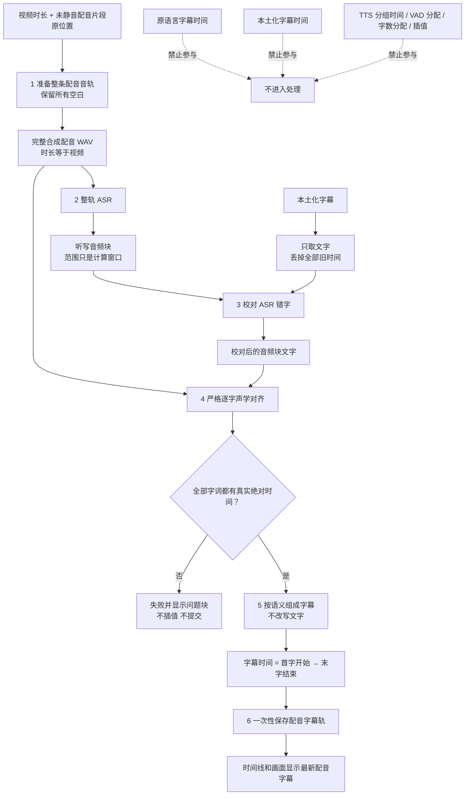

# 根据合成配音生成字幕：大白话流程

## 目标和边界

目标只有一个：把时间线上真正能听到的中文合成配音，生成一条时间准确、文字正确的配音字幕轨。

- 完整合成配音 WAV 是声音和时间的唯一事实。
- 整轨 ASR 决定听到了什么以及先后顺序。
- 本土化字幕只提供校对文字，不提供时间，也不能补入音频里没说的话。
- Forced Aligner 只根据完整 WAV 的发音位置给每个字词真实时间。
- 原语言字幕时间、本土化字幕时间、TTS 分组时间、VAD 时长分配、字数分配、固定偏移和插值都不参与。

## 六个原子子流程

每一步都可以在开发调试模式单独停下查看；正式任务按顺序执行六步。

| 子流程 | 最小输入 | 处理 | 最小输出 |
| --- | --- | --- | --- |
| 1. 准备整条配音音轨 | 视频总时长；未静音配音片段的音频身份、原位置和有效裁切范围 | 把片段放回原位置，空白处补静音，不移动、不压缩间隙 | 临时 WAV 制品 ID、音频 SHA-256、总时长、实际片段数 |
| 2. 识别整条中文配音 | 临时 WAV；ASR 引擎；目标语言 | 完整音频调用一次 ASR | 有序听写音频块：块 ID、音频计算范围、听到的文字；ASR 状态 |
| 3. 用本土化台词校对文字 | 听写音频块；完整、有序且不带时间的本土化文字 | 只修正有 ASR 文字锚点的明显错字、同音字、专名和数字写法 | 有序校对音频块：原文字、校对文字、音频计算范围；修改明细 |
| 4. 取得逐字真实时间 | 临时 WAV；校对音频块；语言 | 每个音频块运行严格 Forced Aligner，并加回完整 WAV 的绝对偏移 | 有序字词：字词 ID、所属块、文字、真实开始和结束时间 |
| 5. 按语义组成字幕 | 校对文字；已对齐字词；只用于来源标记的配音片段信息 | 只在真实字词之间选语义断点；不改写文字 | 最终字幕候选：文字、首字开始时间、末字结束时间、必要来源信息 |
| 6. 保存准确的配音字幕 | 来源版本；最终字幕候选 | 确认输入仍是同一版本，一次性替换配音字幕轨 | 保存版本和字幕数量 |

ASR 音频块中的 `audio_window_start_ms/audio_window_end_ms` 只是从完整 WAV 裁哪一块给声学对齐器，绝不是字幕时间。只有第 4 步产出的字词时间和第 5 步产出的字幕时间可以上时间线和画面。

## 输入输出格式

六步统一使用严格、版本化 JSON。未知字段会直接拒绝，不接收任意字典、本地音频路径或整份上游结果。

- 第 1 步只接收视频时长和配音片段；只输出完整音频身份、时长和片段数。
- 第 2 步只接收完整音频、ASR 引擎和语言；只输出听写块与识别质量。
- 第 3 步只接收听写块和无时间的本土化文字；只输出校对后的块与必要差异统计。
- 第 4 步只接收完整音频、语言和校对块；只输出 `timing_source=forced_aligner` 的字词时间。
- 第 5 步只接收校对文字块、真实字词时间和最小轨道来源。它的类型中不存在 ASR 音频窗口，因此代码不能误把窗口当字幕时间。
- 第 6 步只接收来源版本和最终字幕；只输出实际保存的版本与数量。

第一版没有 LLM 调用，也没有 Markdown 模型输出。若以后只为歧义断点调用 LLM，模型输出必须是稳定字词 ID 之间的断点 JSON，不得返回正文、解释或时间。

## 正常处理

1. 完整 WAV 总时长必须等于视频时长。
2. 片段仍位于当前时间线位置，开头、中间和结尾空白全部保留。
3. ASR 只听这条 WAV，不读取当前临时轨道，也不读取旧字幕时间。
4. 本土化文字只能把“分三集”校成“分三级”、把“四K”校成“4K”这类有声音锚点的小错误。
5. 本土化稿里有、ASR 没听到的句子不会被写入；ASR 听到但参考稿没有的内容也不会被静默删除。
6. 严格声学对齐取得每个字词在完整 WAV 中的绝对时间。
7. 断句先看 ASR 的语义标点；只有实际时长短于 800 毫秒且相邻实际静音不超过 320 毫秒的短片段才合并。字幕开始取首字发音开始，结束取末字发音结束。
8. 正式任务最后一次性保存；调试任务停在指定子流程，不擅自执行后续步骤。

## 出错时怎么补救

- ASR 没听清：错误原样显示在第 2 步结果，不用规则猜内容。
- 校对差异太大：保留 ASR 听到的文字，并在第 3 步详情显示未匹配差异。
- 某个音频块声学对齐失败、缺字、倒序或越界：第 4 步失败，不插值，不生成假时间，不执行保存。Qwen 因 80 毫秒粒度返回的单字零宽时间点可以原样保留，但最终字幕必须有正时长。
- 需要复听：只截取失败音频块重新听或重新声学对齐；不借用任何旧字幕时间。
- 仍无法确认：任务失败并展示具体音频块、文字和错误，不提交半成品。

## 数据运转图

## LLM 的边界

第一版不要求 LLM 生成字幕正文。若以后某个断点确实存在语义歧义，LLM 最多返回“在哪两个稳定字词 ID 之间断开”的严格 JSON 列表；它不能输出新文字、不能改写文字、不能输出或修改时间。

一句话版本：先按原位置渲染与视频等长的完整配音 WAV，再整轨听写、本土化文字校错、严格逐字声学对齐、按语义断句，最后一次性保存；任何时间都只来自 WAV 的真实发音位置。
